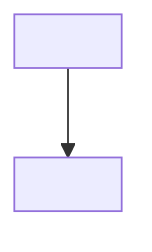

<!--
CONCEPT TEMPLATE. Copy this file over your stub (docs/concepts/<page>.md) and replace every <...>.

A concept page explains an idea and the reasons behind it. It does not walk through setup:
link to the guide that does. Keep the H2s below in this order; drop "Trade-offs" only if there
is genuinely no alternative worth mentioning. Delete this comment before you open the PR.
-->
# <Concept name, same as the toc.yml entry>

<Two or three sentences: the idea in plain words and why it matters when you build with Arc4u.>

## How it works

<The mechanism. Prefer one Mermaid diagram to long prose.>

## Why Arc4u works this way

<The design reasons, and what problem the reader would have without it.>

## Trade-offs

<Alternatives, limits, and when not to follow this approach.>

## In Arc4u

<Where the idea shows up: packages, types (<xref:Arc4u.<Namespace>.<Type>>) and the guides that
apply it, for example [Dependency injection](../guides/dependency-injection/index.md).>

## See also

- [<Related concept>](<page>.md)
- [<Guide>](../guides/<area>/index.md)
