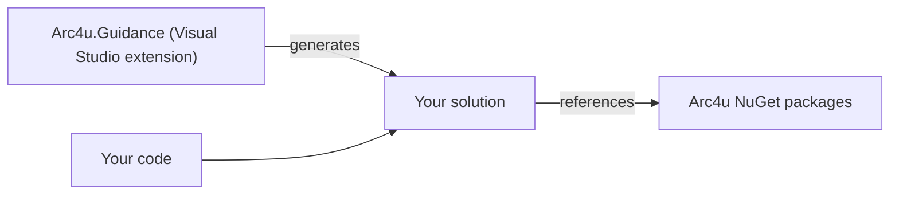

# Arc4u.Guidance

Arc4u.Guidance is a Visual Studio 2022 extension that generates micro-services solutions
built on Arc4u. It is a separate product from the Arc4u framework: Arc4u is open source and
works without it, while the Guidance needs a license. This page explains what the Guidance
produces and how its output relates to the packages documented on this site.

## How it works

The Guidance generates the projects of a solution and the code that wires Arc4u into them.
The generated projects reference the Arc4u NuGet packages like any other application, and
you then write your own code in them.

According to the [Guidance documentation](https://github.com/GFlisch/Arc4u.Guidance.Doc), a
generated solution can contain:

- a YARP reverse proxy that also acts as API gateway, health check portal and OpenID Connect
  entry point (see [Deployment behind a gateway](architecture.md#deployment-behind-a-gateway));
- REST and gRPC services protected by OAuth2 and OpenID Connect;
- integration with Dapr;
- Blazor WebAssembly and WPF (Prism) front ends, with client proxies generated by NSwagStudio;
- configuration for container platforms (Kubernetes, k3s, Docker Compose) or for on-premises
  virtual machines running IIS.

Generated solutions follow a fixed folder convention: each service is in
`BE\<ServiceName>\<SolutionName>.<ServiceName>.Host\`. The
[Arc4u.Guidance.Workflows](https://github.com/Arc4u-org/Arc4u.Guidance.Workflows) repository
provides GitHub workflows that rely on this convention to build a service, package it as a
container image and deploy it to Azure Kubernetes Service.

The Guidance has its own version numbers, `2022.MAJOR.MINOR.PATCH`, where `2022` is the Visual
Studio version. Different Guidance versions can be installed side by side, so that teams on
different Arc4u versions do not have to upgrade at the same time.

## Why Arc4u works this way

- **The framework and the generator solve different problems.** Arc4u provides reusable
  packages; the Guidance decides how a whole solution is laid out and wired. Keeping them
  apart lets you use Arc4u in any project, generated or not.
- **Consistency across teams.** A generator gives every service of an organization the same
  structure, which makes it easier to move between projects and to share build and deployment
  pipelines.

## Trade-offs

- The generated code is a starting point that you own and maintain, including its Arc4u
  package versions.
- The version on the Visual Studio Marketplace (2022.2.1.17, last updated in August 2024)
  predates the Arc4u 9 packages, whose first preview was published in September 2025. To
  move a generated solution to Arc4u 9, follow the [migration guide](../migration/8x-to-9.md).
- Some technologies listed in the Guidance documentation, such as NServiceBus with RabbitMQ,
  are no longer part of Arc4u 9 (see
  [NServiceBus replaced by Dapr pub/sub](../migration/8x-to-9.md#nservicebus-replaced-by-dapr-pubsub)).

## In Arc4u

Nothing in the Arc4u packages depends on the Guidance. The guides on this site show how to
set up each feature by hand, which is also what you need to understand and change the code the
Guidance generated. Start with [Getting started](../getting-started/index.md).

The Guidance is available on the
[Visual Studio Marketplace](https://marketplace.visualstudio.com/items?itemName=Arc4u.Guidance2022-2).
For license information, contact info@arc4u.net.

## See also

- [Architecture](architecture.md)
- [Versioning and package naming](versioning.md)
- [Arc4u.Guidance documentation](https://github.com/GFlisch/Arc4u.Guidance.Doc)
