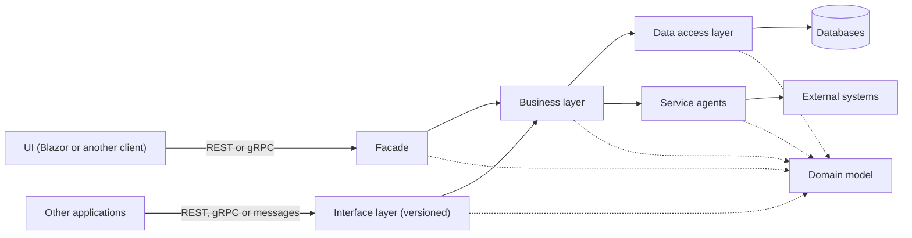
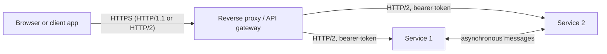

# Architecture

Arc4u is designed for backends split into layers with one responsibility each: a
[facade](glossary.md#facade) or an [interface layer](glossary.md#interface-layer) that exposes
services, a [business layer](glossary.md#business-layer) that holds the rules, and a
[data access layer](glossary.md#data-access-layer) and [service agents](glossary.md#service-agent)
that talk to the outside world. You can use any Arc4u package without following this
architecture, but the packages are organized around it, and knowing where each one fits
tells you which ones a project needs.

## How it works

The diagram shows who calls whom. Solid arrows are calls; dotted arrows show which layers
use the domain model.

Each layer depends on abstractions of the layer below it, and the implementations are
wired together with dependency injection (see [Design principles](design-principles.md)).

### Facade

The facade is the service layer dedicated to your own user interfaces. Its REST or gRPC
endpoints return exactly what a screen needs, and are protected with OAuth2 and OpenID
Connect.

The facade is not versioned: the UI and its facade are built and deployed together, so a
change in the UI changes the facade at the same time, for every UI of the application.
Because response size matters for a UI, DTOs shaped for one screen are a valid choice.

### Interface layer

The interface layer uses the same technologies as the facade, but serves other
applications instead of your own UI. The difference is versioning: when a contract
changes, you publish a new version of the service and keep the previous versions working
as long as you can. Consumers then migrate at their own pace instead of on the day you
deploy. This is the key rule of the layer.

Handlers of asynchronous messages from other backends belong here too: a message is a
backend-to-backend contract like an API.

### Business layer

The business layer holds the rules of the application. The facade and the interface layer
call it; it calls the data access layer and the service agents. It validates input, checks
authorization against the current [AppPrincipal](glossary.md#appprincipal) and reports
expected failures as results (see the [result pattern](glossary.md#result-pattern)) rather
than exceptions.

### Data access layer

The data access layer is a service agent dedicated to databases: it reads and writes the
domain model with Entity Framework Core, MongoDB or another store, and hides the store from
the business layer.

### Service agents

A service agent handles the communication with one external system: another service over
REST or gRPC, files, FTP and so on. It hides the protocol, adds the access token when the
call needs one, and converts the response into domain objects or results.

### Domain model

The domain model is the set of plain classes (entities and value objects) that the layers
exchange. Facades and interfaces map it to the DTOs they expose.

### Deployment behind a gateway

When the application is split into several services, a reverse proxy in front of them
routes the traffic, terminates TLS and can act as an API gateway. Arc4u does not ship a
gateway: you configure one yourself (for example with YARP). The diagram shows the usual
setup, where the user signs in on the gateway and the services validate bearer tokens.

Several Arc4u features are built for this setup:

- On the gateway, `UseOpenIdBearerInjector` (package `Arc4u.OAuth2.AspNetCore`) replaces the
  `Authorization` header of a request from a user signed in with OpenID Connect with a bearer
  token obtained from a [token provider](glossary.md#token-provider), so that the services
  receive a token instead of a cookie.
- In the services, `AddJwtAuthentication` (package `Arc4u.OAuth2.AspNetCore.Authentication`)
  validates that token.
- `Arc4u.OData` can make the URIs in OData responses point to the gateway address rather
  than the service address, and `Arc4u.gRPC` has an interceptor that adds a path suffix for
  routing gRPC calls through a proxy.

## Why Arc4u works this way

- **Separate reasons to change.** A new screen changes the facade, a new partner changes the
  interface layer, a new database changes the data access layer. The business rules stay
  where they are.
- **Versioning only where it pays.** Versioning every service is expensive. Keeping it to the
  interface layer, whose consumers you do not control, lets the facade move as fast as the UI.
- **Replaceable dependencies.** Because each layer depends on interfaces resolved through
  dependency injection, you can test a layer in isolation and swap a database or an external
  system without touching the business layer.

## Trade-offs

- For a small service with one consumer, separate facade, business and data access projects
  add ceremony. Merge the layers and keep the separation as folders or namespaces.
- DTOs and mapping duplicate the domain model. Map by hand when the mapping is simple or when
  performance matters; a mapping library saves code for large models.
- Keeping old interface versions alive has a cost. Announce deprecated versions and remove
  them on a schedule.

## In Arc4u

The table shows where the packages are used. The cross-cutting packages apply to every
layer.

| Layer | Packages | Guide |
|---|---|---|
| UI | `Arc4u.OAuth2.Blazor`, `Arc4u.OAuth2.AspNetCore.Blazor` | [Client authentication and Blazor](../guides/authentication-client/index.md) |
| Facade and interface layer | `Arc4u.OAuth2.AspNetCore`, `Arc4u.OAuth2.AspNetCore.Authentication`, `Arc4u.Authorization` | [Server authentication](../guides/authentication-server/index.md) |
| Facade and interface layer | `Arc4u.AspNetCore.Results` | [Results and errors](../guides/results/index.md) |
| Facade and interface layer | `Arc4u.AspNetCore.gRpc`, `Arc4u.AspNetCore.Versioning` | [gRPC and API versioning](../guides/grpc-versioning/index.md) |
| Business layer | `Arc4u.Results`, `Arc4u.FluentValidation` | [Results and errors](../guides/results/index.md) |
| Business layer | `Arc4u.Caching` and its providers | [Caching](../guides/caching/index.md) |
| Business layer | `Arc4u.Dispatcher` | [Dispatcher](../guides/dispatcher/index.md) |
| Data access layer | `Arc4u.EfCore`, `Arc4u.MongoDB`, `Arc4u.OData` | [Data access](../guides/data/index.md) |
| Service agents | `Arc4u.OAuth2.Client`, `Arc4u.OAuth2.Client.Authentication`, `Arc4u.gRPC` | [Client authentication and Blazor](../guides/authentication-client/index.md) |
| Domain model | `Arc4u.Data`, `Arc4u.Core` | [Data access](../guides/data/index.md) |
| Cross-cutting | `Arc4u.Dependency`, `Arc4u.Dependency.Tool` | [Dependency injection](../guides/dependency-injection/index.md) |
| Cross-cutting | `Arc4u.Configuration` and its extensions | [Configuration](../guides/configuration/index.md) |
| Cross-cutting | `Arc4u.Diagnostics`, `Arc4u.Diagnostics.Serilog` | [Diagnostics and logging](../guides/diagnostics/index.md) |

Three foundation packages are referenced by most of the others:

| Package | Contents |
|---|---|
| `Arc4u.Core` | Settings abstractions (<xref:Arc4u.IKeyValueSettings>, <xref:Arc4u.IAppSettings>), the application configuration model (<xref:Arc4u.Configuration.ApplicationConfig>) and the <xref:Arc4u.Core.ValueObject> base class for the domain model. |
| `Arc4u.Threading` | Threading helpers: <xref:Arc4u.Threading.Scope`1>, <xref:Arc4u.Threading.AsyncLock>, <xref:Arc4u.Threading.AsyncSemaphore> and <xref:Arc4u.Threading.Culture>. |
| `Arc4u` | Shared building blocks: the [AppPrincipal](glossary.md#appprincipal) and [application context](glossary.md#application-context), certificate loading, change tracking (<xref:Arc4u.Data.IPersistEntity>), extension methods and collections. |

The [package support](../guides/package-support.md) page lists every package with its status
and target frameworks.

## See also

- [Design principles](design-principles.md)
- [Glossary](glossary.md)
- [Arc4u.Guidance](arc4u-guidance.md), which generates solutions preconfigured with Arc4u
- [Getting started](../getting-started/index.md)
