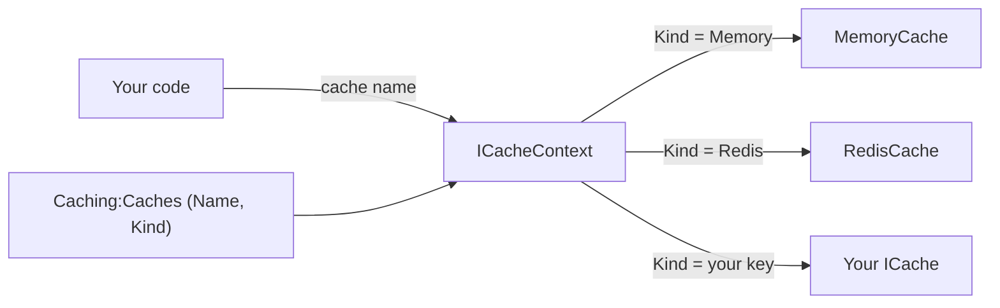

# Design principles

Arc4u follows two rules. It builds on what .NET and its ecosystem already provide instead of
rebuilding it, and it adds its features as abstractions whose implementations are chosen
through dependency injection. Together they mean that your code depends on interfaces, and
that you can replace almost any Arc4u behavior by registering another implementation.

## How it works

### Abstraction plus injection

Your code works with an abstraction such as <xref:Arc4u.Caching.ICache> or
<xref:Arc4u.OAuth2.Token.ITokenProvider>, never with a concrete technology. The dependency
injection container decides which implementation it gets. For several extension points, the
choice is made in configuration: the implementation is registered as a
[keyed service](glossary.md#keyed-service), and a configuration value names the key.

The diagram shows this for caching: the `Kind` of each [named cache](glossary.md#named-cache)
is the key of the <xref:Arc4u.Caching.ICache> implementation that the
[cache context](glossary.md#cache-context) resolves.



Token providers work the same way: the `ProviderId` value of the security settings used by an
HTTP handler or a gRPC interceptor is the key of the <xref:Arc4u.OAuth2.Token.ITokenProvider>
that obtains the token.

### What Arc4u builds on instead of wrapping

Arc4u does not replace the standard .NET building blocks. It configures them and fills the
gaps.

| Concern | Arc4u builds on | What Arc4u adds |
|---|---|---|
| Dependency injection | `Microsoft.Extensions.DependencyInjection`, including keyed services | The [`[Export]` attribute](glossary.md#export-attribute) and source generators that write the registrations. |
| Configuration | `IConfiguration` and the options pattern | Configuration providers that decrypt secrets, and a configuration store. |
| Logging | `Microsoft.Extensions.Logging` (`ILogger`), with Serilog as provider | A fluent API on `ILogger` (`Technical()`, `Business()`, `Monitoring()`) and Serilog sinks. |
| Tracing | `System.Diagnostics.ActivitySource` | Activities for caching, principal creation and token acquisition. |
| Authentication | The ASP.NET Core JwtBearer, OpenID Connect and cookie handlers | Setup from configuration, the [AppPrincipal](glossary.md#appprincipal) and [token providers](glossary.md#token-provider). |
| Caching | `IDistributedCache` implementations (memory, Redis, SQL Server) and the Dapr client | [Named caches](glossary.md#named-cache) selected in configuration, with serialization. |
| Results and validation | FluentResults and FluentValidation | Extension methods and the conversion of failures to [ProblemDetails](glossary.md#problemdetails). |
| API versioning | `Asp.Versioning` | One registration call with fixed conventions. |

OpenTelemetry is an example of something Arc4u deliberately does not wrap: there is no
Arc4u OpenTelemetry package, and no Arc4u package references OpenTelemetry. Arc4u creates
its activities with a plain `ActivitySource` named `Arc4u` (through
<xref:Arc4u.Diagnostics.IActivitySourceFactory>, registered by `AddApplicationContext`).
You configure OpenTelemetry yourself and subscribe to that source:

```csharp
using OpenTelemetry.Trace;

builder.Services.AddOpenTelemetry()
    .WithTracing(tracing => tracing.AddSource("Arc4u"));
```

`AddOpenTelemetry` comes from the `OpenTelemetry.Extensions.Hosting` package; add the
exporters you use as usual. `Arc4u.Diagnostics` contains an
<xref:Arc4u.Diagnostics.OpenTelemetrySettings> class, but no Arc4u code reads it.

### Replace a behavior through dependency injection

There are three ways to change what Arc4u does, depending on how the behavior is registered.

**Register your implementation before the Arc4u registration call.** Several Arc4u `Add...`
methods register their defaults with `TryAdd...`, which does nothing when the service is
already registered (others use a plain `Add...`; check the method before relying on this).
For example, `AddJwtAuthentication` registers
<xref:Arc4u.OAuth2.Events.StandardBearerEvents> as `JwtBearerEvents` this way. To handle
the JwtBearer events yourself, derive from it and register your class first:

```csharp
using Arc4u.OAuth2.Events;
using Arc4u.OAuth2.Extensions;
using Microsoft.AspNetCore.Authentication.JwtBearer;

var builder = WebApplication.CreateBuilder(args);

// Registered first: AddJwtAuthentication keeps this registration.
builder.Services.AddTransient<JwtBearerEvents, AuditBearerEvents>();
builder.Services.AddJwtAuthentication(builder.Configuration);

public class AuditBearerEvents(ILogger<StandardBearerEvents> logger) : StandardBearerEvents(logger)
{
    public override async Task TokenValidated(TokenValidatedContext context)
    {
        await base.TokenValidated(context);
        // Your code, for example an audit entry.
    }
}
```

The same applies to `IApplicationContext` and `IActivitySourceFactory` (`AddApplicationContext`),
`ICacheContext` (`AddCacheContext`), and the cookie and OpenID Connect events of the
authentication methods.

**Register a new key.** When Arc4u resolves an implementation by key, add yours under a key
of your own and put that key in configuration. This token provider is registered under
`ApiKey`. When the security settings of an HTTP client set `ProviderId` to `ApiKey` and
`AuthenticationType` to `Inject`, `JwtHttpHandler` calls it and sends the key in an
`X-Api-Key` header: with `Inject`, a token type other than `Bearer` or `Basic` is used as the
header name.

```csharp
using Arc4u;
using Arc4u.Dependency.Attribute;
using Arc4u.OAuth2.Token;
using FluentResults;

[Export(ProviderName, typeof(ITokenProvider)), Shared]
public sealed class ApiKeyTokenProvider(IConfiguration configuration) : ITokenProvider
{
    public const string ProviderName = "ApiKey";

    public Task<Result<TokenInfo>> GetTokenAsync(IKeyValueSettings? settings, object? platformParameters)
    {
        var key = configuration["Downstream:ApiKey"];
        return Task.FromResult(key is null
            ? Result.Fail<TokenInfo>("Downstream:ApiKey is not configured.")
            : Result.Ok(new TokenInfo("X-Api-Key", key, DateTime.UtcNow.AddMinutes(5))));
    }

    public ValueTask SignOutAsync(IKeyValueSettings settings, CancellationToken cancellationToken)
        => ValueTask.CompletedTask;
}
```

Use the `TokenInfo` constructor that takes an expiry date: the two-argument constructor
parses the token as a JWT and throws for any other value. `JwtHttpHandler` does not send a
token whose expiry date has passed.

The `[Export]` and `[Shared]` attributes let the Arc4u source generator write the
registration for you. Without the generator, write it by hand:

```csharp
builder.Services.AddKeyedSingleton<ITokenProvider, ApiKeyTokenProvider>(ApiKeyTokenProvider.ProviderName);
```

**Register another class for the same contract.** Most Arc4u implementations marked with
`[Export]` are registered by your application, either by hand or by the source generator
from the `Application.Dependency` configuration section. To replace one, leave it out and
register your own class for the same service type and key. If both end up registered,
resolving a single service returns the one registered last.

The [Dependency injection](../guides/dependency-injection/index.md) guide explains the
attributes and the source generators in detail.

## Why Arc4u works this way

- **Less code to learn and maintain.** The .NET building blocks are documented, supported and
  known by most developers. Wrapping them would add a layer to learn and would lag behind
  their new versions.
- **Technology choices stay open.** Code written against `ICache` does not change when you
  move a cache from memory to Redis; only configuration changes.
- **Nothing is sealed off.** Because every feature is resolved from the container, you can
  replace a default that does not fit instead of working around it or forking the package.
- **Testability.** Abstractions can be replaced by test doubles.

## Trade-offs

- Resolution happens at run time. A key that does not match any registration is not a
  compile error: for example, a cache whose `Kind` matches no registered `ICache` is not
  created, the problem is logged, and getting that cache by name throws an
  `InvalidOperationException`. Keys are compared case-sensitively, so use the exact spelling.
- Registration order matters. A registration made after an Arc4u `Add...` call does not
  prevent the Arc4u default from being registered; when both are registered, the last one wins
  for single resolution, but code that resolves all implementations gets both.
- Building on the standard libraries means you still configure them yourself: Arc4u does not
  hide OpenTelemetry, Serilog sinks or the ASP.NET Core authentication handlers behind its
  own settings.

## In Arc4u

- `Arc4u.Dependency` defines the `[Export]`, `[Shared]` and `[Scoped]` attributes, and
  `Arc4u.Dependency.Tool` contains the source generators:
  [Dependency injection](../guides/dependency-injection/index.md).
- Cache kinds are keys of <xref:Arc4u.Caching.ICache>: [Caching](../guides/caching/index.md).
- Token providers are keys of <xref:Arc4u.OAuth2.Token.ITokenProvider>:
  [Client authentication and Blazor](../guides/authentication-client/index.md).
- Logging builds on `ILogger` and tracing on `ActivitySource`:
  [Diagnostics and logging](../guides/diagnostics/index.md).
- Arc4u 9 removed its own container abstraction in favor of keyed services:
  [IContainer replaced by keyed services](../migration/8x-to-9.md#icontainer-replaced-by-keyed-services).

## See also

- [Architecture](architecture.md)
- [Glossary](glossary.md)
- [Dependency injection](../guides/dependency-injection/index.md)
