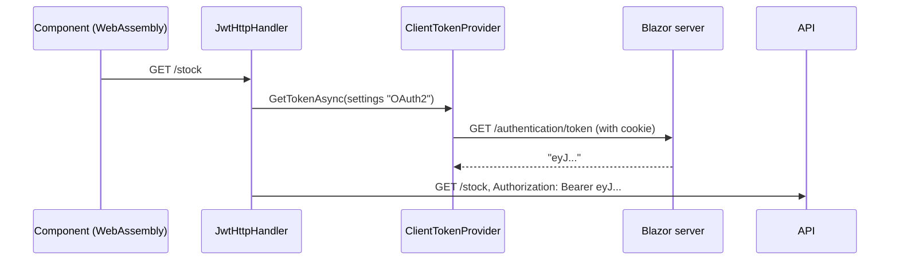

# Blazor

A Blazor application needs two things from Arc4u: the `AppPrincipal` of the signed-in user in its
components (through the [application context](../../concepts/glossary.md#application-context)),
and a token to call APIs. How they are obtained depends on where the component runs. The user
signs in on the server with OpenID Connect and a cookie, as described in
[Server authentication](../authentication-server/index.md).

| Render mode | Where the code runs | Arc4u provides |
|---|---|---|
| Interactive WebAssembly | In the browser | The principal rebuilt from the authentication state sent by the server; a token fetched from the server with the cookie (`ClientTokenProvider`). |
| Interactive Server | On the server, in a SignalR circuit | The principal set in the `IApplicationContext` of the circuit. |
| Interactive Auto | Both, one after the other | Both of the above. See [Hybrid rendering](#hybrid-rendering). |

## Packages involved

| Package | Use it for |
|---|---|
| `Arc4u.OAuth2.Blazor` | The WebAssembly project: token providers, the `JwtHttpHandler` for `HttpClient`, `AddAuthenticationCookie`, and the principal built from the authentication state. |
| `Arc4u.OAuth2.AspNetCore.Blazor` | The server project: the principal of Interactive Server components (`AppPrincipalServerAuthenticationStateProvider`, `ApplicationContextCircuitHandler`) and the `BlazorController`. |

```bash
dotnet add package Arc4u.OAuth2.Blazor --prerelease
dotnet add package Arc4u.OAuth2.AspNetCore.Blazor --prerelease
```

## WebAssembly: call APIs with the user's token

The WebAssembly app cannot read the authentication cookie of the server, and should not store
tokens in the browser. Instead, <xref:Arc4u.OAuth2.TokenProvider.ClientTokenProvider> asks the
server for the access token of the signed-in user: the browser sends the cookie with the request,
and the server answers with the token.



### Configure the WebAssembly app

`AddAuthenticationCookie(builder.Configuration)` reads `Authentication:OAuth2.Settings` (pass
`sectionName` to use another section) and registers the settings named `OAuth2` (pass
`sectionKey` to change it). It also registers a named `HttpClient` whose requests include the
browser cookies. The section must exist; an overload takes an
`Action<AuthenticationCookieSettingsOption>` instead.

```json
{
  "Authentication": {
    "OAuth2.Settings": {
      "BaseUri": "https://app.example.com",
      "TokenRequestUrl": "/authentication/token"
    }
  }
}
```

| Key | Type | Default | Description |
|---|---|---|---|
| `Authentication:OAuth2.Settings:BaseUri` | `Uri` | `https://localhost` | Base address of the Blazor server. |
| `Authentication:OAuth2.Settings:TokenRequestUrl` | `string` | `/authentication/token` | Server endpoint that returns the token. |
| `Authentication:OAuth2.Settings:HttpClientName` | `string` | `Authentication` | Name of the `HttpClient` that calls the server. |
| `Authentication:OAuth2.Settings:ProviderId` | `string` | `Client` | Key of the token provider. |

```csharp
// Program.cs (WebAssembly project)
using Arc4u.Blazor.Handlers;
using Arc4u.Blazor.Options;
using Arc4u.Configuration;
using Arc4u.Dependency;
using Arc4u.OAuth2.Token;
using Arc4u.OAuth2.TokenProvider;
using Microsoft.AspNetCore.Components.WebAssembly.Hosting;

var builder = WebAssemblyHostBuilder.CreateDefault(args);

builder.Services.AddILogger();
builder.Services.AddTransient<AttachCookiesHandler>();
builder.Services.AddAuthenticationCookie(builder.Configuration);
builder.Services.AddKeyedSingleton<ITokenProvider, ClientTokenProvider>(ClientTokenProvider.ProviderName);

builder.Services.AddHttpClient<InventoryClient>(client => client.BaseAddress = new Uri("https://inventory.example.com/"))
    .AddHttpMessageHandler(sp => new JwtHttpHandler(
        sp,
        sp.GetRequiredService<ILogger<JwtHttpHandler>>(),
        "OAuth2"));

await builder.Build().RunAsync();
```

`AttachCookiesHandler` must be registered because `AddAuthenticationCookie` adds it to its
`HttpClient`. <xref:Arc4u.Blazor.Handlers.JwtHttpHandler> resolves the settings named `OAuth2`
(it throws `ConfigurationException` when none exist), and sends the token in the `Authorization`
header, with the token type as the scheme; when the provider fails, it logs the error and sends
the request without a token. `ClientTokenProvider` keeps the token until it expires, so the token
must be a JWT (it reads its expiration).

### Expose the token on the server

Arc4u does not map the token endpoint: add it to the server project. It must require an
authenticated user and return the access token as a JSON string. With the OpenID Connect and
cookie authentication of [Server authentication](../authentication-server/index.md), the `Oidc`
token provider gives the user's access token, refreshed when needed:

```csharp
// Program.cs (server project)
using Arc4u.Configuration;
using Arc4u.OAuth2;
using Arc4u.OAuth2.Token;
using Arc4u.OAuth2.TokenProviders;
using Microsoft.Extensions.Options;

var builder = WebApplication.CreateBuilder(args);

// ... OpenID Connect and cookie authentication: see the Server authentication guide.
builder.Services.AddKeyedScoped<ITokenProvider, OidcTokenProvider>(OidcTokenProvider.ProviderName);

var app = builder.Build();

app.MapGet("/authentication/token", async (HttpContext context, IOptionsMonitor<SimpleKeyValueSettings> settings) =>
{
    var provider = context.RequestServices.GetRequiredKeyedService<ITokenProvider>(OidcTokenProvider.ProviderName);
    var token = await provider.GetTokenAsync(settings.Get(Constants.CookiesAuthenticationType), null);

    return token.IsSuccess ? Results.Ok(token.Value.Token) : Results.Unauthorized();
}).RequireAuthorization();

app.Run();
```

> [!CAUTION]
> This endpoint hands out the user's access token to any caller that holds the cookie. Keep the
> authentication cookie `HttpOnly` and `SameSite`, and do not let other origins call the endpoint
> with credentials (CORS).

### Get the principal in WebAssembly components

From .NET 9, the server can serialize the authentication state into the page and the
WebAssembly app can read it back. Arc4u plugs into the deserialization:
<xref:Arc4u.Blazor.Options.ConfigureAuthStateDeserializationOptions> sets the callback, and
<xref:Arc4u.Blazor.AppPrincipalFromAuthenticationState> builds an `AppPrincipal` from the claims
with the `IClaimAuthorizationFiller` and `IClaimProfileFiller`, and sets it in the
`IApplicationContext`. An anonymous user gets a principal without operations.

```csharp
// Program.cs (WebAssembly project)
using Arc4u.Blazor;
using Arc4u.Blazor.Options;
using Arc4u.Security.Principal;
using Microsoft.AspNetCore.Components.WebAssembly.Authentication;
using Microsoft.AspNetCore.Components.WebAssembly.Hosting;

var builder = WebAssemblyHostBuilder.CreateDefault(args);

builder.Services.AddAuthorizationCore();
builder.Services.AddCascadingAuthenticationState();
builder.Services.AddAuthenticationStateDeserialization();

builder.Services.AddSingleton<IApplicationContext, ApplicationInstanceContext>();
builder.Services.AddSingleton<IClaimAuthorizationFiller, ClaimsAuthorizationFiller>();
builder.Services.AddSingleton<IClaimProfileFiller, ClaimsProfileFiller>();
builder.Services.AddSingleton<IAppPrincipalAuthenticationStateProvider, AppPrincipalFromAuthenticationState>();
builder.Services.AddSingleton<IConfigureOptions<AuthenticationStateDeserializationOptions>, ConfigureAuthStateDeserializationOptions>();

await builder.Build().RunAsync();
```

The authorization is built from the claims, so the server must send them all:
`builder.Services.AddRazorComponents().AddInteractiveWebAssemblyComponents().AddAuthenticationStateSerialization(options => options.SerializeAllClaims = true);`.
By default, Blazor only sends the name and role claims.

## Interactive Server: get the principal in the circuit

An Interactive Server component runs in a SignalR circuit, which has its own dependency injection
scope. The `IApplicationContext` filled during the HTTP request is not the one of the circuit, so
without Arc4u the component event handlers see no principal. `Arc4u.OAuth2.AspNetCore.Blazor`
fills the circuit's `IApplicationContext` in two places:

- <xref:Arc4u.Blazor.AppPrincipalServerAuthenticationStateProvider> replaces the Blazor
  `ServerAuthenticationStateProvider`: each time the authentication state is read, it builds the
  `AppPrincipal` and sets it in the `IApplicationContext`.
- <xref:Arc4u.Blazor.ApplicationContextCircuitHandler> does the same when the circuit connects, so
  the principal is there even before a component reads the authentication state.

```csharp
// Program.cs (server project)
using Arc4u.Blazor;
using Arc4u.Security.Principal;
using Microsoft.AspNetCore.Components.Authorization;
using Microsoft.AspNetCore.Components.Server.Circuits;

var builder = WebApplication.CreateBuilder(args);

// ... OpenID Connect and cookie authentication: see the Server authentication guide.

builder.Services.AddRazorComponents().AddInteractiveServerComponents();
builder.Services.AddCascadingAuthenticationState();

builder.Services.AddScoped<IApplicationContext, ApplicationInstanceContext>();
builder.Services.AddScoped<AuthenticationStateProvider, AppPrincipalServerAuthenticationStateProvider>();
builder.Services.AddScoped<CircuitHandler, ApplicationContextCircuitHandler>();

var app = builder.Build();
app.Run();
```

`IApplicationContext` must be scoped, so that each circuit and each request has its own. The
claims fillers (`IClaimAuthorizationFiller`, `IClaimProfileFiller`) are the ones of the server
authentication. Only the principal is set in the circuit: the tokens kept for the HTTP request
(`TokenRefreshInfo`) are not.

## Hybrid rendering

With the Interactive Auto render mode, a component first runs on the server and then in the
browser, so the application needs both setups above. Hybrid rendering is tracked in
[#171](https://github.com/Arc4u-org/Arc4u/issues/171) (open): the principal is reported missing
in server-rendered parts of a hybrid application. Test the principal in each render mode your
application uses.

## Other WebAssembly token providers

`Arc4u.OAuth2.Blazor` contains two other providers. Both are registered under the key `blazor`:
register only one of them, because a keyed registration replaces the previous one with the same
key (known issue).

- <xref:Arc4u.OAuth2.TokenProvider.BlazorMsalTokenProvider> works with the Microsoft WebAssembly
  authentication (`AddMsalAuthentication` or `AddOidcAuthentication`), where the browser signs the
  user in and holds the tokens. It returns the token of the current principal when it is still
  valid, otherwise the token requested from `IAccessTokenProviderAccessor`. It does not use the
  Microsoft Authentication Library for .NET (see [MSAL status](desktop.md#msal-status)).
- <xref:Arc4u.OAuth2.TokenProvider.BlazorTokenProvider> opens a pop-up window on the
  `BlazorController` of the server, which sends the token back to a page of the package and the
  token is kept in the browser local storage.

> [!WARNING]
> The pop-up flow does not work in 9.0 (known issue): `BlazorController` redirects to
> `_content/Arc4u.Standard.OAuth2.Blazor/GetToken.html`, the path of the package before it was
> renamed, instead of `_content/Arc4u.OAuth2.Blazor/GetToken.html`, and the browser gets a 404.
> Use `ClientTokenProvider`.

## Troubleshooting

### No service for type AttachCookiesHandler has been registered

`ClientTokenProvider` logs this `InvalidOperationException` and the API is called without a token:
`AddAuthenticationCookie` adds `AttachCookiesHandler` to its `HttpClient`, but does not register it. Add
`builder.Services.AddTransient<AttachCookiesHandler>();`.

### The API is called without a token

When `ClientTokenProvider` fails, the `JwtHttpHandler` of the WebAssembly app sends the request
anyway. Check that the settings name given to the handler is the one registered by
`AddAuthenticationCookie` (`OAuth2` by default), that the token endpoint answers with a 200 status
in the browser developer tools, and that it returns a JSON string (`"eyJ..."`), not plain text.

### The principal is null in an event handler of an Interactive Server component

Register `AppPrincipalServerAuthenticationStateProvider` and `ApplicationContextCircuitHandler`, and
register `IApplicationContext` as scoped (a singleton is shared by all users).

## See also

- [Server authentication](../authentication-server/index.md)
- [HttpClient and gRPC clients](httpclient-grpc.md)
- [ASP.NET Core Blazor authentication and authorization](https://learn.microsoft.com/aspnet/core/blazor/security/)
- <xref:Arc4u.Blazor> in the API reference
