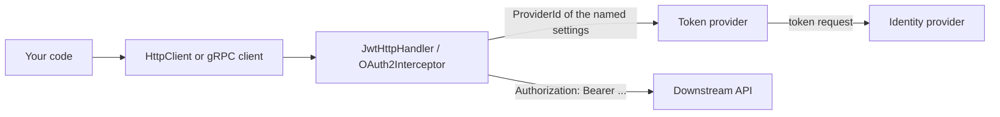

# Client authentication and Blazor

When your code calls another API, the call must carry a token that this API accepts: the token of
the user, a token obtained on behalf of the user, or a token of your application. Arc4u separates
the code that gets the token (a [token provider](../../concepts/glossary.md#token-provider)) from
the code that sends it (an `HttpClient` handler or a gRPC interceptor), and connects them by name
in the configuration. This guide covers calls from ASP.NET Core services, desktop and mobile apps,
and Blazor applications. How an API validates the tokens it receives is covered in
[Server authentication](../authentication-server/index.md).

## What it solves

Without Arc4u, every typed `HttpClient` needs code to request a token, cache it, refresh it, and
decide whether to send the token of the user or the one of the application. With Arc4u, you
declare the token in `appsettings.json`, register the matching token provider, and add a handler
to the client. The handler reads the current user from the
[application context](../../concepts/glossary.md#application-context), asks the provider for a
token and sets the header.



Arc4u leaves the rest to .NET and to established libraries: `IHttpClientFactory`, the gRPC client
factory, the ASP.NET Core authentication handlers, the Blazor authentication state, and
[Duende.IdentityModel.OidcClient](https://www.nuget.org/packages/Duende.IdentityModel.OidcClient)
for desktop sign-in.

## Packages involved

| Package | Use it for |
|---|---|
| `Arc4u.OAuth2` | The token provider contract (<xref:Arc4u.OAuth2.Token.ITokenProvider>, <xref:Arc4u.OAuth2.Token.TokenKeys>) and the token cache. All the packages below reference it. |
| `Arc4u.OAuth2.AspNetCore` | Services: the client credentials, user name and password, and remote secret providers, with `AddClientTokens` and `AddRemoteSecretsAuthentication`. |
| `Arc4u.OAuth2.AspNetCore.Authentication` | Services: the `JwtHttpHandler<T>` for `HttpClient`, and the providers that forward the user's token or exchange it on behalf of the user. It references `Arc4u.OAuth2.AspNetCore`. |
| `Arc4u.gRPC` | The `OAuth2Interceptor<T>` for gRPC clients. |
| `Arc4u.OAuth2.Client` | Client apps: the `AppPrincipalFactory` that builds the principal from the token, and the user name and password provider. |
| `Arc4u.OAuth2.Client.Authentication` | Desktop and mobile apps: OpenID Connect sign-in, token provider and `HttpClient` handler. |
| `Arc4u.OAuth2.Blazor` | Blazor WebAssembly: token providers, `HttpClient` handler and principal. It references `Arc4u.OAuth2.Client`. |
| `Arc4u.OAuth2.AspNetCore.Blazor` | Blazor server: the principal of Interactive Server components. |

`Arc4u.OAuth2.Msal` is not shipped in Arc4u 9: see [MSAL status](desktop.md#msal-status).

## Install

For a service (ASP.NET Core) that calls other APIs:

```bash
dotnet add package Arc4u.OAuth2.AspNetCore.Authentication --prerelease
dotnet add package Arc4u.Caching.Memory --prerelease
dotnet add package Arc4u.Serializer.JSon --prerelease
dotnet add package Arc4u.gRPC --prerelease
```

The cache packages keep the application tokens (see [Caching](../caching/index.md)); use another
cache kind if you prefer. Add `Arc4u.gRPC` only for gRPC clients. For a Blazor app, install `Arc4u.OAuth2.Blazor` in the
WebAssembly project and `Arc4u.OAuth2.AspNetCore.Blazor` in the server project. For a desktop or
mobile app, install `Arc4u.OAuth2.Client.Authentication`.

You need an app registration in your identity provider (Microsoft Entra ID, Keycloak, ...) for
each application that requests tokens.

## Configuration

Each token is declared by a named entry. The registration methods read these sections and
register one set of settings per entry, named after the entry:

| Section | Read by | Settings name |
|---|---|---|
| `Authentication:ClientTokens:<name>` | `AddClientTokens` | `<name>` |
| `Authentication:OnBehalfOf:<name>` | `AddOnBehalfOf` | `<name>` |
| `Authentication:RemoteSecrets:<name>` | `AddRemoteSecretsAuthentication` | `<name>` |
| `Authentication:OAuth2.Settings` | `AddJwtAuthentication`, `AddHybridAuthentication` (server) | `OAuth2` |
| `Authentication:OpenId.Settings` | `AddOidcAuthentication`, `AddHybridAuthentication` (server) | `Cookies` |
| `Authentication:OAuth2.Settings` (WebAssembly app) | `AddAuthenticationCookie` | `OAuth2` |
| `Authentication:OidcClient.Settings` | `AddOidcClientAuthentication` | `OidcClient` |

`AddClientTokens`, `AddOnBehalfOf`, `AddRemoteSecretsAuthentication` and `AddAuthenticationCookie`
take a `sectionName` parameter to read another section. The server methods and
`AddOidcClientAuthentication` take an `authenticationSectionName` instead, and read the paths of
their sub-sections from keys of that section (for example `OAuth2SettingsSectionPath` or
`OidcClientIdSettingsSectionPath`). The keys of each section are described in
[Token providers](token-providers.md), [Blazor](blazor.md) and
[Desktop and mobile clients](desktop.md).

### appsettings.json

The shortest setup calls an API with the identity of your service (client credentials). The token
provider keeps the token in an Arc4u cache, declared in the `Caching` section (see
[Caching](../caching/index.md)):

```json
{
  "Caching": {
    "Default": "Volatile",
    "Caches": [
      {
        "Name": "Volatile",
        "Kind": "Memory",
        "IsAutoStart": true,
        "Settings": {
          "SizeLimitInMB": 100
        }
      }
    ]
  },
  "Authentication": {
    "DefaultAuthority": {
      "Url": "https://login.microsoftonline.com/<tenant-id>/v2.0"
    },
    "TokenCache": {
      "CacheName": "Volatile"
    },
    "ClientTokens": {
      "Inventory": {
        "Scenario": "ClientCredentials",
        "Scopes": [ "api://inventory/.default" ],
        "Settings": {
          "ClientId": "<client-id>",
          "ClientSecret": "<client-secret>"
        }
      }
    }
  }
}
```

| Key | Type | Default | Description |
|---|---|---|---|
| `Authentication:DefaultAuthority:Url` | `Uri` | none (required) | The identity provider. Its token endpoint is read from its OpenID Connect metadata, unless `TokenEndpoint` is set. |
| `Authentication:TokenCache:CacheName` | `string` | none (required by `AddTokenCache`) | The Arc4u cache that keeps the tokens. |
| `Authentication:TokenCache:MaxTime` | `TimeSpan` | `00:50:00` | How long a token stays in the cache at most. |
| `Authentication:ClientTokens:<name>:Scenario` | `string` | none (required) | `ClientCredentials` requests a token for the application. |
| `Authentication:ClientTokens:<name>:Scopes` | `string[]` | `openid` | Scopes of the downstream API. |
| `Authentication:ClientTokens:<name>:Settings:ClientId` | `string` | none (required) | Client ID of your service. |
| `Authentication:ClientTokens:<name>:Settings:ClientSecret` | `string` | none (required) | Client secret of your service. |

### Code

```csharp
// Program.cs
using Arc4u.Caching;
using Arc4u.Caching.Memory;
using Arc4u.Configuration;
using Arc4u.Dependency;
using Arc4u.OAuth2;
using Arc4u.OAuth2.AspNetCore;
using Arc4u.OAuth2.Extensions;
using Arc4u.OAuth2.Token;
using Arc4u.OAuth2.TokenProvider;
using Arc4u.Security.Principal;
using Arc4u.Serializer;

var builder = WebApplication.CreateBuilder(args);

// Services used by the handler.
builder.Services.AddILogger();
builder.Services.AddHttpContextAccessor();
builder.Services.AddSingleton<IScopedServiceProviderAccessor, ScopedServiceProviderAccessor>();
builder.Services.AddScoped<IApplicationContext, ApplicationInstanceContext>();

// The token cache: an Arc4u memory cache (see the Caching guide).
builder.Services.AddCacheContext(builder.Configuration);
builder.Services.AddSingleton<IObjectSerialization, JsonSerialization>();
builder.Services.AddKeyedTransient<ICache, MemoryCache>(CacheContext.Memory);
builder.Services.AddTokenCache(builder.Configuration);
builder.Services.AddSingleton<ICacheHelper, CacheHelper>();
builder.Services.AddSingleton<ITokenCache, ApplicationCache>();

// The token: settings named "Inventory" and the provider they name.
builder.Services.AddDefaultAuthority(builder.Configuration);
builder.Services.AddClientTokens(builder.Configuration);
builder.Services.AddKeyedSingleton<ITokenProvider, ClientCredentialsTokenProvider>(ClientCredentialsTokenProvider.ProviderName);

// The client that sends it.
builder.Services.AddHttpClient<InventoryClient>(client => client.BaseAddress = new Uri("https://inventory.example.com/"))
    .AddHttpMessageHandler(sp => new JwtHttpHandler<InventoryClient>(
        sp,
        sp.GetRequiredService<ILogger<InventoryClient>>(),
        "Inventory"));

var app = builder.Build();
app.Run();

public sealed class InventoryClient(HttpClient httpClient)
{
    public Task<string> GetStockAsync(string sku, CancellationToken cancellationToken)
        => httpClient.GetStringAsync($"stock/{sku}", cancellationToken);
}
```

Every request of `InventoryClient` now carries `Authorization: Bearer <token>`. The token is
requested once and reused until one minute before it expires. When you use the configuration based
`AddJwtAuthentication` of [Server authentication](../authentication-server/index.md), it already
calls `AddClientTokens` and `AddTokenCache`.

## Common scenarios

### Choose the token to send

| The downstream API accepts | Use | Page |
|---|---|---|
| The token your API received | The `Bootstrap` provider with the `OAuth2` settings | [Forward the user's token](token-providers.md#forward-the-users-token) |
| The user's token of your web app | The `Oidc` provider with the `Cookies` settings | [Forward the user's token](token-providers.md#forward-the-users-token) |
| A token for the user, with its own audience | On-behalf-of | [Call an API on behalf of the user](token-providers.md#call-an-api-on-behalf-of-the-user) |
| A token of your application | Client credentials | [Call an API with the application identity](token-providers.md#call-an-api-with-the-application-identity) |
| A technical account | User name and password | [Call an API with a user name and password](token-providers.md#call-an-api-with-a-user-name-and-password) |
| An Arc4u remote secret | Remote secret | [Send a remote secret](token-providers.md#send-a-remote-secret) |

### Call a gRPC service

Add the `OAuth2Interceptor<T>` to the gRPC client with the same settings. See
[Add the interceptor to a gRPC client](httpclient-grpc.md#add-the-interceptor-to-a-grpc-client).

### Send different tokens depending on the caller

Chain several handlers on one client: see
[Chain several handlers](httpclient-grpc.md#chain-several-handlers).

### Call an API from a background job

Give the handlers a scope to read the application context from: see
[Call an API outside a request](httpclient-grpc.md#call-an-api-outside-a-request).

### Call an API from a Blazor WebAssembly app

The WebAssembly app gets the user's token from its server with the authentication cookie: see
[Blazor](blazor.md).

### Sign in the user of a desktop or mobile app

See [Desktop and mobile clients](desktop.md).

## Extensibility points

| Service | Default implementation | Replace it to |
|---|---|---|
| <xref:Arc4u.OAuth2.Token.ITokenProvider> (keyed) | The providers listed in [Token providers](token-providers.md#built-in-token-providers) | Get tokens another way. Register yours under a new key and put that key in `ProviderId`. |
| <xref:Arc4u.OAuth2.TokenProvider.Scenarios.IClientTokenScenario> | `ClientCredentials`, `UserPassword`, `Basic` | Add a scenario to `Authentication:ClientTokens` with `ClientTokensExtension.SetScenarioResolver`. |
| <xref:Arc4u.OAuth2.Token.ITokenCache> | <xref:Arc4u.OAuth2.Token.ApplicationCache> | Store the application tokens elsewhere. |
| `ISecureCache` (client apps) | <xref:Arc4u.OAuth2.Client.Authentication.Cache.CacheTokens> (desktop), <xref:Arc4u.Blazor.Caching.SecureCache> (Blazor) | Encrypt the tokens kept by a desktop app. |

See [Write your own token provider](token-providers.md#write-your-own-token-provider).

## Troubleshooting

### The downstream API returns 401

The request probably has no `Authorization` header: the handler adds nothing when the settings
name is wrong, when `AuthenticationType` does not match the caller, or when the provider is not
registered or fails. See
[HttpClient and gRPC clients](httpclient-grpc.md#the-downstream-api-returns-401-and-the-request-has-no-authorization-header).

### An item with the same key has already been added

An `ArgumentException` thrown the first time the settings are read means that two registrations
wrote the same settings name. Common causes:

- `AddOnBehalfOf(configuration)` called in addition to the configuration based
  `AddOidcAuthentication` or `AddHybridAuthentication`, which already call it. The same applies
  to `AddRemoteSecretsAuthentication` with the configuration based `AddJwtAuthentication`.
- An entry named like a settings name that Arc4u uses, for example a `ClientTokens` entry named
  `OAuth2` or `Cookies`. Give each entry a unique name.

### Known issues

- On-behalf-of with the default `AuthenticationType` `Inject` sends the token in an `access_token`
  header. Set `AuthenticationType` explicitly, see
  [Call an API on behalf of the user](token-providers.md#call-an-api-on-behalf-of-the-user).
- A gRPC call made outside an HTTP request throws `NullReferenceException` unless a scope is set,
  see [Call an API outside a request](httpclient-grpc.md#call-an-api-outside-a-request).
- `NullTokenProvider` (`ProviderId` `"null"`) makes the service and desktop `JwtHttpHandler<T>`
  throw `NullReferenceException`, see
  [HttpClient and gRPC clients](httpclient-grpc.md#nullreferenceexception-in-the-handler).
- The token caches of the `Obo` and `Credential` providers, and the client credentials cache with
  extra parameters, are not keyed as expected, see
  [Token providers](token-providers.md#cache-keys).
- In Blazor, `BlazorTokenProvider` and `BlazorMsalTokenProvider` share the key `blazor`, and the
  pop-up flow of `BlazorController` ends on a 404, see [Blazor](blazor.md#other-webassembly-token-providers).
- In desktop apps, several options of `AddOidcClientAuthentication` are not used, see
  [Desktop and mobile clients](desktop.md#configuration).

## See also

- [Token providers](token-providers.md)
- [HttpClient and gRPC clients](httpclient-grpc.md)
- [Blazor](blazor.md)
- [Desktop and mobile clients](desktop.md)
- [Server authentication](../authentication-server/index.md)
- [Migrate from Arc4u 8.x to 9](../../migration/8x-to-9.md#adal-and-protobuf-removed): ADAL was removed in 9.
- <xref:Arc4u.OAuth2.Token> in the API reference
