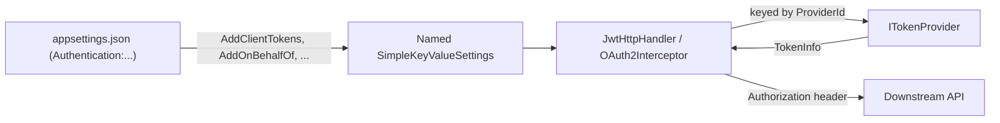

# Token providers

A token provider gets the token that a call to another API carries. This page lists the
providers Arc4u ships, explains how a handler picks one, and shows how to configure the
scenarios of an ASP.NET Core back end: forward the user's token, exchange it on behalf of the
user, or use an application identity. The concept is summarized in the
[glossary](../../concepts/glossary.md#token-provider); how the token is attached to the call is
in [HttpClient and gRPC clients](httpclient-grpc.md).

## How a provider is selected

Three pieces take part in every call:

- **Named settings**: a <xref:Arc4u.Configuration.SimpleKeyValueSettings> registered as a
  named option (read it with `IOptionsMonitor<SimpleKeyValueSettings>.Get(name)`). The key
  `ProviderId` names the provider, `AuthenticationType` says for which caller the settings
  apply, and the other keys (`ClientId`, `Scope`, ...) are read by the provider. The key names
  are the constants of <xref:Arc4u.OAuth2.Token.TokenKeys>.
- **A token provider**: an <xref:Arc4u.OAuth2.Token.ITokenProvider> registered as a keyed
  service, whose key is the `ProviderId` value.
- **A handler**: an HttpClient `DelegatingHandler` or a gRPC interceptor built with the
  settings. For each call it resolves the keyed provider, calls
  <xref:Arc4u.OAuth2.Token.ITokenProvider.GetTokenAsync*> with the settings, and writes the
  header.



`AuthenticationType` decides whose token is sent:

- `Inject`: the provider's token is sent whoever the caller is. The application identity
  scenarios (client credentials, user name and password, remote secret) use it by default.
  The token type returned by the provider becomes the scheme: `Bearer` and `Basic` go in the
  `Authorization` header, any other value is used as the name of a custom header.
- Any other value: no token is sent when the current user was authenticated with another
  authentication type, and the scheme is always `Bearer`. The settings that Arc4u registers
  for the user's own token use `OAuth2` (bearer token of an API call) and `Cookies` (user signed
  in with OpenID Connect). The HttpClient handler checks that the settings value contains the
  identity's authentication type; the gRPC interceptor checks that they are equal. See
  [HttpClient and gRPC clients](httpclient-grpc.md#how-the-handlers-decide).

## Built-in token providers

Each provider exposes its key as a `ProviderName` constant (`TokenProviderName` for
`OidcClientIdentityModelTokenProvider`). Register the ones you use as keyed services under that
key, as shown in the scenarios below.

| Key | Type | Package | Token it returns |
|---|---|---|---|
| `Bootstrap` | <xref:Arc4u.OAuth2.TokenProviders.BootstrapContextTokenProvider> | `Arc4u.OAuth2.AspNetCore.Authentication` | The access token of the incoming request, kept in the `BootstrapContext` of the current identity. Fails when it is expired. |
| `Oidc` | <xref:Arc4u.OAuth2.TokenProviders.OidcTokenProvider> | `Arc4u.OAuth2.AspNetCore.Authentication` | The access token of a user signed in with OpenID Connect and a cookie, refreshed with the refresh token when it is about to expire. |
| `Obo` | <xref:Arc4u.OAuth2.TokenProviders.AzureADOboTokenProvider> | `Arc4u.OAuth2.AspNetCore.Authentication` | A token for another API, exchanged for the user's token with the on-behalf-of grant. |
| `ClientCredentials` | <xref:Arc4u.OAuth2.TokenProvider.ClientCredentialsTokenProvider> | `Arc4u.OAuth2.AspNetCore` | An application token (client credentials grant). |
| `Credential` | <xref:Arc4u.OAuth2.TokenProvider.CredentialTokenCacheTokenProvider> | `Arc4u.OAuth2.AspNetCore` | A token for a fixed user name and password (password grant), requested through the `CredentialDirect` <xref:Arc4u.OAuth2.TokenProvider.CredentialTokenProvider>. |
| `RemoteSecret` | <xref:Arc4u.OAuth2.TokenProvider.RemoteClientSecretTokenProvider> | `Arc4u.OAuth2.AspNetCore` | No call to an identity provider: the configured secret, sent in the configured header. |
| `Client` | <xref:Arc4u.OAuth2.TokenProvider.ClientTokenProvider> | `Arc4u.OAuth2.Blazor` | The user's token, fetched by a Blazor WebAssembly app from its server. See [Blazor](blazor.md). |
| `blazor` | <xref:Arc4u.OAuth2.TokenProvider.BlazorTokenProvider>, <xref:Arc4u.OAuth2.TokenProvider.BlazorMsalTokenProvider> | `Arc4u.OAuth2.Blazor` | The user's token in a Blazor WebAssembly app. See [Blazor](blazor.md). |
| `OidcClientIdentityModel` | <xref:Arc4u.OAuth2.Client.Authentication.TokenProvider.OidcClientIdentityModelTokenProvider> | `Arc4u.OAuth2.Client.Authentication` | The user's token in a desktop or mobile app. See [Desktop and mobile clients](desktop.md). |
| `usernamePassword` | <xref:Arc4u.OAuth2.Token.UsernamePasswordTokenProvider> | `Arc4u.OAuth2.Client` | A token for credentials that the user of a client app enters. See [Desktop and mobile clients](desktop.md). |

The table below shows which registration method produces the settings each provider reads.

| Scenario | Registration method | Section | Settings name | `ProviderId` | `AuthenticationType` |
|---|---|---|---|---|---|
| [Forward the user's token (API)](#forward-the-users-token) | `ConfigureOAuth2Settings`, called by `AddJwtAuthentication` and `AddHybridAuthentication` | `Authentication:OAuth2.Settings` | `OAuth2` | `Bootstrap` | `OAuth2` |
| [Forward the user's token (web app)](#forward-the-users-token) | `ConfigureOpenIdSettings`, called by `AddOidcAuthentication` and `AddHybridAuthentication` | `Authentication:OpenId.Settings` | `Cookies` | `Oidc` | `Cookies` |
| [On-behalf-of](#call-an-api-on-behalf-of-the-user) | `AddOnBehalfOf` | `Authentication:OnBehalfOf` | the entry name | `Obo` | `Inject` |
| [Client credentials](#call-an-api-with-the-application-identity) | `AddClientTokens` | `Authentication:ClientTokens` | the entry name | `ClientCredentials` | `Inject` |
| [User name and password](#call-an-api-with-a-user-name-and-password) | `AddClientTokens` | `Authentication:ClientTokens` | the entry name | `Credential` | `Inject` |
| [Remote secret](#send-a-remote-secret) | `AddRemoteSecretsAuthentication` | `Authentication:RemoteSecrets` | the entry name | `RemoteSecret` | `Inject` |

The `ProviderId` and `AuthenticationType` columns are the defaults; most sections let you
override them. The server-side registration methods and their sections are described in
[Server authentication](../authentication-server/index.md).

## Forward the user's token

Use it when an API calls another API that accepts the same token (same audience), or when a
web app calls its own API with the token of the signed-in user.

`AddJwtAuthentication` registers the settings named `OAuth2` and `AddOidcAuthentication`
registers the settings named `Cookies`; `AddHybridAuthentication` registers both. Register the
matching provider, then build the handler with those settings:

```csharp
// Program.cs
using Arc4u.OAuth2.Token;
using Arc4u.OAuth2.TokenProviders;

var builder = WebApplication.CreateBuilder(args);

// ... authentication: see the Server authentication guide.

builder.Services.AddKeyedScoped<ITokenProvider, BootstrapContextTokenProvider>(BootstrapContextTokenProvider.ProviderName);
builder.Services.AddKeyedScoped<ITokenProvider, OidcTokenProvider>(OidcTokenProvider.ProviderName);

var app = builder.Build();
app.Run();
```

`OidcTokenProvider` also needs an `ITokenRefreshProvider`:
<xref:Arc4u.OAuth2.TokenProviders.RefreshTokenProvider> redeems the refresh token with the client
ID, client secret and authority of the OpenID Connect scheme.

Pass the settings named `OAuth2` to one handler and the settings named `Cookies` to another, and
chain them (see [Chain several handlers](httpclient-grpc.md#chain-several-handlers)): each one
sends the token only when the caller used its authentication type.

## Call an API on behalf of the user

The on-behalf-of flow exchanges the user's token for a token whose audience is the downstream
API. Use it when the downstream API does not accept the token your API received.
<xref:Arc4u.OAuth2.TokenProviders.AzureADOboTokenProvider> posts the exchange
(`grant_type=urn:ietf:params:oauth:grant-type:jwt-bearer`, `requested_token_use=on_behalf_of`)
to the token endpoint of the `Default` authority, and caches the result until it expires. The
user's token is the `BootstrapContext` of the current identity or, when there is none, the
access token kept by the cookie authentication.

```json
{
  "Authentication": {
    "DefaultAuthority": {
      "Url": "https://login.microsoftonline.com/<tenant-id>/v2.0"
    },
    "OnBehalfOf": {
      "Inventory": {
        "ClientId": "<client-id>",
        "ClientSecret": "<client-secret>",
        "Scopes": [ "api://inventory/.default" ],
        "AuthenticationType": "OAuth2"
      }
    }
  }
}
```

`AddOnBehalfOf(builder.Configuration)` reads `Authentication:OnBehalfOf` (pass `sectionName` to
use another section) and registers one settings entry per child, named after the child
(`Inventory` here). The configuration based `AddOidcAuthentication` and `AddHybridAuthentication`
already call it with the default section: do not call it a second time, see
[Troubleshooting](index.md#an-item-with-the-same-key-has-already-been-added).
`AddOnBehalfOfSettings(options, optionKey)` registers one entry from code.

| Key | Type | Default | Description |
|---|---|---|---|
| `Authentication:OnBehalfOf:<name>:ClientId` | `string` | none (required) | Client ID of your application. |
| `Authentication:OnBehalfOf:<name>:ClientSecret` | `string` | none (required) | Client secret of your application. |
| `Authentication:OnBehalfOf:<name>:Scopes` | `string[]` | none (required) | Scopes requested for the downstream API. |
| `Authentication:OnBehalfOf:<name>:AuthenticationType` | `string` | `Inject` | See the warning below. |
| `Authentication:OnBehalfOf:<name>:ProviderId` | `string` | `Obo` | Key of the token provider. |

> [!WARNING]
> Set `AuthenticationType` to the authentication type of your callers: `OAuth2` in an API,
> `Cookies` in a web app. With the default `Inject`, the handler uses the token type as the
> scheme, and the on-behalf-of provider returns the type `access_token`: the token is sent in a
> header named `access_token` instead of `Authorization: Bearer`, and the downstream API
> rejects the call (known issue).

Register the provider and the services it uses: the scoped `TokenRefreshInfo` (already registered
by `AddOidcAuthentication`, not by `AddJwtAuthentication`), an `ICacheHelper` that gives the cache
for the exchanged tokens (see [Caching](../caching/index.md)) and an `IActivitySourceFactory`.

```csharp
builder.Services.AddOnBehalfOf(builder.Configuration);
builder.Services.AddScoped<TokenRefreshInfo>();
builder.Services.AddKeyedScoped<ITokenProvider, AzureADOboTokenProvider>(AzureADOboTokenProvider.ProviderName);
```

## Call an API with the application identity

Use the client credentials grant for calls that do not depend on a user: background jobs,
calls to a technical API, or when the downstream API authorizes your application rather than
the user. Declare one entry per downstream API in `Authentication:ClientTokens`:

```json
{
  "Authentication": {
    "DefaultAuthority": {
      "Url": "https://login.microsoftonline.com/<tenant-id>/v2.0"
    },
    "ClientTokens": {
      "Inventory": {
        "Scenario": "ClientCredentials",
        "Scopes": [ "api://inventory/.default" ],
        "Settings": {
          "ClientId": "<client-id>",
          "ClientSecret": "<client-secret>"
        }
      }
    }
  }
}
```

```csharp
builder.Services.AddDefaultAuthority(builder.Configuration);
builder.Services.AddClientTokens(builder.Configuration);
builder.Services.AddKeyedSingleton<ITokenProvider, ClientCredentialsTokenProvider>(ClientCredentialsTokenProvider.ProviderName);
```

`AddClientTokens` reads `Authentication:ClientTokens` (pass `sectionName` to use another
section), validates every entry and throws a `ConfigurationException` at registration when one is
invalid. Each entry becomes the settings named after it (`Inventory` here). The configuration
based `AddJwtAuthentication` already calls it; calling it again is harmless, an entry is
registered only once.

<xref:Arc4u.OAuth2.TokenProvider.ClientCredentialsTokenProvider> sends the client ID and secret
in an `Authorization: Basic` header (`client_secret_basic`), and the scope and any extra
parameter in the form body. It caches the token in the registered `ITokenCache` (see the
[shortest setup](index.md#code) for its registration) and requests a new one when the cached token
expires in less than one minute.

| Key | Type | Default | Description |
|---|---|---|---|
| `Authentication:ClientTokens:<name>:Scenario` | `string` | none (required) | `ClientCredentials`, `UserPassword` or `Basic`. |
| `Authentication:ClientTokens:<name>:Scopes` | `string[]` | `openid` | Scopes requested, joined with spaces. |
| `Authentication:ClientTokens:<name>:AuthenticationType` | `string` | `Inject` | See [How a provider is selected](#how-a-provider-is-selected). |
| `Authentication:ClientTokens:<name>:Authority` | object | the `Default` authority | An authority for this entry only (`Url`, `TokenEndpoint`, `Issuer`, `MetaDataAddress`), registered under the entry name. |
| `Authentication:ClientTokens:<name>:Settings:ClientId` | `string` | none (required) | Client ID of your application. |
| `Authentication:ClientTokens:<name>:Settings:ClientSecret` | `string` | none (required) | Client secret of your application. |
| `Authentication:ClientTokens:<name>:Settings:<other>` | `string` | none | Any other key is sent to the token endpoint as an extra form parameter, for example `resource`. See [Cache keys](#cache-keys). |

The `Default` authority comes from `Authentication:DefaultAuthority`, read by
`AddDefaultAuthority`. When `TokenEndpoint` is not set, the token endpoint is read from the
OpenID Connect metadata of the authority (`<Url>/.well-known/openid-configuration`, or
`MetaDataAddress`).

## Call an API with a user name and password

Some identity providers issue a token for a technical account with the password grant. The
`UserPassword` scenario takes the user name and the password as two keys, the `Basic` scenario
takes them as one `user:password` value:

```json
{
  "Authentication": {
    "DefaultAuthority": {
      "Url": "https://sts.example.com/realms/example"
    },
    "ClientTokens": {
      "Reporting": {
        "Scenario": "UserPassword",
        "Scopes": [ "openid" ],
        "Settings": {
          "ClientId": "<client-id>",
          "User": "<user>",
          "Password": "<password>"
        }
      },
      "Archive": {
        "Scenario": "Basic",
        "Settings": {
          "ClientId": "<client-id>",
          "Credential": "<user>:<password>"
        }
      }
    }
  }
}
```

Both scenarios use the `Credential` provider, which caches the token and asks the `CredentialDirect`
provider for a new one when it expires in less than one minute. `ClientSecret` is optional in the
`Settings` of both scenarios, for identity providers that require it with the password grant.
Unlike the client credentials scenario, other `Settings` keys are not sent to the token endpoint.

```csharp
builder.Services.AddDefaultAuthority(builder.Configuration);
builder.Services.AddClientTokens(builder.Configuration);
builder.Services.AddKeyedTransient<ITokenProvider, CredentialTokenCacheTokenProvider>(CredentialTokenCacheTokenProvider.ProviderName);
builder.Services.AddKeyedSingleton<ICredentialTokenProvider, CredentialTokenProvider>(CredentialTokenProvider.ProviderName);
```

`CredentialTokenCacheTokenProvider` also needs the `ITokenCache` of the
[shortest setup](index.md#code). Without the `Default` authority (registered by
`AddDefaultAuthority` or by the server authentication), every call throws
`NotSupportedException: The 'about' scheme is not supported.`

> [!CAUTION]
> Keep passwords and client secrets out of `appsettings.json` in source control: use user
> secrets, environment variables, a vault, or the encrypted values of the
> [Configuration](../configuration/index.md) guide.

## Send a remote secret

A remote secret is not a token: it is a value (typically an encrypted `user:password` pair) that
your service sends in a header, and that the receiving service turns into a token with its Basic
authentication middleware (see [Server authentication](../authentication-server/index.md)).
<xref:Arc4u.OAuth2.TokenProvider.RemoteClientSecretTokenProvider> calls no identity provider.

```json
{
  "Authentication": {
    "RemoteSecrets": {
      "Billing": {
        "ClientSecret": "<encrypted-secret>",
        "HeaderKey": "SecretKey"
      }
    }
  }
}
```

```csharp
builder.Services.AddRemoteSecretsAuthentication(builder.Configuration);
builder.Services.AddKeyedSingleton<ITokenProvider, RemoteClientSecretTokenProvider>(RemoteClientSecretTokenProvider.ProviderName);
```

`AddRemoteSecretsAuthentication` reads `Authentication:RemoteSecrets` (pass `sectionName` to use
another section). The configuration based `AddJwtAuthentication` already calls it.

| Key | Type | Default | Description |
|---|---|---|---|
| `Authentication:RemoteSecrets:<name>:ClientSecret` | `string` | none (required) | The value to send. |
| `Authentication:RemoteSecrets:<name>:HeaderKey` | `string` | `SecretKey` | The header that carries the value. `Basic` sends `Authorization: Basic <value>`. |
| `Authentication:RemoteSecrets:<name>:AuthenticationType` | `string` | `Inject` | Keep `Inject`: the header name is taken from the token type only in that mode. |
| `Authentication:RemoteSecrets:<name>:ProviderId` | `string` | `RemoteSecret` | Key of the token provider. |

## Cache keys

The providers cache the tokens they obtain. A cache key contains every value that changes the
token, and the secret parts (user token, password, client secret) are hashed with SHA-256 through
<xref:Arc4u.OAuth2.Token.TokenCacheKey>. The hash is the same in every process, so with a
distributed cache (Redis, SQL Server) the entries are shared between instances and survive a
restart:

| Provider | Key |
|---|---|
| `ClientCredentials` | `ClientCredentials_<client-id>_<hash>`, the hash covers the authority URL, the scope, the client secret and the extra parameters (for example `resource`, in any order). |
| `Credential` | `Credential_<user>_<hash>`, the hash covers the authority URL, the scope, the user and the password. |
| `Obo` | `_Obo_<client-id>_<hash>`, the hash covers the authority URL, the user's token and the scope. |

Two `ClientTokens` entries that differ only by an extra parameter such as `resource` get their
own cached token.

## Write your own token provider

Implement <xref:Arc4u.OAuth2.Token.ITokenProvider>, register it as a keyed service, and put its
key in the `ProviderId` of the settings. `GetTokenAsync` returns a `Result<TokenInfo>`: return a
failed result rather than throwing when no token is available, the handlers then send the call
without a token.

```csharp
using Arc4u;
using Arc4u.OAuth2.Token;
using FluentResults;

public sealed class StaticTokenProvider : ITokenProvider
{
    public const string ProviderName = "Static";

    public Task<Result<TokenInfo>> GetTokenAsync(IKeyValueSettings? settings, object? platformParameters)
    {
        if (settings is null || !settings.Values.TryGetValue("Token", out var token))
        {
            return Task.FromResult(Result.Fail<TokenInfo>("No token configured."));
        }

        return Task.FromResult(Result.Ok(new TokenInfo("Bearer", token, DateTime.UtcNow.AddMinutes(5))));
    }

    public ValueTask SignOutAsync(IKeyValueSettings settings, CancellationToken cancellationToken) => ValueTask.CompletedTask;
}
```

```csharp
builder.Services.AddKeyedSingleton<ITokenProvider, StaticTokenProvider>(StaticTokenProvider.ProviderName);
```

To add a scenario to `Authentication:ClientTokens`, implement
<xref:Arc4u.OAuth2.TokenProvider.Scenarios.IClientTokenScenario> (its validation rules and the
settings it writes) and register it before `AddClientTokens` runs, keeping the built-in ones.
Here `MyScenario` is your implementation:

```csharp
ClientTokensExtension.SetScenarioResolver(discriminator => discriminator switch
{
    "MyScenario" => new MyScenario(),
    _ => ClientTokensExtension.DefaultScenario(discriminator)
});
```

## See also

- [HttpClient and gRPC clients](httpclient-grpc.md)
- [Server authentication](../authentication-server/index.md)
- [Caching](../caching/index.md), for the cache that keeps the tokens
- <xref:Arc4u.OAuth2.Token> in the API reference
