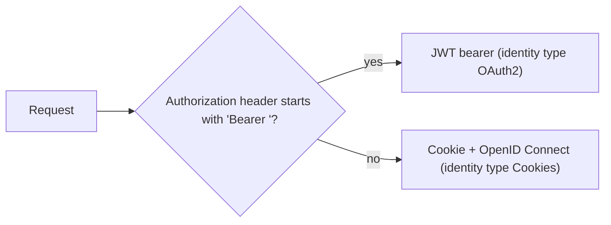

# Hybrid

Use `AddHybridAuthentication` when the same application serves browser users and API clients: for example a
backend for frontend that also exposes an API, or a service whose Swagger UI is used from a browser. It
combines [OpenID Connect and cookie](oidc-cookie.md) with [JWT bearer](jwt-bearer.md); both produce the same
[AppPrincipal](../../concepts/glossary.md#appprincipal). Start with the [overview](index.md) for the services
every scenario registers.

## How a request is authenticated

The default authentication scheme is the `Arc4uScheme` policy scheme. It selects the handler for each
request:



The default **challenge** scheme is JWT bearer: an unauthenticated request to a protected endpoint gets a
401, not a redirection to the sign-in page. Browser pages that must redirect to the identity provider use
the [forced OpenID Connect middleware](#send-browser-users-to-the-sign-in-page).

## Configuration

<xref:Arc4u.OAuth2.Extensions.AuthenticationExtensions.AddHybridAuthentication*> reads the same sections as
`AddOidcAuthentication` ([OpenID Connect and cookie](oidc-cookie.md#configuration)) into
<xref:Arc4u.OAuth2.Options.HybridAuthenticationSectionOptions>, plus:

| Key | Type | Default | Description |
|---|---|---|---|
| `Authentication:OAuth2SettingsSectionPath` | string | `Authentication:OAuth2.Settings` | Section of the JWT bearer settings, see [OAuth2 settings](jwt-bearer.md#configuration). The section is required: without an audience (or `ValidateAudience: false`) the registration throws `ConfigurationException: Audiences field is not defined.` |
| `Authentication:BasicAuthenticationSectionPath` | string | `Authentication:Basic` | Optional Basic authentication settings, see [Accept Basic credentials](jwt-bearer.md#accept-basic-credentials). Nothing is registered when the section is missing. |

### appsettings.json

```json
{
  "Application.configuration": { "ApplicationName": "MyApp" },
  "Caching": {
    "Default": "Volatile",
    "Caches": [
      {
        "Name": "Volatile",
        "Kind": "Memory",
        "IsAutoStart": true,
        "Settings": { "SizeLimitInMB": 10 }
      }
    ]
  },
  "Authentication": {
    "DefaultAuthority": { "Url": "https://login.example.com/my-tenant/v2.0" },
    "CookieName": ".MyApp.Cookies",
    "OpenId.Settings": {
      "ClientId": "my-client-id",
      "ClientSecret": "<client-secret>",
      "Audiences": [ "api://my-api" ],
      "Scopes": [ "openid", "profile", "offline_access", "api://my-api/access" ]
    },
    "OAuth2.Settings": { "Audiences": [ "api://my-api" ] },
    "ClaimsMiddleWare": {
      "ForceOpenId": { "ForceAuthenticationForPaths": [ "/swagger*" ] }
    },
    "DataProtection": {
      "EncryptionCertificate": { "Store": { "Name": "MyAppCertificate" } },
      "CacheStore": { "CacheKey": "DataProtection", "CacheName": "Volatile" }
    },
    "TokenCache": { "CacheName": "Volatile" }
  }
}
```

### Code

```csharp
using Arc4u.OAuth2.Extensions;
using Arc4u.OAuth2.Middleware;
using Arc4u.OAuth2.Token;
using Arc4u.OAuth2.TokenProviders;

// ... the Arc4u services of the overview ...
builder.Services.AddTransient<ITokenRefreshProvider, RefreshTokenProvider>();
builder.Services.AddKeyedTransient<ITokenProvider, OidcTokenProvider>(OidcTokenProvider.ProviderName);

builder.Services.AddHybridAuthentication(builder.Configuration);
builder.Services.AddForceOpenId(builder.Configuration);
builder.Services.AddAuthorization();

var app = builder.Build();

app.UseAuthentication();
app.UseForceOpenId();
app.UseAuthorization();
```

The code overload `AddHybridAuthentication(Action<HybridAuthenticationOptions>)` takes the options of the OpenID
Connect code overload plus `OAuth2SettingsOptions`, which is required.

> [!WARNING]
> Known issue: both `AddHybridAuthentication` overloads ignore `ValidateAudience` and `ValidateAuthority` of the
> options; the OpenID Connect checks stay enabled. Use the `PostConfigure<OidcAuthenticationOptions>` workaround
> of [Disable the audience check](oidc-cookie.md#disable-the-audience-check).

## Common scenarios

### Send browser users to the sign-in page

`UseForceOpenId()` challenges the OpenID Connect scheme for unauthenticated requests whose path matches
`ForceAuthenticationForPaths`, even when the endpoint does not require authorization (static Swagger UI files,
for example). After the sign-in, the user comes back to the requested path and query string.
`AddForceOpenId(configuration)` reads `Authentication:ClaimsMiddleWare:ForceOpenId`; pass `sectionName` to
use another section, or configure it from code with `AddForceOpenId(options => ...)`.

| Key | Type | Default | Description |
|---|---|---|---|
| `ForceAuthenticationForPaths` | string array | empty | Paths matched from the start of the request path, ignoring case. `*` matches any characters (`/swagger*`). The middleware does nothing when the list is empty. |
| `RedirectUrlForAuthority` | string | empty | Absolute base URL of the application as users see it (behind a reverse proxy). After the sign-in the user is sent to the requested path on this base URL instead of the URL of the request. |

Call `UseForceOpenId()` after `UseAuthentication()`. It also works with `AddOidcAuthentication`.

### Call the API from the browser session

A page served by the application can call its own API with the session cookie: without a `Bearer` header,
the request uses the cookie. Code written for bearer tokens can get the token from the `BootstrapContext`
when `app.UseOpenIdBearerInjector()` runs after `UseAuthentication()` (see
[Use the user's access token](oidc-cookie.md#use-the-users-access-token)).

## Troubleshooting

### Browser requests get a 401 instead of the sign-in page

The default challenge scheme is JWT bearer. Add the path to `ForceAuthenticationForPaths`, or challenge the
`OpenIdConnect` scheme yourself (`Results.Challenge(authenticationSchemes: ["OpenIdConnect"])`).

### "Audiences field is not defined." at startup

The `Authentication:OAuth2.Settings` section is missing or has no audience. It is required in hybrid mode.

## See also

- [JWT bearer](jwt-bearer.md)
- [OpenID Connect and cookie](oidc-cookie.md)
- [Server authentication](index.md)
- <xref:Arc4u.OAuth2.Options.HybridAuthenticationSectionOptions> and <xref:Arc4u.OAuth2.Middleware.ForceOpenIdMiddleWareOptions> in the API reference
