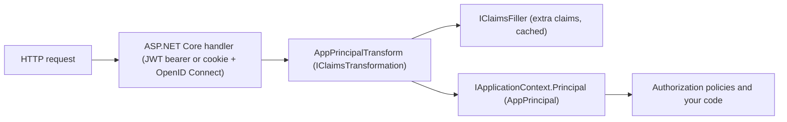

# Server authentication

Arc4u configures the ASP.NET Core authentication handlers (JWT bearer, OpenID Connect with a cookie, or
both) from the `Authentication` section of your configuration, and turns every authenticated user into an
[AppPrincipal](../../concepts/glossary.md#appprincipal): a `ClaimsPrincipal` that also carries the user
profile and the Arc4u authorization (roles, operations and scopes). Read this guide when you build an API or
a web application that must authenticate users against an identity provider such as Microsoft Entra ID,
Azure AD B2C, ADFS, Keycloak or ForgeRock. The principal is stored in the
[application context](../../concepts/glossary.md#application-context), described in
[Concepts](../../concepts/index.md). The services are registered through dependency injection, as described in
[Design principles](../../concepts/design-principles.md); where authentication sits in the layers of an Arc4u
application is shown in [Architecture](../../concepts/architecture.md).

## What it solves

ASP.NET Core already validates tokens and runs the OpenID Connect protocol. Arc4u adds:

- one registration call per scenario that reads a documented configuration section and wires the handlers,
  the events, the cookie and the data protection keys consistently;
- the refresh of the user's access token in a cookie session, before it expires;
- the creation of an `AppPrincipal` for each request: profile, authorization and optional extra claims loaded
  once and cached ([claims filler](../../concepts/glossary.md#claims-filler));
- authorization policies built from the Arc4u operations, usable with `[Authorize(Policy = ...)]`;
- a few middlewares for real deployments: forced login on browser paths, TLS termination in front of the
  application, Basic credentials converted into a bearer token.

Arc4u leaves the protocol itself to ASP.NET Core (`Microsoft.AspNetCore.Authentication.JwtBearer` and
`Microsoft.AspNetCore.Authentication.OpenIdConnect`) and the storage of tokens, tickets and keys to the
[Arc4u caches](../caching/index.md).

The following diagram shows what happens to an authenticated request.



## Packages involved

| Package | Use it for |
|---|---|
| `Arc4u.OAuth2.AspNetCore.Authentication` | `AddJwtAuthentication`, `AddOidcAuthentication` and `AddHybridAuthentication`, their events, the cookie ticket store and the data protection key store. |
| `Arc4u.OAuth2.AspNetCore` | The creation of the `AppPrincipal` (`AppPrincipalTransform`), the middlewares (forced OpenID Connect login, Basic authentication, bearer injection, resource rights) and the server-side token providers. |
| `Arc4u.OAuth2` | The options shared by all scenarios (authority, token cache, claims filler, claim identifiers) and the default claims filler. |
| `Arc4u.Authorization` | Authorization policies built from Arc4u operations and scopes. |

`Arc4u.OAuth2.AspNetCore.Authentication` references `Arc4u.OAuth2.AspNetCore`, which references
`Arc4u.OAuth2`. Install `Arc4u.Authorization` only if you use its policies.

## Install

```bash
dotnet add package Arc4u.OAuth2.AspNetCore.Authentication --prerelease
dotnet add package Arc4u.Authorization --prerelease
```

The samples of this guide also use a memory cache and the JSON serializer:

```bash
dotnet add package Arc4u.Caching.Memory --prerelease
dotnet add package Arc4u.Serializer.JSon --prerelease
```

You need an application registered in your identity provider: its authority URL, and for OpenID Connect a
client id, a client secret and the redirect URI `https://<your-host>/signin-oidc`.
[Identity providers](identity-providers.md) lists what is specific to each provider.

## Configuration

Each registration method reads the `Authentication` section; pass `authenticationSectionName` to use
another one. The section paths below are the defaults: each one can be changed by a `...SectionPath` key of
the scenario (see the scenario pages). The keys specific to each scenario are described in
[JWT bearer](jwt-bearer.md), [OpenID Connect and cookie](oidc-cookie.md) and [Hybrid](hybrid.md).

### appsettings.json

The smallest configuration, for an API that accepts JWT bearer tokens:

```json
{
  "Caching": {
    "Default": "Volatile",
    "Caches": [
      {
        "Name": "Volatile",
        "Kind": "Memory",
        "IsAutoStart": true,
        "Settings": { "SizeLimitInMB": 10 }
      }
    ]
  },
  "Authentication": {
    "DefaultAuthority": { "Url": "https://login.example.com/my-tenant/v2.0" },
    "OAuth2.Settings": { "Audiences": [ "api://my-api" ] },
    "TokenCache": { "CacheName": "Volatile" }
  }
}
```

The `Caching` section is described in the [caching guide](../caching/index.md). The sections shared by
all scenarios are:

| Key | Type | Default | Description |
|---|---|---|---|
| `Authentication:DefaultAuthority:Url` | URI | none (required) | Base URL of the identity provider. For OpenID Connect it must be equal to the `iss` claim of the access tokens. |
| `Authentication:DefaultAuthority:MetaDataAddress` | URI | `Url` + `/.well-known/openid-configuration` | Address of the OpenID Connect metadata document. Set it when the provider publishes the document elsewhere. When it starts with `http://`, HTTPS is not required for the metadata. |
| `Authentication:DefaultAuthority:TokenEndpoint` | URI | read from the metadata | Token endpoint, used by the token providers. |
| `Authentication:TokenCache:CacheName` | string | none (required) | Name of the [named cache](../../concepts/glossary.md#named-cache) that stores tokens and extra claims. When the name is unknown, the default cache is used. |
| `Authentication:TokenCache:MaxTime` | TimeSpan | `00:50:00` | Lifetime of a cached entry, including the extra claims of a user. |
| `Authentication:ClaimsIdentifier` | string array | `http://schemas.microsoft.com/identity/claims/objectidentifier`, `oid` | Claim types that identify a user. The first one found is used as cache key for the extra claims. |
| `Authentication:ClaimsMiddleWare:ClaimsFiller` | object | see [Claims and authorization](claims-and-authorization.md#claims-filler-options) | Extra claims loaded when the principal is created. |
| `Authentication:DomainsMapping` | object | empty | Maps the domain part of a `upn` claim to the domain of the user profile, for example `"contoso.com": "CONTOSO"`. |

### Code

`AddJwtAuthentication`, `AddOidcAuthentication` and `AddHybridAuthentication` register the handlers and
their options. The services that create the `AppPrincipal` and the caches are registered by your
application:

```csharp
// Program.cs
using Arc4u.Caching;
using Arc4u.Caching.Memory;
using Arc4u.OAuth2;
using Arc4u.OAuth2.Extensions;
using Arc4u.OAuth2.Security;
using Arc4u.OAuth2.Security.Principal;
using Arc4u.OAuth2.Token;
using Arc4u.Security.Principal;
using Arc4u.Serializer;
using Microsoft.AspNetCore.Authentication;

var builder = WebApplication.CreateBuilder(args);

// Application context (scoped), logger and activity source.
builder.Services.AddApplicationContext();

// Caches for the tokens and the extra claims.
builder.Services.AddCacheContext(builder.Configuration);
builder.Services.AddKeyedTransient<ICache, MemoryCache>("Memory");
builder.Services.AddSingleton<IObjectSerialization, JsonSerialization>();

// Creation of the AppPrincipal.
builder.Services.AddScoped<IClaimsTransformation, AppPrincipalTransform>();
builder.Services.AddSingleton<IClaimProfileFiller, ClaimsProfileFiller>();
builder.Services.AddSingleton<IClaimAuthorizationFiller, ClaimsAuthorizationFiller>();
builder.Services.AddTransient<IClaimsFiller, ClaimsBearerTokenExtractor>();
builder.Services.AddSingleton<ICacheHelper, CacheHelper>();
builder.Services.AddSingleton<ICacheKeyGenerator, KeyGeneratorFromIdentity>();
builder.Services.AddSingleton<IUserObjectIdentifier, UserObjectIdentifier>();

// Authentication and authorization.
builder.Services.AddJwtAuthentication(builder.Configuration);
builder.Services.AddAuthorization();

var app = builder.Build();

app.UseAuthentication();
app.UseAuthorization();

app.MapGet("/me", (IApplicationContext context) => context.Principal!.Profile.DisplayName)
   .RequireAuthorization();

app.Run();
```

- `AddAuthorization()` is required: the Arc4u methods only call `AddAuthorizationCore()`, and
  `UseAuthorization()` throws without it.
- `AddApplicationContext()` registers `IApplicationContext` as a scoped service: each request has its own
  principal.

> [!TIP]
> The Arc4u types above carry `[Export]` attributes, so the `Arc4u.Dependency.Tool` source generator can
> register them from the `Application.Dependency:RegisterTypes` list of your configuration (see
> [Dependency injection](../dependency-injection/index.md)). Keep `AddApplicationContext()` in code:
> `ApplicationInstanceContext` is exported as a singleton, which is only right for desktop applications.

## Common scenarios

### Protect an API with JWT bearer tokens

Call `AddJwtAuthentication`. Clients send `Authorization: Bearer <token>`; the audience, the signature and
the lifetime of the token are validated. See [JWT bearer](jwt-bearer.md), which also shows how to accept
Basic credentials.

### Sign users in to a web application

Call `AddOidcAuthentication`. Unauthenticated requests are redirected to the identity provider, the user
session is kept in a cookie and the access token is refreshed before it expires. See
[OpenID Connect and cookie](oidc-cookie.md).

### Serve pages and an API from the same application

Call `AddHybridAuthentication`. Requests with a `Bearer` header use JWT bearer, the others use the cookie.
See [Hybrid](hybrid.md).

### Grant access from the user's operations

Load the user's rights with a claims filler and protect endpoints with policies named after the Arc4u
operations. See [Claims and authorization](claims-and-authorization.md).

### Run behind a reverse proxy or with a private certificate authority

When TLS ends before the application, see
[TLS termination](oidc-cookie.md#run-behind-a-tls-terminating-proxy). To trust services whose certificates
are issued by your own authority, see [Custom root CA](custom-root-ca.md).

### Call another API with the user's token

Obtaining tokens for outgoing calls (on-behalf-of, client credentials, `HttpClient` and gRPC handlers) is
covered in [Client authentication](../authentication-client/index.md).

## Extensibility points

The registration methods add their defaults with `TryAdd`, or you register the services yourself (see
[Code](#code)). Register your implementation instead of the default one.

| Service | Default implementation | Replace it to |
|---|---|---|
| <xref:Arc4u.Security.Principal.IClaimsFiller> | <xref:Arc4u.OAuth2.Security.Principal.ClaimsBearerTokenExtractor> | Load the user's rights and extra claims from your own store. |
| <xref:Arc4u.Security.Principal.IClaimAuthorizationFiller> | <xref:Arc4u.Security.Principal.ClaimsAuthorizationFiller> | Build the `Authorization` of the principal another way than from the Arc4u authorization claim. |
| <xref:Arc4u.Security.Principal.IClaimProfileFiller> | <xref:Arc4u.Security.Principal.ClaimsProfileFiller> | Build the `UserProfile` from other claims. |
| `IClaimsTransformation` | <xref:Arc4u.OAuth2.AppPrincipalTransform> | Create the principal yourself. |
| <xref:Arc4u.OAuth2.Security.IUserObjectIdentifier> | <xref:Arc4u.OAuth2.Security.UserObjectIdentifier> | Identify a user from something else than the `ClaimsIdentifier` claim types. |
| `JwtBearerEvents` | <xref:Arc4u.OAuth2.Events.StandardBearerEvents> | Change the 401 response or add checks on the token. Register it before the `Add...Authentication` call. |
| `OpenIdConnectEvents` | <xref:Arc4u.OAuth2.Events.StandardOpenIdConnectEvents> | Change the redirection to the identity provider or the error pages. Register it before the `Add...Authentication` call. |
| `CookieAuthenticationEvents` | <xref:Arc4u.OAuth2.Events.StandardCookieEvents> | Change the validation and refresh of the cookie session. Register it before the `Add...Authentication` call. |
| `ITicketStore` | <xref:Arc4u.OAuth2.TicketStore.CacheTicketStore> | Store the cookie session elsewhere. Register it before the `Add...Authentication` call. |
| <xref:Arc4u.OAuth2.Token.ITokenRefreshProvider> | <xref:Arc4u.OAuth2.TokenProviders.RefreshTokenProvider> | Refresh the tokens of a cookie session differently. |
| <xref:Arc4u.OAuth2.Token.ITokenProvider> (keyed) | `Oidc`, `Bootstrap`, `Obo`, `Credential`, ... | Provide a token for a `ProviderId` of your settings. |

For example, to answer an unauthenticated API call with a 401 whose `ProblemDetails.Status` is also 401,
derive from `StandardBearerEvents` (the override keeps the `x-token-expired` header of the base class):

```csharp
// MyBearerEvents.cs
using Arc4u.OAuth2.Events;
using Microsoft.AspNetCore.Authentication.JwtBearer;
using Microsoft.AspNetCore.Mvc;
using Microsoft.IdentityModel.Tokens;

public sealed class MyBearerEvents(ILogger<StandardBearerEvents> logger) : StandardBearerEvents(logger)
{
    public override async Task Challenge(JwtBearerChallengeContext context)
    {
        context.HandleResponse();
        context.Response.StatusCode = StatusCodes.Status401Unauthorized;
        if (context.AuthenticateFailure is SecurityTokenExpiredException expired)
        {
            context.Response.Headers.Append("x-token-expired", expired.Expires.ToString("o"));
        }

        await context.Response.WriteAsJsonAsync(new ProblemDetails
        {
            Title = context.Error ?? "Unauthorized",
            Detail = context.ErrorDescription,
            Status = StatusCodes.Status401Unauthorized,
        });
    }
}
```

```csharp
using Arc4u.OAuth2.Extensions;
using Microsoft.AspNetCore.Authentication.JwtBearer;

builder.Services.AddTransient<JwtBearerEvents, MyBearerEvents>();
builder.Services.AddJwtAuthentication(builder.Configuration);
```

## Troubleshooting

### The application throws at startup

Most registration errors name the missing key: `DefaultAuthority must be filled!`,
`Audiences field is not defined.`, `TokenCacheOptions.CacheName is not defined in the configuration file.`
or `Unable to find the required services... 'IServiceCollection.AddAuthorization'`. See
[Troubleshooting](troubleshooting.md#startup-errors).

### Every request returns 401 or 500

See [Troubleshooting](troubleshooting.md), which lists the symptoms reported in past issues with their
causes, and the known issues of `develop/9.0.0`.

## See also

- [JWT bearer](jwt-bearer.md), [OpenID Connect and cookie](oidc-cookie.md), [Hybrid](hybrid.md)
- [Claims and authorization](claims-and-authorization.md)
- [Identity providers](identity-providers.md)
- [Custom root CA](custom-root-ca.md)
- [Troubleshooting](troubleshooting.md)
- [Client authentication](../authentication-client/index.md)
- [Caching](../caching/index.md)
- [Authentication settings in the 8.x to 9 migration guide](../../migration/8x-to-9.md#authentication-settings-refactoring)
- <xref:Arc4u.OAuth2.Extensions.AuthenticationExtensions> and <xref:Arc4u.OAuth2.Options> in the API reference
