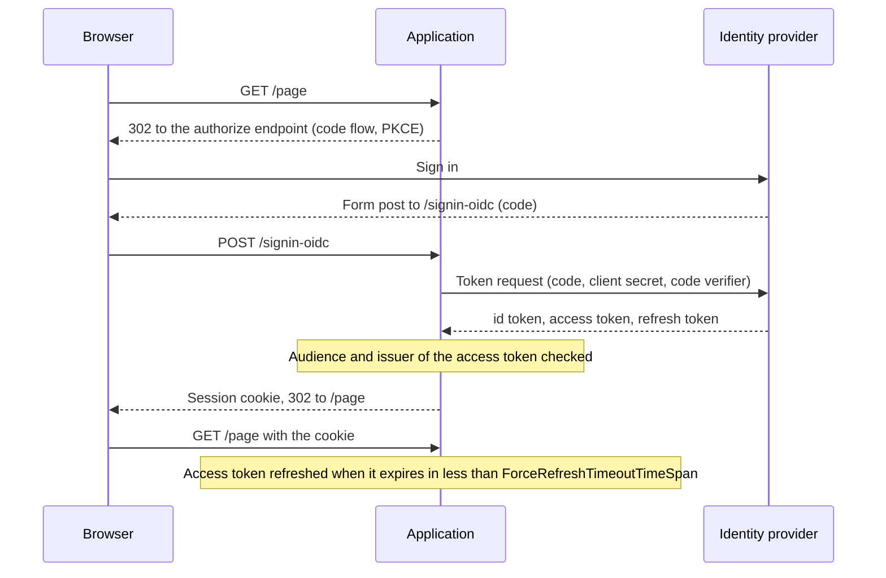

# OpenID Connect and cookie

Use `AddOidcAuthentication` for an application used from a browser: a server-rendered site, Blazor Server,
or a backend for frontend. Unauthenticated users are redirected to the identity provider, the session is kept
in a cookie, and the user's access token is refreshed before it expires, so the application can call other
APIs on behalf of the user. Each request gets an [AppPrincipal](../../concepts/glossary.md#appprincipal). Start
with the [overview](index.md) for the services every scenario registers.

## How it works

The following diagram shows the sign-in and a later request.



- The authorization code flow with PKCE is used; the response mode is always `form_post`.
- The tokens are saved in the authentication ticket. The ticket is stored in a cache and the cookie only
  holds its key.
- The identity of the user has the authentication type `Cookies`.

## Configuration

<xref:Arc4u.OAuth2.Extensions.AuthenticationExtensions.AddOidcAuthentication*> reads the `Authentication`
section (parameter `authenticationSectionName`) into
<xref:Arc4u.OAuth2.Options.OidcAuthenticationSectionOptions>, then the sections it points to.

### appsettings.json

```json
{
  "Application.configuration": { "ApplicationName": "MyApp" },
  "Caching": {
    "Default": "Volatile",
    "Caches": [
      {
        "Name": "Volatile",
        "Kind": "Memory",
        "IsAutoStart": true,
        "Settings": { "SizeLimitInMB": 10 }
      }
    ]
  },
  "Authentication": {
    "DefaultAuthority": { "Url": "https://login.example.com/my-tenant/v2.0" },
    "CookieName": ".MyApp.Cookies",
    "OpenId.Settings": {
      "ClientId": "my-client-id",
      "ClientSecret": "<client-secret>",
      "Audiences": [ "api://my-api" ],
      "Scopes": [ "openid", "profile", "offline_access", "api://my-api/access" ]
    },
    "DataProtection": {
      "EncryptionCertificate": { "Store": { "Name": "MyAppCertificate" } },
      "CacheStore": { "CacheKey": "DataProtection", "CacheName": "Volatile" }
    },
    "TokenCache": { "CacheName": "Volatile" }
  }
}
```

> [!IMPORTANT]
> A memory cache is enough to try the scenario. In production, store the data protection keys and the
> tickets in a cache shared by all instances and kept across restarts (Redis, SQL Server, Dapr), otherwise
> users lose their session when the application restarts or when a request reaches another instance.

### OpenID settings

The `Authentication:OpenId.Settings` section (<xref:Arc4u.OAuth2.Options.OpenIdSettingsOption>):

| Key | Type | Default | Description |
|---|---|---|---|
| `ClientId` | string | none (required) | Client id of the application in the identity provider. |
| `ClientSecret` | string | none | Client secret, sent to the token endpoint. Keep it out of `appsettings.json` (user secrets, environment variables or an [encrypted value](../configuration/index.md)). |
| `Scopes` | string array | none (required) | Scopes requested. Nothing is added for you: include `openid`, and the scope that makes your provider issue a refresh token (usually `offline_access`). |
| `Audiences` | string array | none (required while `ValidateAudience` is `true`) | Accepted audiences of the **access token** returned by the token endpoint. The id token is validated against `ClientId` by ASP.NET Core. |
| `ValidateAudience` | bool | `true` | Audience validation, see [Disable the audience check](#disable-the-audience-check). |
| `Authority` | object | the default authority | Authority used for these settings. The metadata is still read from `DefaultAuthority`. |
| `ProviderId` | string | `Oidc` | Key of the token provider that returns the user's access token. |
| `AuthorizationEndpoint` | object | empty | Extra parameters added to the authorize request, see [Send extra parameters](#send-extra-parameters-to-the-identity-provider). |
| `TokenEndpoint` | object | empty | Extra parameters added to the token and refresh requests. |

A missing `ClientId`, `Scopes` or `Audiences` throws `MissingFieldException` at startup.

### Authentication section

The other keys of the `Authentication` section:

| Key | Type | Default | Description |
|---|---|---|---|
| `DefaultAuthority` | object | none (required) | The identity provider, see [Configuration](index.md#configuration). |
| `CookieName` | string | none (required) | Name of the session cookie. Use a name specific to the application. |
| `CallbackPath` | string | `/signin-oidc` | Path the identity provider posts the code to. Register `https://<host><CallbackPath>` as redirect URI. |
| `ResponseType` | string | `code` | OpenID Connect response type. |
| `AuthenticationMethod` | string | `RedirectGet` | How the browser is sent to the identity provider: `RedirectGet` (302) or `FormPost` (an HTML page that posts the request). |
| `ForceRefreshTimeoutTimeSpan` | TimeSpan | `00:05:00` | The access token is refreshed when it expires in less than this value. |
| `RefreshTokenLifetime` | TimeSpan | `90.00:00:00` | Assumed lifetime of the refresh token. It is also the `MaxAge` of the cookie. |
| `AuthenticationTicketTtl` | TimeSpan | `7.00:00:00` | Sliding lifetime of the session. The cookie expires after the shorter of this value and `RefreshTokenLifetime`. |
| `DefaultKeyLifetime` | TimeSpan | `365.00:00:00` | Lifetime of the data protection keys. |
| `NameClaimType` | string | `name` | Claim type of `Identity.Name`. |
| `RoleClaimType` | string | `role` | Claim type used as role claim by the handler. The `AppPrincipal` roles come from the Arc4u authorization, see [Claims and authorization](claims-and-authorization.md#roles-and-isinrole). |
| `CertSecurityKeyPath` | string | none | Section describing a certificate used as issuer signing key. |
| `ApplicationNameSectionPath` | string | `Application.configuration:ApplicationName` | Configuration key holding the application name that isolates the data protection keys. |
| `OpenIdSettingsSectionPath` | string | `Authentication:OpenId.Settings` | Section of the OpenID settings. |
| `CertificateSectionPath` | string | `Authentication:DataProtection:EncryptionCertificate` | Certificate that encrypts the data protection keys. |
| `DataProtectionSectionPath` | string | `Authentication:DataProtection:CacheStore` | Cache that stores the data protection keys. |
| `AuthenticationCacheTicketStorePath` | string | `Authentication:AuthenticationCacheTicketStore` | Cache that stores the tickets. |
| `TokenCacheSectionPath` | string | `Authentication:TokenCache` | Token cache. `CacheName` is required. |
| `ClaimsIdentifierSectionPath` | string | `Authentication:ClaimsIdentifier` | Claim types that identify a user. |
| `ClaimsFillerSectionPath` | string | `Authentication:ClaimsMiddleWare:ClaimsFiller` | Extra claims options. |
| `DomainMappingsSectionPath` | string | `Authentication:DomainsMapping` | Domain mapping of the user profile. |

`ValidateAudience` and `ValidateAuthority` are also bound on this section, but the configuration overload does
not apply them (known issue, see [Disable the audience check](#disable-the-audience-check)).

### Data protection certificate

The data protection keys, which encrypt the cookie, are stored in the cache named by
`Authentication:DataProtection:CacheStore:CacheName` under the key `CacheKey`, and are encrypted with a
certificate. Both `CacheKey` and `CacheName` are required. The certificate is read from the store or from PEM
files:

| Form | Keys | Description |
|---|---|---|
| `Store` | `Name` (required), `FindType` (default `FindBySubjectName`), `Location` (default `LocalMachine`), `StoreName` (default `My`) | A certificate of the operating system store. |
| `File` | `Cert`, `Key` | Paths of the PEM certificate and of its PEM private key, for example a Kubernetes secret mounted as a volume. |

```json
{
  "Authentication": {
    "DataProtection": {
      "EncryptionCertificate": {
        "File": { "Cert": "/app/certs/tls.crt", "Key": "/app/certs/tls.key" }
      },
      "CacheStore": { "CacheKey": "DataProtection", "CacheName": "Volatile" }
    }
  }
}
```

When both are present, `Store` is used. A certificate that cannot be found throws at startup.

### Ticket store

The `Authentication:AuthenticationCacheTicketStore` section is optional:

| Key | Type | Default | Description |
|---|---|---|---|
| `CacheName` | string | `Default` | Cache that stores the tickets. When no cache has this name, the default cache is used. |
| `KeyPrefix` | string | `AuthSessionStore-` | Prefix of the cache keys. |

### Code

```csharp
using Arc4u.OAuth2.Extensions;
using Arc4u.OAuth2.Token;
using Arc4u.OAuth2.TokenProviders;

// ... the Arc4u services of the overview ...
builder.Services.AddTransient<ITokenRefreshProvider, RefreshTokenProvider>();
builder.Services.AddKeyedTransient<ITokenProvider, OidcTokenProvider>(OidcTokenProvider.ProviderName);

builder.Services.AddOidcAuthentication(builder.Configuration);
builder.Services.AddAuthorization();

var app = builder.Build();

app.UseAuthentication();
app.UseAuthorization();
```

`RefreshTokenProvider` refreshes the session tokens, and `OidcTokenProvider` gives the user's access token
to the claims filler and to the code that calls other APIs. Besides the handlers, `AddOidcAuthentication`
registers the token cache, the claims filler options, the domain mapping, the on-behalf-of settings
(`Authentication:OnBehalfOf`) and the options of the bearer injector.

## Token checks

On the token response, <xref:Arc4u.OAuth2.Events.StandardOpenIdConnectEvents> checks the access token:

- its `aud` claim must contain one of `OpenId.Settings:Audiences`, otherwise the sign-in fails with
  `Invalid audience`;
- its `iss` claim must be equal (ignoring case) to `DefaultAuthority:Url`, otherwise the sign-in fails with
  `Invalid authority`.

The access token must be a JWT. The id token is validated by ASP.NET Core (signature, lifetime, nonce and the
`ClientId` audience).

## Session and refresh

The session cookie is `HttpOnly`, `Secure` (always), `SameSite=Lax` and essential. Its expiration slides,
and it expires after the shorter of `AuthenticationTicketTtl` and `RefreshTokenLifetime`.

On each request, <xref:Arc4u.OAuth2.Events.StandardCookieEvents> reads the tokens of the ticket. When the
access token expires in less than `ForceRefreshTimeoutTimeSpan`, it calls the token endpoint with the refresh
token and renews the cookie. If there is no refresh token, or the refresh fails, the user is signed out and
the next request starts a new sign-in.

## Common scenarios

### Send extra parameters to the identity provider

Some providers need parameters that OpenID Connect does not define, for example a `resource` or an
`audience`. Add them as key/value pairs; they are sent with every authorize request, and the `TokenEndpoint`
ones with every token request (the refresh requests receive both lists):

```json
{
  "Authentication": {
    "OpenId.Settings": {
      "AuthorizationEndpoint": { "resource": "urn:my-api" },
      "TokenEndpoint": { "audience": "my-audience" }
    }
  }
}
```

To read them from other sections, call `AddAuthenticationApiContext(configuration, section)` before
`AddOidcAuthentication`, with an <xref:Arc4u.OAuth2.Options.ApiExtraContextAuthenticationSectionOption> whose
`AuthorizationEndpointSectionPath` and `TokenEndpointSectionPath` name your sections: the first registration
wins.

### Run behind a TLS-terminating proxy

In Kubernetes, the ingress often ends TLS and forwards plain HTTP. ASP.NET Core then builds the redirect URI
with `http://`, which the identity provider rejects. `StandardOpenIdConnectEvents` replaces `http://` with
`https://` in the redirect URI, except for `http://localhost`
([#131](https://github.com/Arc4u-org/Arc4u/issues/131)).

The host of the redirect URI still comes from the request. When the proxy changes the host, forward it with the
ASP.NET Core forwarded headers middleware (general ASP.NET Core guidance, see
[Configure ASP.NET Core to work with proxy servers](https://learn.microsoft.com/aspnet/core/host-and-deploy/proxy-load-balancer)).

### Disable the audience check

Some providers issue access tokens without your audience (Keycloak, by default). With the configuration
overload, `OpenId.Settings:ValidateAudience: false` alone is not enough.

> [!WARNING]
> Known issue: `OidcAuthenticationOptions.ValidateAudience` and `ValidateAuthority` are only applied by the
> code overload `AddOidcAuthentication(Action<OidcAuthenticationOptions>)`. The configuration overloads and
> `AddHybridAuthentication` ignore them. Moreover, when `OpenId.Settings:ValidateAudience` is `false`, the
> audience list is not registered, and the sign-in fails with a
> `KeyNotFoundException` for the `Audiences` key (the browser shows `You are not authenticated.` with a 500).

Set both values, the second one with `PostConfigure`:

```json
{
  "Authentication": {
    "OpenId.Settings": { "ValidateAudience": false }
  }
}
```

```csharp
using Arc4u.OAuth2.Extensions;
using Arc4u.OAuth2.Options;

builder.Services.AddOidcAuthentication(builder.Configuration);
builder.Services.PostConfigure<OidcAuthenticationOptions>(options => options.ValidateAudience = false);
```

The same `PostConfigure` with `ValidateAuthority = false` disables the issuer check. Prefer configuring an
audience in the identity provider when it is possible.

### Configure from code

`AddOidcAuthentication(Action<OidcAuthenticationOptions>)` takes the options directly and applies
`ValidateAudience` and `ValidateAuthority`. `OpenIdSettingsOptions`, `DataProtectionCertificate`,
`DataProtectionCacheStoreOption`, `ClaimsIdentifierOptions` and `DefaultAuthority` are required. It does not
read any configuration section: register the token cache and the other options yourself.

```csharp
using System.Security.Cryptography.X509Certificates;
using Arc4u.OAuth2.Extensions;
using Arc4u.OAuth2.Options;

var certificate = X509Certificate2.CreateFromPemFile("/app/certs/tls.crt", "/app/certs/tls.key");

builder.Services.AddTokenCache(options => options.CacheName = "Volatile");
builder.Services.AddOidcAuthentication(options =>
{
    options.DefaultAuthority = new AuthorityOptions(new Uri("https://login.example.com/my-tenant/v2.0"), null, null, null);
    options.CookieName = ".MyApp.Cookies";
    options.ApplicationName = "MyApp";
    options.DataProtectionCertificate = certificate;
    options.DataProtectionCacheStoreOption = store => { store.CacheKey = "DataProtection"; store.CacheName = "Volatile"; };
    options.ClaimsIdentifierOptions = identifiers => identifiers.Add("oid");
    options.OpenIdSettingsOptions = settings =>
    {
        settings.ClientId = "my-client-id";
        settings.ClientSecret = builder.Configuration["MyApp:ClientSecret"]!;
        settings.Audiences.Add("api://my-api");
        settings.Scopes.AddRange(["openid", "profile", "offline_access", "api://my-api/access"]);
    };
});
```

### Use the user's access token

In a cookie session the access token is not in the `BootstrapContext` of the identity. Resolve the keyed
`ITokenProvider` named `Oidc` to get it (refreshed when needed), or add `app.UseOpenIdBearerInjector()` after
`UseAuthentication()`: for cookie-authenticated requests, it puts the token in the `Authorization` header of
the request and in the `BootstrapContext`, so code written for bearer tokens works unchanged. Its options are
registered by the configuration overloads; with the code overload, call `builder.Services.AddOpenIdBearerInjector()`. Calling other
APIs with this token, directly or on behalf of the user, is covered in
[Client authentication](../authentication-client/index.md).

## Troubleshooting

### "There was an issue during the request: Invalid audience."

The access token returned by the token endpoint has no audience listed in `OpenId.Settings:Audiences`. Request
a scope of your API so that the token is issued for it, and add its audience. The page is returned with a 200
status.

### "There was an issue during the request: Invalid authority."

The `iss` claim of the access token differs from `DefaultAuthority:Url`, for example because of a trailing
slash or because the provider issues tokens with another issuer (see
[Identity providers](identity-providers.md)). Make `Url` equal to the issuer.

### "You are not authenticated." with a 500 after the sign-in

The sign-in failed with an exception; the log contains it. With `OpenId.Settings:ValidateAudience: false`, it
is the known `KeyNotFoundException` described in [Disable the audience check](#disable-the-audience-check).

### The user is signed out after the lifetime of the access token

The provider returned no refresh token, so the session ends when the access token is about to expire (often
after one hour). Add the
scope that issues a refresh token (usually `offline_access`) and allow it for the client in the provider.

### The identity provider rejects the redirect URI

The redirect URI is `https://<host><CallbackPath>`. Register exactly that value, and see
[Run behind a TLS-terminating proxy](#run-behind-a-tls-terminating-proxy) when the application sees `http` or
another host.

## See also

- [Server authentication](index.md)
- [Hybrid](hybrid.md)
- [Identity providers](identity-providers.md)
- [Troubleshooting](troubleshooting.md)
- <xref:Arc4u.OAuth2.Options.OidcAuthenticationSectionOptions>, <xref:Arc4u.OAuth2.Options.OpenIdSettingsOption> and <xref:Arc4u.OAuth2.Options.OidcAuthenticationOptions> in the API reference
