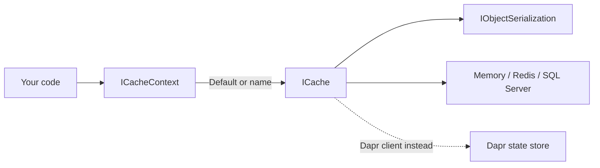

# Caching

Arc4u lets you declare one or more named caches in `appsettings.json`, then use them through a single
interface, <xref:Arc4u.Caching.ICache>. The store behind a name (process memory, Redis, SQL Server or a Dapr state
store) is a configuration choice, so the same code can use memory on a developer machine and Redis in production.
This guide builds on the [named cache](../../concepts/glossary.md#named-cache) and
[cache context](../../concepts/glossary.md#cache-context) concepts; see the
[concepts overview](../../concepts/index.md) for the rest of the framework.

## What it solves

.NET already provides `IMemoryCache` and `IDistributedCache`. Arc4u does not replace them: the memory, Redis and SQL Server
providers wrap the standard `IDistributedCache` implementations. On top of them, Arc4u adds:

- **Several caches by name.** Declare a small cache in memory and a shared one in Redis, and pick each by name in code.
- **Configuration instead of code.** The kind and the settings of every cache come from the `Caching` section.
- **Typed values.** You put and get objects, not `byte[]`. The value is serialized for you, even in the memory cache,
  with an [`IObjectSerialization`](serialization.md) (System.Text.Json).
- **One interface for all stores**, so a cache can change kind without changing the calling code.



> [!NOTE]
> `HybridCache` (the .NET hybrid cache) is not implemented. The
> [Arc4u 9.0 roadmap](https://github.com/Arc4u-org/Arc4u/issues/129) (an open issue) lists "Upgrade Caching to use
> HybridCache". The 9.0 code does not reference
> `HybridCache`: caches are `ICache` instances as described on this page.

## Packages involved

| Package | Use it for |
|---|---|
| `Arc4u.Caching` | `ICacheContext`, `ICache`, the `Caching` configuration section and `AddCacheContext`. Every other caching package references it. |
| `Arc4u.Caching.Memory` | The `Memory` kind: [a cache in the memory of the process](memory.md). |
| `Arc4u.Caching.Redis` | The `Redis` and `RedisSentinel` kinds: [a shared cache in Redis](redis.md). |
| `Arc4u.Caching.SqlServer` | The `Sql` kind: [a cache in a SQL Server table](sql-server.md). The project is in the `src/Arc4u.Caching.Sql` folder. |
| `Arc4u.Caching.Dapr` | The `Dapr` kind: [a cache in a Dapr state store](dapr.md). |
| `Arc4u.Serializer` | The `IObjectSerialization` contract. |
| `Arc4u.Serializer.JSon` | [The JSON serializers](serialization.md): plain and compressed. |

`Arc4u.Caching` references `Arc4u.Serializer`. Each provider package references `Arc4u.Caching`. The serializer
implementations are not referenced by the providers: install `Arc4u.Serializer.JSon` yourself, except for the Dapr kind,
which does not use it.

## Install

Install the core package, one package per kind you use, and the JSON serializer. For example, for a memory and a Redis cache:

```bash
dotnet add package Arc4u.Caching --prerelease
dotnet add package Arc4u.Caching.Memory --prerelease
dotnet add package Arc4u.Caching.Redis --prerelease
dotnet add package Arc4u.Serializer.JSon --prerelease
```

The caches log through the Arc4u logger. Register it with `AddILogger()` (see [Diagnostics](../diagnostics/index.md));
without it the first cache created fails with `InvalidOperationException: Bad Arc4u usage.`.

## Configuration

`AddCacheContext(configuration, sectionName = "Caching")` reads the section to register the options of each cache, and
<xref:Arc4u.Caching.CacheContext>, the `ICacheContext` implementation, reads the same section to create the caches.
The examples below use the default name `Caching`.

### appsettings.json

```json
{
  "Caching": {
    "Default": "Volatile",
    "Caches": [
      {
        "Name": "Volatile",
        "Kind": "Memory",
        "IsAutoStart": true,
        "Settings": {
          "SizeLimitInMB": 100
        }
      },
      {
        "Name": "Shared",
        "Kind": "Redis",
        "IsAutoStart": true,
        "Settings": {
          "ConnectionString": "localhost:6379",
          "InstanceName": "MyApp-"
        }
      }
    ]
  }
}
```

| Key | Type | Default | Description |
|---|---|---|---|
| `Caching:Default` | `string` | empty | Name of the cache returned by `ICacheContext.Default`. When it is empty, no cache is created at all. |
| `Caching:Caches` | array | empty | The declared caches. |
| `Caching:Caches:n:Name` | `string` | empty | Name used to get the cache from `ICacheContext`. Also the name of its options. |
| `Caching:Caches:n:Kind` | `string` | empty | `Memory`, `Redis`, `RedisSentinel`, `Sql` or `Dapr`, case-insensitive. Any other value is a custom kind and must match, with the same casing, the key of the keyed `ICache` service that implements it. |
| `Caching:Caches:n:IsAutoStart` | `bool` | `false` | `true` creates and initializes the cache when the `ICacheContext` is first resolved. See [the known issue](#the-first-access-to-a-cache-with-isautostart-false-throws) with `false`. |
| `Caching:Caches:n:Settings` | object | none | Settings of the kind. The keys are in the page of each kind. |

The section replaces the format of the 8.x documentation: `Memory.Settings`, `SizeLimit`, `SizeLimitInMegaBytes` and a
`Principal` block are not read by Arc4u 9.

### Code

`AddCacheContext` registers `ICacheContext` and the options of each declared cache. Each `Arc4u.Caching.*` package
registers its cache implementations with its own extension: `AddMemoryCacheKind()`, `AddRedisCacheKinds()` (`Redis` and
`RedisSentinel`), `AddSqlCacheKind()` and `AddDaprCacheKind()`. Register the serializer yourself.

```csharp
// Program.cs
using Arc4u.Caching;
using Arc4u.Caching.Memory;
using Arc4u.Caching.Redis;
using Arc4u.Dependency;
using Arc4u.Serializer;

var builder = WebApplication.CreateBuilder(args);

builder.Services.AddILogger();
builder.Services.AddCacheContext(builder.Configuration);

// The serializer used by the caches (the Memory, Redis and Sql kinds).
builder.Services.AddSingleton<IObjectSerialization, JsonSerialization>();

// The ICache implementations of the kinds you use.
builder.Services.AddMemoryCacheKind();
builder.Services.AddRedisCacheKinds();

var app = builder.Build();
app.Run();
```

The constants `CacheContext.Memory`, `Redis`, `RedisSentinel`, `Sql` and `Dapr` hold the kind names; the extensions register each implementation as a keyed `ICache` service with that key. The
`[Export]` attributes on the cache classes let the Arc4u code generator write the same registrations
(see [Dependency injection](../dependency-injection/index.md)).

## Common scenarios

### Use the default cache

Inject `ICacheContext` and use `Default`, the cache named by `Caching:Default`:

```csharp
using Arc4u.Caching;

public class Catalog(ICacheContext caches)
{
    public async Task<Product?> GetAsync(string id)
    {
        var product = await caches.Default.GetAsync<Product>(id);
        if (product is null)
        {
            product = new Product(id, "Widget");
            await caches.Default.PutAsync(id, TimeSpan.FromMinutes(10), product);
        }

        return product;
    }
}

public record Product(string Id, string Name);
```

`Get` returns `default` when the key does not exist; `TryGetValue` returns `false` for a missing key, so it tells a stored `0`
or `false` apart from no value. `Put` without a timeout keeps the value until it is removed or evicted by the store; with a
timeout, the value expires after it. Every kind behaves the same way:

- `Put` and `PutAsync` reject `null` with `ArgumentNullException` and store the default of a value type (`0`, `false`).
- An error of the store or of the serializer is thrown as `DataCacheException`, with the original exception as
  `InnerException`, by `Get` and `Put`. `TryGetValue` and `Remove` return `false` instead.

### Use several caches

Get another cache by name with the indexer. `Exist` tells whether a name is declared, without creating the cache.

```csharp
using Arc4u.Caching;

public class Sessions(ICacheContext caches)
{
    public Task SaveAsync(string id, string data)
    {
        // A shared cache for values that other instances of the service must see.
        return caches["Shared"].PutAsync(id, TimeSpan.FromHours(1), data);
    }

    public bool IsShared => caches.Exist("Shared");
}
```

The indexer throws `InvalidOperationException` when no cache has that name.

### Expire values

```csharp
using Arc4u.Caching;

public static class Expiration
{
    public static async Task RunAsync(ICache cache)
    {
        // Absolute: the value disappears 5 minutes after it was written.
        await cache.PutAsync("report", TimeSpan.FromMinutes(5), "value");

        // Sliding: the 5 minutes restart each time the value is read.
        await cache.PutAsync("token", TimeSpan.FromMinutes(5), "value", isSlided: true);
    }
}
```

The Dapr cache does not support the sliding expiration and throws `NotSupportedException`.

### Use a different kind per environment

Because the kind is configuration, keep the cache name and change the kind and its settings in an environment file such as
`appsettings.Production.json`. Register the keyed `ICache` of every kind you may use.

```json
{
  "Caching": {
    "Default": "Volatile",
    "Caches": [
      {
        "Name": "Volatile",
        "Kind": "Redis",
        "IsAutoStart": true,
        "Settings": {
          "ConnectionString": "redis:6379",
          "InstanceName": "MyApp-"
        }
      }
    ]
  }
}
```

.NET configuration merges array items by index, so this entry overrides the first cache of the base file: repeat its
`Name`. Keys of the base file that the override does not repeat stay in place. In containers, replace `:` by `__` in environment
variable names (`Caching__Caches__0__Kind`).

### Choose a provider

| Kind | Package | Shared between instances | Survives a restart | Sliding expiration | Serializer |
|---|---|---|---|---|---|
| [`Memory`](memory.md) | `Arc4u.Caching.Memory` | No | No | Yes | `IObjectSerialization` |
| [`Redis`, `RedisSentinel`](redis.md) | `Arc4u.Caching.Redis` | Yes | Depends on the Redis persistence | Yes | `IObjectSerialization` |
| [`Sql`](sql-server.md) | `Arc4u.Caching.SqlServer` | Yes | Yes | Yes | `IObjectSerialization` |
| [`Dapr`](dapr.md) | `Arc4u.Caching.Dapr` | Depends on the state store | Depends on the state store | No | The Dapr client |

## Extensibility points

| Service | Default implementation | Replace it to |
|---|---|---|
| <xref:Arc4u.Caching.ICache> (keyed by kind) | `MemoryCache`, `RedisCache`, `RedisSentinelCache`, `SqlCache`, `DaprCache` | Add another store. Register your class with `AddKeyedTransient<ICache, MyCache>("MyKind")` and use `"MyKind"` as `Kind`. |
| <xref:Arc4u.Serializer.IObjectSerialization> | `JsonSerialization` and its compressed variants | Change the format or the JSON options. See [Serialization](serialization.md). |
| <xref:Arc4u.Caching.ICacheContext> | <xref:Arc4u.Caching.CacheContext> | Change how caches are created. `AddCacheContext` uses `TryAddSingleton`, so register yours first. |

A custom kind is not covered by `AddCacheContext`, which only registers the options of the five known kinds: read
your own options yourself. Deriving from <xref:Arc4u.Caching.BaseDistributeCache`1> gives you the serializer handling,
the expiration and the tracing on top of an `IDistributedCache`.

## Troubleshooting

### `InvalidOperationException: Bad Arc4u usage.` when the cache context is created

The caches log with the Arc4u logger. Call `builder.Services.AddILogger()` (the order relative to `AddCacheContext` does not matter).

### `InvalidOperationException: Section 'Caching' not found in configuration.`

`AddCacheContext` requires the section. Add the `Caching` section to the configuration.

### `InvalidOperationException: There is no cache configured with the name ...`

The name is not declared in `Caching:Caches`, or the cache could not be created. Check `Exist(name)`, then the log of
`CacheContext`: `Cannot resolve an ICache instance with the name: <Kind>` means that no keyed `ICache` is registered for
that `Kind`. `Default` fails the same way when `Caching:Default` is empty or is not a declared name.

### `CacheNotInitializedException`

The cache exists but could not finish its initialization. For the Memory, Redis and Sql kinds, the message says that an
`IObjectSerialization` cannot be resolved: register one (see [Serialization](serialization.md)).

### The first access to a cache with `IsAutoStart` false throws

> [!WARNING]
> Known issue, reproduced on `develop/9.0.0`. The first use of a cache declared with `"IsAutoStart": false` through the
> `ICacheContext` indexer logs `An item with the same key has already been added` and throws
> `InvalidOperationException: There is no cache configured with the name ...`. The cache is initialized anyway and the
> next access works. Until it is fixed, set `"IsAutoStart": true` (the recommended setting for now), or catch the first
> exception. `Caching:Caches:n:IsAutoStart` defaults to `false`, so set it explicitly.

### A memory cache silently stores nothing

> [!WARNING]
> Known issue, reproduced on `develop/9.0.0`. A `Memory` cache declared without a `Settings` section gets a size limit
> of 100 bytes instead of the documented 100 MB, so values larger than that are not stored (`Put` succeeds, `Get`
> returns `null`). Always declare `Settings` with a `SizeLimitInMB`. See [Memory cache](memory.md).

## See also

- [Serialization](serialization.md)
- [Memory](memory.md), [Redis](redis.md), [SQL Server](sql-server.md) and [Dapr](dapr.md) caches
- [Dependency injection](../dependency-injection/index.md)
- [Migrate from 8.x: Newtonsoft.Json replaced by System.Text.Json](../../migration/8x-to-9.md#newtonsoftjson-replaced-by-systemtextjson)
- [Migrate from 8.x: ADAL and Protobuf removed](../../migration/8x-to-9.md#adal-and-protobuf-removed)
- <xref:Arc4u.Caching> in the API reference
