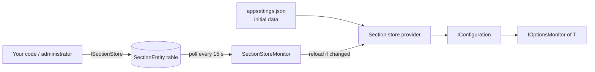

# Configuration store

`appsettings.json` and environment variables are fixed when the application starts. Changing a
feature limit, a timeout or a switch then means a redeployment or a restart. The configuration store
persists the sections you choose in a database, lets your code or an administrator change them, and
reloads them in every running instance within a polling interval. The consumers use the usual
options types (`IOptionsMonitor<T>`), so they do not know that the values come from a database. See
[Configuration](index.md) for the other parts of Arc4u configuration.

## How it works

You declare, in code, which sections are persisted. The values found in `appsettings.json` (or the
value you pass in code) become the **initial data**. When the application starts, sections that are
missing in the database are inserted with the initial data. From then on the database is the
source of truth for those sections: a hosted service polls the table and, when a value differs
from the current configuration, updates the `IConfiguration` provider and raises the
configuration change token.



Two limits are by design:

- The application defines the sections. Only the initial data declared in code creates sections.
  Through <xref:Arc4u.Configuration.Store.ISectionStore> you change the value of a
  <xref:Arc4u.Configuration.Store.SectionEntity> or reset the whole store, but you do not add or
  delete individual sections.
- Values are stored as JSON and bound like any other configuration, so a section can be a complex
  object or a single value.

## Packages involved

| Package | Use it for |
|---|---|
| `Arc4u.Configuration.Store` | The configuration provider, the polling service, `ISectionStore` and `SectionEntity`. It has no database dependency. |
| `Arc4u.Configuration.Store.EfCore` | An `ISectionStore` implemented on an EF Core `DbContext`. References `Arc4u.Configuration.Store`. |

## Install

```bash
dotnet add package Arc4u.Configuration.Store.EfCore --prerelease
```

You also need an EF Core provider for your database, for example
`Microsoft.EntityFrameworkCore.SqlServer` or `Microsoft.EntityFrameworkCore.Sqlite`.

## Set it up

The example persists a `Feature` section, and uses SQLite for brevity.

### Step 1: Add the section to the model

The table is defined by a `DbContext` that you own. In `OnModelCreating`, call
<xref:Arc4u.Configuration.Store.EntityTypeBuilderExtensions.Configure*> on the `SectionEntity`
entity type. It sets the primary key (`Key`, maximum length 1024) and the `Value` column. The
context does not need a `DbSet<SectionEntity>` property.

```csharp
// SettingsContext.cs
using Arc4u.Configuration.Store;
using Microsoft.EntityFrameworkCore;

public class SettingsContext(DbContextOptions<SettingsContext> options) : DbContext(options)
{
    protected override void OnModelCreating(ModelBuilder modelBuilder)
    {
        modelBuilder.Entity<SectionEntity>().Configure();
    }
}

public class FeatureOptions
{
    public string Name { get; set; } = string.Empty;

    public int Limit { get; set; }
}
```

With the EF Core conventions, the table is named `SectionEntity` and has two `NOT NULL` text columns,
`Key` (primary key) and `Value`. Create it like any other table, with an EF Core migration on your context.

### Step 2: Register the store

```json
{
  "Feature": {
    "Name": "Default",
    "Limit": 10
  }
}
```

```csharp
// Program.cs
using Arc4u.Configuration.Store;
using Arc4u.Dependency;
using Microsoft.EntityFrameworkCore;
using Microsoft.Extensions.Options;

var builder = WebApplication.CreateBuilder(args);

// 1. Declare the persisted sections. "Feature" is read from the providers registered before.
builder.Configuration.AddSectionStoreConfiguration(options => options.Add<FeatureOptions>("Feature"));

// 2. Register the services.
builder.Services.AddILogger();
builder.Services.AddDbContext<SettingsContext>(options => options.UseSqlite("Data Source=settings.db"));
builder.Services.AddDbContextSectionStore<SettingsContext>();
builder.Services.AddSectionStoreService();
builder.Services.Configure<FeatureOptions>(builder.Configuration.GetSection("Feature"));

var app = builder.Build();

// 3. The schema must exist. For a demo, EnsureCreated; in an application, use migrations.
using (var scope = app.Services.CreateScope())
{
    scope.ServiceProvider.GetRequiredService<SettingsContext>().Database.EnsureCreated();
}

// 4. Seed the missing sections and start reading from the database.
app.Services.UseSectionStoreConfiguration();

app.MapGet("/feature", (IOptionsMonitor<FeatureOptions> options) => options.CurrentValue);
app.Run();
```

What each call does:

| Call | Description |
|---|---|
| `AddSectionStoreConfiguration` | Adds the configuration provider (<xref:Arc4u.Configuration.Store.ConfigurationBuilderExtensions>). Call it **after** the providers that hold the initial values. |
| `options.Add<T>(key)` | Persists the section `key`. The initial value is `section.Get<T>()` from the providers registered before. The section must exist, otherwise the build throws `InvalidOperationException`. |
| `options.Add<T>(key, value)` | Persists the section `key` with an initial value you pass in code. |
| `AddILogger` | Registers the Arc4u logger. The polling service logs through it and fails at host start without it (see [Troubleshooting](#bad-arc4u-usage-when-the-host-starts)). |
| `AddDbContextSectionStore<TDbContext>` | Registers `ISectionStore` as a scoped service backed by your context. |
| `AddSectionStoreService` | Registers the singleton that reloads providers and a hosted service that polls. The parameterless overload polls every 15 seconds; pass a `TimeSpan` to change it. |
| `UseSectionStoreConfiguration` | Call it on `app.Services` after the database schema exists. It inserts the sections that are missing in the database, then starts the reloads. |

`AddSectionStoreConfiguration` needs the final `IConfiguration` to be an `IConfigurationRoot`. That
is the case for `builder.Configuration` in `WebApplication` and the generic host.

## Reload behavior

| Moment | Values seen by the application |
|---|---|
| Before `UseSectionStoreConfiguration` | The initial data (from `appsettings.json` or the value passed in code). The database is not read yet. |
| At `UseSectionStoreConfiguration` | Sections that have no row are inserted with the initial data. Existing rows are never overwritten by the initial data, so from the first run on the database wins over `appsettings.json`. |
| Every polling interval | The hosted service reads all rows. If the resulting values differ from the current ones, the provider reloads and the configuration change token fires. If nothing changed, nothing fires. |
| After `ISectionStore.ResetAsync` | All rows are deleted. At the next poll the initial data is inserted again and the application returns to its startup values. |

So a change in the database is visible after at most one polling interval, in every instance of the
application. `IOptionsMonitor<T>.OnChange` fires at that poll, and `CurrentValue` returns the new values.

Which options interface sees the change:

| Interface | Sees changes |
|---|---|
| `IOptionsMonitor<T>` | Yes, `CurrentValue` and `OnChange`. |
| `IOptionsSnapshot<T>` | Yes, at the next scope (for example the next HTTP request). |
| `IOptions<T>` | No, it keeps the value read at first use. |

A poll that throws (for example when the database is unreachable) is logged and the next poll runs
after the interval; the application keeps the last values.

## Common scenarios

### Change a value from code

Inject <xref:Arc4u.Configuration.Store.ISectionStore> (it is scoped) and use the extension methods of
<xref:Arc4u.Configuration.Store.ISectionStoreExtensions>. `TrySetValueAsync` returns `false` when the
section is not persisted, because sections cannot be created at runtime.

```csharp
// FeatureEndpoints.cs
using Arc4u.Configuration.Store;

public static class FeatureEndpoints
{
    public static void MapFeatureEndpoints(this WebApplication app)
    {
        app.MapPut("/feature/limit/{limit:int}", async (int limit, ISectionStore store, CancellationToken cancellationToken) =>
        {
            var (found, feature) = await store.TryGetValueAsync<FeatureOptions>("Feature", cancellationToken);
            if (!found || feature is null)
            {
                return Results.NotFound();
            }

            feature.Limit = limit;
            await store.TrySetValueAsync("Feature", feature, cancellationToken);
            return Results.NoContent();
        });
    }
}
```

> [!IMPORTANT]
> An endpoint that changes configuration must be protected with authentication and authorization.

### Change a value in the database

Each row holds the section name and its value as JSON, wrapped in a `Value` property:

| Key | Value |
|---|---|
| `Feature` | `{"Value":{"Name":"Default","Limit":10}}` |
| `MaxItems` | `{"Value":42}` |

Update the `Value` text with SQL and the application picks it up at the next poll. Keep the wrapper: a
row without the `Value` property makes the reload fail.

### Persist a single value

```csharp
// Program.cs
using Arc4u.Configuration.Store;

var builder = WebApplication.CreateBuilder(args);

builder.Configuration.AddSectionStoreConfiguration(options => options
    .Add("MaxItems", 42)
    .Add("Banner", "Welcome"));

var app = builder.Build();
// app.Configuration["MaxItems"] is "42"
app.Run();
```

Complex values are flattened like JSON configuration: the `Limit` property of `Feature` is the key
`Feature:Limit`. Keys are case-insensitive.

## Extensibility points

| Service | Default implementation | Replace it to |
|---|---|---|
| <xref:Arc4u.Configuration.Store.ISectionStore> | `DbContextSectionStore<TDbContext>` (internal, scoped) | Use a store other than EF Core. |

`AddDbContextSectionStore` uses `TryAdd`, so a registration you make before it wins. Note that
`SectionEntity.Key` and `SectionEntity.Value` have internal setters: a store can keep and return the
instances it receives in `ISectionStore.Add`, but building entities from its own data requires
reflection, as EF Core does. The interface is usable for wrapping or decorating the EF Core store.

## Security notes

- The database is now part of your configuration trust boundary: whoever can write the
  `SectionEntity` table changes the behavior of every instance. Restrict write access to the table.
- Values are stored in clear text as JSON. Do not persist secrets in the store. Keep them
  [encrypted in the configuration files](decrypting-secrets.md), or in a dedicated secret store.
- A section that is invalid for its options type (for example text in a number) is only found when
  the options are bound. Validate the options (`ValidateOnStart`, `ValidateDataAnnotations`) so that a
  wrong edit is not silent.

## Troubleshooting

### Bad Arc4u usage when the host starts

`AddILogger()` was not called. The polling service logs with the Arc4u logger extensions, and the
host fails to start with an `InvalidOperationException` ("Bad Arc4u usage.") from
`SectionStoreMonitor.StartAsync`. Add `builder.Services.AddILogger();` from the `Arc4u.Dependency`
namespace, as in the setup above.

> [!WARNING]
> Known issue: the requirement for `AddILogger()` is not enforced or reported by
> `AddSectionStoreService()`. The failure only shows when the host starts.

### no such table: SectionEntity

The database has no table for `SectionEntity`, and `UseSectionStoreConfiguration` fails while it reads the
existing rows. Create the schema (migration or `EnsureCreated`) before you call it.

### My change in `appsettings.json` is ignored

After the first start, the database row for the section exists and wins over `appsettings.json`. Change the value
in the store (see above), or delete the row: it is inserted again with the file values at the next
start (or the next poll after `ResetAsync`).

### The section is not persisted

`Add<T>(key)` throws `InvalidOperationException` when the section `key` does not exist in the providers
registered before `AddSectionStoreConfiguration`. Register the store after `appsettings.json`, or use
`Add(key, value)`.

### The application does not see the change

- The consumer uses `IOptions<T>`; switch to `IOptionsMonitor<T>` or `IOptionsSnapshot<T>`.
- `UseSectionStoreConfiguration` was not called: polling only starts after it.
- The polling interval has not elapsed yet.

### Adding the initial SectionEntities failed

Logged as an error by the EF Core store when the initial insert fails, for example when two
instances start at the same time and both insert the same key. The failure is swallowed
by design and the values are read on the next poll.

## See also

- [Configuration](index.md)
- [Decrypting secrets](decrypting-secrets.md)
- [Data access with EF Core](../data/index.md)
- <xref:Arc4u.Configuration.Store> in the API reference
