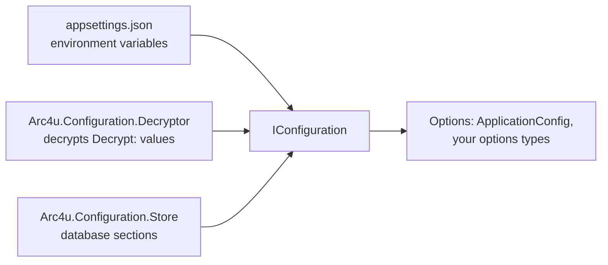

# Configuration

Arc4u builds on the .NET configuration system (`IConfiguration` and the options pattern) and
adds three things: a small set of application-wide settings that other Arc4u packages read, a way
to keep encrypted secrets in configuration files, and a database-backed configuration provider
that reloads while the application runs. This guide is for the developer who wires an application's
configuration. Arc4u registers these services through
[dependency injection](../../concepts/design-principles.md).

## What it solves

- **Application identity.** Logging, caching and authorization need to know the application name, the
  environment and the time zone. Arc4u reads them once from the `Application.Configuration` section
  into <xref:Arc4u.Configuration.ApplicationConfig>.
- **Secrets in the repository.** .NET user secrets stay on one machine. The decryptor lets you commit
  values encrypted with a certificate and decrypts them when the application starts.
- **Settings that change without a redeployment.** The configuration store persists chosen sections
  in a database and reloads them in running instances.

Arc4u leaves the configuration sources (JSON files, environment variables, Azure App Configuration,
and so on) to .NET: everything here is an `IConfigurationProvider` or a helper that reads
`IConfiguration`.



## Packages involved

| Package | Use it for |
|---|---|
| `Arc4u.Configuration` | `ApplicationConfig`, `AppSettings`, `ConfigureSettings` and other helpers. Also a dependency of the `Arc4u` package. |
| `Arc4u.Configuration.Decryptor` | Decrypt configuration values with a certificate or an AES key. See [Decrypting secrets](decrypting-secrets.md). |
| `Arc4u.Configuration.Store` | A configuration provider that persists sections through `ISectionStore` and polls for changes. |
| `Arc4u.Configuration.Store.EfCore` | The `ISectionStore` implementation for EF Core. See [Configuration store](configuration-store.md). |

## Install

```bash
dotnet add package Arc4u.Configuration --prerelease
dotnet add package Arc4u.Configuration.Decryptor --prerelease
dotnet add package Arc4u.Configuration.Store.EfCore --prerelease
```

Install only the packages you use. `Arc4u.Configuration.Decryptor` depends on `Arc4u`, and
`Arc4u.Configuration.Store.EfCore` depends on `Arc4u.Configuration.Store`.

## Configuration

Section names follow the .NET rules: `:` separates levels, and the names of Arc4u sections are
PascalCase words that can contain a dot, which is part of the key
(`Application.Configuration` is one key at the root, not a section `Application` with a child
`Configuration`). Each Arc4u feature documents the section it reads and the method parameter that
renames it.

### Application.Configuration

`AddApplicationConfig(IConfiguration, string sectionName = "Application.Configuration")` reads the
section into <xref:Arc4u.Configuration.ApplicationConfig> and registers it as options.

```json
{
  "Application.Configuration": {
    "ApplicationName": "Orders",
    "Environment": {
      "Name": "Dev",
      "LoggingName": "ORDERS-DEV",
      "TimeZone": "Romance Standard Time"
    }
  }
}
```

| Key | Type | Default | Description |
|---|---|---|---|
| `Application.Configuration:ApplicationName` | `string` | none (required) | Name that identifies the application outside the logs, for example to the cache and authorization features. |
| `Application.Configuration:Environment:Name` | `string` | none (required) | Name of the environment, for example `Dev` or `Prod`. |
| `Application.Configuration:Environment:LoggingName` | `string` | none (required) | The value written in the `Application` property of every log entry. |
| `Application.Configuration:Environment:TimeZone` | `string` | none (required) | A system time zone ID accepted by `TimeZoneInfo.FindSystemTimeZoneById`, used by `TimeZoneContext`. Examples: `Romance Standard Time`, `Europe/Brussels`. |

The four values are required: a missing or empty value throws a
<xref:Arc4u.Configuration.ConfigurationException> that lists all of them.

### Code

```csharp
// Program.cs
using Arc4u.Configuration;

var builder = WebApplication.CreateBuilder(args);

builder.Services.AddApplicationConfig(builder.Configuration);
// builder.Services.AddApplicationConfig(builder.Configuration, "MyApp");   // another section name

var app = builder.Build();
app.Run();
```

Inject `IOptions<ApplicationConfig>` or `IOptionsMonitor<ApplicationConfig>` to read it. There is also an
overload that takes an `Action<ApplicationConfig>`, for values that do not come from configuration.

## Common scenarios

### Read a group of string settings by name

`ConfigureSettings` reads a section as a dictionary of strings and registers it as a **named**
`SimpleKeyValueSettings` option. Use it when several services each have a
section with the same shape: one name per service.

```json
{
  "Backends": {
    "Orders": {
      "Url": "https://orders.example.com",
      "Audience": "orders-api"
    }
  }
}
```

```csharp
// Program.cs
using Arc4u.Configuration;

var builder = WebApplication.CreateBuilder(args);

var orders = builder.Services.ConfigureSettings("Orders", builder.Configuration, "Backends:Orders");
// orders.Values["Url"] == "https://orders.example.com"

var app = builder.Build();
app.Run();
```

```csharp
// OrdersClient.cs
using Arc4u.Configuration;
using Microsoft.Extensions.Options;

public class OrdersClient(IOptionsMonitor<SimpleKeyValueSettings> settings)
{
    public string Url => settings.Get("Orders").Values["Url"];
}
```

<xref:Arc4u.IKeyValueSettings> exposes the dictionary as `Values`. Only direct children of the
section that have a string value are meaningful: it does not read nested sections. The method throws
a `ConfigurationException` when the section does not exist.

### Read the `AppSettings` section

<xref:Arc4u.AppSettings> implements <xref:Arc4u.IAppSettings> (also an
`IKeyValueSettings`) and exposes the children of the `AppSettings` section as a read-only dictionary.
It is marked for registration by the Arc4u dependency attributes; to register it yourself:

```csharp
// Program.cs
using Arc4u;
using Arc4u.Configuration;

var builder = WebApplication.CreateBuilder(args);

builder.Services.AddSingleton<IAppSettings, AppSettings>();

var app = builder.Build();
app.Run();
```

```json
{
  "AppSettings": {
    "Region": "eu"
  }
}
```

The dictionary is read once, when `AppSettings` is constructed. A missing `AppSettings` section gives
an empty dictionary.

### Keep secrets out of the repository

Use the [decryptor](decrypting-secrets.md): commit `Decrypt:`-prefixed values and provide the
certificate at runtime.

### Change settings without a redeployment

Use the [configuration store](configuration-store.md): persist chosen sections in a database and
let the running instances reload them.

## Extensibility points

Everything here builds on standard .NET extension points. The Arc4u-specific ones are documented in
the sub-pages:

| Service | Default implementation | Replace it to |
|---|---|---|
| <xref:Arc4u.Security.Cryptography.IX509CertificateLoader> | <xref:Arc4u.Security.Cryptography.X509CertificateLoader> | Find the decryption certificate elsewhere. See [Decrypting secrets](decrypting-secrets.md#extensibility-points). |
| <xref:Arc4u.Configuration.Store.ISectionStore> | EF Core store | Persist sections somewhere other than a `DbContext`. See [Configuration store](configuration-store.md#extensibility-points). |

## Troubleshooting

### No section with name ... exists

`ConfigureSettings` throws a `ConfigurationException` when the section is missing. Check the
section path (`:` between levels) and that the provider holding it is registered.

### The section 'Application.Configuration' does not exist or is empty

`AddApplicationConfig(IConfiguration)` throws a `ConfigurationException` with this text when the
section has no values at all: the section is missing, or misspelled. Check the spelling of the section
name and that the file that holds it is loaded.

### Application name is not defined

The `ConfigurationException` message starts with "Application name is not defined in the
initialization of the application config settings" and lists every required value of
`Application.Configuration` that is empty.

## See also

- [Decrypting secrets](decrypting-secrets.md)
- [Configuration store](configuration-store.md)
- [Diagnostics](../diagnostics/index.md)
- [Dependency injection](../dependency-injection/index.md)
- <xref:Arc4u.Configuration> in the API reference
