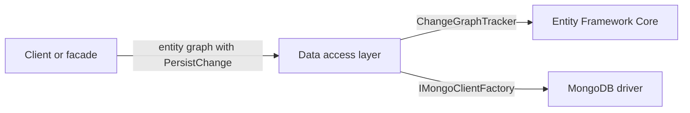

# Data access

Arc4u does not replace Entity Framework Core, the MongoDB driver or ASP.NET Core OData. It adds a small layer on top of them for the [data access layer](../../concepts/glossary.md#data-access-layer) of a service: entities that carry the change a client asked for (insert, update, delete), the glue that turns that change into an Entity Framework Core state, a `DbContext`-like abstraction for MongoDB, and the two settings OData needs behind a reverse proxy. The pieces build on the layering described in the [architecture concept](../../concepts/architecture.md).

## What it solves

A service that exposes a domain model (a root entity with child collections) receives an object graph from a client and has to persist it. With plain Entity Framework Core you must find out, node by node, which entities are new, changed or removed. Arc4u moves that decision into the entity itself:

1. Every entity has a `PersistChange` value (`None`, `Insert`, `Update`, `Delete`), set by the caller that built or edited the graph and carried through serialization.
2. At the data layer, one call converts these values to Entity Framework Core states for the whole graph and saves it.



Arc4u deliberately leaves the following to the underlying libraries: choosing an EF Core provider, mapping, migrations, querying, and everything about the MongoDB driver except the client and collection lookup. `Arc4u.OData` is not an OData implementation: it only fixes the URLs in OData responses when a service sits behind a proxy.

## Packages involved

| Package | Use it for |
|---|---|
| `Arc4u.Data` | Entity base classes, `PersistChange` handling, `EntitySet<TEntity>`, validation helpers. See [Data primitives](data-primitives.md). |
| `Arc4u.EfCore` | Converting `PersistChange` to EF Core entity states and applying `Graph<T>` includes to queries. See [Entity Framework Core](efcore.md). |
| `Arc4u.MongoDB` | Registering a MongoDB database context and getting collections mapped to entity types. See [MongoDB](mongodb.md). |
| `Arc4u.OData` | Rewriting the URLs in OData responses behind a reverse proxy. See [OData](odata.md). |

`Arc4u.EfCore` references `Arc4u.Data`. `Arc4u.MongoDB` and `Arc4u.OData` do not reference `Arc4u.Data` or each other. `IPersistEntity`, `PersistChange` and `Graph<T>` live in the base `Arc4u` package, which `Arc4u.Data` and `Arc4u.EfCore` reference, so the interfaces are available to a domain model that does not reference EF Core.

## Install

Install only what the service uses:

```bash
dotnet add package Arc4u.EfCore --prerelease
dotnet add package Arc4u.MongoDB --prerelease
dotnet add package Arc4u.OData --prerelease
```

`Arc4u.EfCore` brings `Arc4u.Data` with it. Add `Arc4u.Data` alone for a domain project that only defines entities. You also need an EF Core provider package (for example `Microsoft.EntityFrameworkCore.SqlServer`) or a reachable MongoDB server; Arc4u ships neither.

## Configuration

`Arc4u.Data`, `Arc4u.EfCore` and `Arc4u.OData` read no configuration section. `Arc4u.MongoDB` reads one connection string from the standard `ConnectionStrings` section, whose name you pass to `AddMongoDatabase`. The keys are described in [MongoDB](mongodb.md#configuration).

## Common scenarios

### Save an entity graph with EF Core

Derive your entities from `IdEntity`, tell EF Core to ignore `PersistChange`, and let `ChangeGraphTracker` set the states:

```csharp
using Arc4u.Data;
using Arc4u.EfCore;
using Microsoft.EntityFrameworkCore;

public class OrderRepository(DbContext db)
{
    public async Task SaveAsync(IdEntity root, CancellationToken cancellationToken)
    {
        db.ChangeTracker.TrackGraph(root, ChangeGraphTracker.Tracker);
        await db.SaveChangesAsync(cancellationToken);
    }
}
```

The complete setup, including the model configuration and the pitfalls, is in [Entity Framework Core](efcore.md).

### Read a MongoDB collection mapped to an entity

```csharp
using Arc4u.MongoDB;
using MongoDB.Driver;

public class ProductStore(IMongoClientFactory<ShopContext> factory)
{
    public Task<List<Product>> GetAllAsync(CancellationToken cancellationToken) =>
        factory.GetCollection<Product>().Find(FilterDefinition<Product>.Empty).ToListAsync(cancellationToken);
}
```

`ShopContext` and `Product` are defined in [MongoDB](mongodb.md#step-by-step-setup).

### Expose OData behind a gateway

See [OData](odata.md#configure-the-base-address).

## Extensibility points

| Service | Default implementation | Replace it to |
|---|---|---|
| `IMongoClientFactory<TContext>` | <xref:Arc4u.MongoDB.DefaultMongoClientFactory`1> | Control how the client and database are created. `AddMongoDatabase` registers the default with `TryAdd`, so register your own before calling it. |

`Arc4u.Data` and `Arc4u.EfCore` are plain classes and static helpers, without dependency injection registrations. Derive from the entity classes, or implement `IPersistEntity` on your own types, to reuse `ChangeGraphTracker` without any base class.

## Troubleshooting

### `ArgumentException: Invalid transition between Insert and Delete change`

You set `PersistChange` to `Delete` on an entity that is still `Insert`, or the reverse. An entity that was never saved has nothing to delete: remove it from its collection instead (`EntitySet<TEntity>.Remove` does this for you). See [Data primitives](data-primitives.md#persistchange).

### `MongoClientException: No mongo client settings defined for key ...`

`DefaultMongoClientFactory<TContext>.CreateClient` found no `MongoClientSettings` registered for the lower-case database name of the context. `AddMongoDatabase` registers them under that name, so this only happens when you register the context or the settings yourself. See [MongoDB troubleshooting](mongodb.md#troubleshooting).

### More symptoms

Symptoms specific to one package are on its page: [Entity Framework Core](efcore.md#troubleshooting), [MongoDB](mongodb.md#troubleshooting), [OData](odata.md#troubleshooting).

## See also

- [Data primitives](data-primitives.md), [Entity Framework Core](efcore.md), [MongoDB](mongodb.md), [OData](odata.md)
- [Glossary: data access layer](../../concepts/glossary.md#data-access-layer)
- [Results](../results/index.md), which explains the `Result` type returned by the validation helpers
- <xref:Arc4u.Data> and <xref:Arc4u.EfCore> in the API reference
