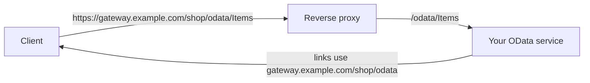

# OData

`Arc4u.OData` is not an OData implementation. OData itself (the Entity Data Model, query options such as `$filter` and `$top`, the controllers) comes from [Microsoft.AspNetCore.OData](https://learn.microsoft.com/odata/webapi-8/overview), which the package references. What `Arc4u.OData` adds is two extension methods that solve one problem: an OData service running behind a reverse proxy such as YARP, in the setup described in the [architecture concept](../../concepts/architecture.md). The [overview](index.md) shows how it relates to the other data packages.

## What it solves

OData responses contain absolute URLs generated by the service: `@odata.context` in every payload, `@odata.nextLink` when the server pages the results, and the ids of entities. The service only knows its own address (`http://service-pod:8080/odata/...`), not the public address the client used to reach the proxy (`https://gateway.example.com/shop/odata/...`). The client then receives links it cannot follow.

`Arc4u.OData` lets you tell the service its external base address once, and rewrites the URLs of the responses accordingly.



## Install

```bash
dotnet add package Arc4u.OData --prerelease
```

The package targets ASP.NET Core (it references the shared framework) and brings `Microsoft.AspNetCore.OData` with it. It has no configuration section of its own.

## Configure the base address

Call both methods where you set up OData (`AddODataSerializerBaseAddress` alone already rewrites `@odata.context` and `@odata.nextLink` in the checked scenarios; the formatter setting complements it). The base address is a `Uri` that you read from your own configuration (there is no Arc4u key for it). It must end with the OData route prefix followed by `/`.

```json
{
  "OData": {
    "BaseAddress": "https://gateway.example.com/shop/odata/"
  }
}
```

`OData:BaseAddress` above is an example key that your code reads; Arc4u does not bind it.

```csharp
// Program.cs
using Arc4u.OData;
using Microsoft.AspNetCore.OData;
using Microsoft.OData.ModelBuilder;

var builder = WebApplication.CreateBuilder(args);

var odataBaseAddress = builder.Configuration["OData:BaseAddress"] is { } address ? new Uri(address) : null;

var modelBuilder = new ODataConventionModelBuilder();
modelBuilder.EntitySet<Item>("Items");

builder.Services.AddControllers()
    .AddOData(options => options
        .EnableQueryFeatures()
        .AddRouteComponents("odata", modelBuilder.GetEdmModel(),
            services => services.AddODataSerializerBaseAddress(odataBaseAddress!)))
    .AddMvcOptions(options => options.SetODataFormattersBaseAddress(odataBaseAddress!));

var app = builder.Build();
app.MapControllers();
app.Run();

public class Item
{
    public int Id { get; set; }
}
```

Here `"odata"` is the route prefix, and the local part of the base address (`/shop/odata/`) ends with it. The part before the prefix (`/shop`) is the path under which the proxy publishes the service.

## What each method does

| Method | Effect |
|---|---|
| `IServiceCollection.AddODataSerializerBaseAddress(Uri)`, <xref:Arc4u.OData.ODataExtensions.AddODataSerializerBaseAddress*> | Registers an `IODataSerializerProvider` in the route's service container. Before each payload is serialized, it sets the scheme, host, port and path base of the request from the base address, so every URL OData generates (`@odata.context`, `@odata.nextLink`, ids) uses the external address. Call it inside the `configureServices` argument of `AddRouteComponents`, so it applies to that route only. |
| `MvcOptions.SetODataFormattersBaseAddress(Uri)`, <xref:Arc4u.OData.ODataExtensions.SetODataFormattersBaseAddress*> | Sets the base address factory of the OData input and output formatters, which controls the `@odata.context` URL of responses. Call it after `AddOData`, on the `MvcOptions`, so the formatters exist. |

Both return their input for chaining, and both do nothing when the address is `null`, which lets the same code run in a test or standalone, without a proxy.

The behavior was checked against a service running on Kestrel, with server-driven paging (`[EnableQuery(PageSize = 1)]`) and a single-entity request:

| Base address | `@odata.context` | `@odata.nextLink` |
|---|---|---|
| none | `http://127.0.0.1:port/odata/$metadata#Items` | `http://127.0.0.1:port/odata/Items?$skiptoken=Id-1` |
| `https://gateway.example.com/shop/odata/` | `https://gateway.example.com/shop/odata/$metadata#Items` | `https://gateway.example.com/shop/odata/Items?$skiptoken=Id-1` |
| `https://gateway.example.com:8443/odata/` | `https://gateway.example.com:8443/odata/$metadata#Items` | `https://gateway.example.com:8443/odata/Items?$skiptoken=Id-1` |

## Common scenarios

### Serve OData with paging behind YARP

The routing itself (the YARP route that forwards the public path to the service) is not part of Arc4u. Configure the gateway so that `https://gateway.example.com/shop/odata/{**path}` reaches the service route `/odata/{**path}`, and pass `https://gateway.example.com/shop/odata/` as the base address. Paging links then lead back through the gateway.

### Run the same service without a gateway

Leave `OData:BaseAddress` unset. The sample above then passes `null`, which both methods ignore, and the service generates its own addresses.

## Extensibility points

`Arc4u.OData` exposes no interface of its own. Its `IODataSerializerProvider` implementation is internal and derives from the one in `Microsoft.AspNetCore.OData`.

## Troubleshooting

### The links in the response still use the service address

Check that both calls are present, that `AddODataSerializerBaseAddress` is inside the `configureServices` callback of the `AddRouteComponents` call of that route, and that `SetODataFormattersBaseAddress` runs after `AddOData`. With only `SetODataFormattersBaseAddress`, `@odata.context` is rewritten but `@odata.nextLink` keeps the local address.

### HTTP 500 on every OData request after adding the base address

`ArgumentException: The local path of the OData base address (...) does not end with the OData route prefix (odata/)`. The path of the base address must end with the route prefix followed by a `/`. `https://gateway.example.com/shop/odata/` matches the prefix `odata`; `https://gateway.example.com/shop/api/` and `https://gateway.example.com/shop/odata` (no trailing slash) do not.

### `Request.Host` changes during an OData request

`AddODataSerializerBaseAddress` assigns the request's `Scheme`, `Host` and `PathBase` while serializing, and they stay changed for the rest of that request. Code running after the OData response is written, for example a middleware that logs `Request.Host`, sees the external address.

## See also

- [Data access](index.md)
- [Microsoft.AspNetCore.OData documentation](https://learn.microsoft.com/odata/webapi-8/overview)
- <xref:Arc4u.OData> in the API reference
