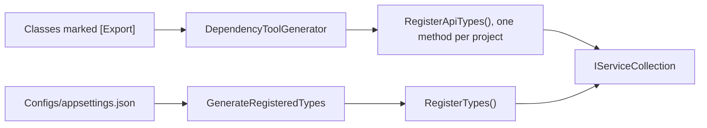

# Dependency injection

Arc4u uses the standard .NET dependency injection container (`IServiceCollection` and
`IServiceProvider`). The `Arc4u.Dependency` package adds attributes that declare a registration
on the class itself, and the `Arc4u.Dependency.Tool` source generators turn those attributes into
registration code when you build. Read this guide if you write the business services of an Arc4u
application, or if you register Arc4u implementations such as caches. The
[design principles](../../concepts/design-principles.md) explain why Arc4u builds on dependency
injection.

## What it solves

A business application has hundreds of services. Registering each one with `AddScoped` or
`AddSingleton` in `Program.cs` puts the lifetime far from the class, and the list is easy to get
out of sync. With Arc4u you mark the class with `[Export]` and, optionally, `[Shared]` or
`[Scoped]`. At build time a source generator writes an extension method on `IServiceCollection`
that registers every marked class of the project. A second generator registers types from other
assemblies, such as Arc4u's own cache implementations, from a list in a JSON file.

Because the registrations are generated when you compile:

- nothing scans assemblies or loads types by name at startup, which keeps the application
  compatible with trimming and Native AOT;
- a mistake such as a contract the class does not implement is a build error, not a runtime error.

The container, scopes, resolution and keyed services are the ones of .NET. Arc4u 9 has no container
abstraction of its own: `IContainer` and `IContainerResolve` were removed
([IContainer replaced by keyed services](../../migration/8x-to-9.md#icontainer-replaced-by-keyed-services)).

The diagram shows what each generator reads and the method it writes.



## Packages involved

| Package | Use it for |
|---|---|
| `Arc4u.Dependency` | The `[Export]`, `[Shared]` and `[Scoped]` attributes, and `TryGetService` helpers on `IServiceProvider`. |
| `Arc4u.Dependency.Tool` | The two source generators. A development dependency: it runs inside the compiler, and your code never calls it. |

Reference both packages in every project that contains `[Export]` classes. On `develop/9.0.0`,
`Arc4u.Dependency` targets `netstandard2.0`, `net10.0` and `net11.0` (the published
`9.0.0-preview37` targets `netstandard2.0`, `net8.0`, `net9.0` and `net10.0`). Its
`netstandard2.0` build contains only the attributes. On the other target frameworks it references
`Microsoft.Extensions.Hosting`, which brings the `Microsoft.Extensions.DependencyInjection` API that
the generated code calls.

`Arc4u.Dependency.ComponentModel`, which held the `IContainer` implementation, is not built or
shipped in Arc4u 9. See [Package support](../package-support.md).

## Install

```bash
dotnet add package Arc4u.Dependency --prerelease
dotnet add package Arc4u.Dependency.Tool --prerelease
```

Because `Arc4u.Dependency.Tool` is a development dependency, `dotnet add package` writes its
reference with `PrivateAssets` set to `all`, so it does not flow to the projects that reference
yours:

```xml
<PackageReference Include="Arc4u.Dependency.Tool" Version="<version>">
  <IncludeAssets>runtime; build; native; contentfiles; analyzers; buildtransitive</IncludeAssets>
  <PrivateAssets>all</PrivateAssets>
</PackageReference>
```

## Configuration

Registering the classes of your own project needs no configuration. The `Application.Dependency`
section is only read by the second generator, to register types that live in other assemblies
(see [Register Arc4u implementations from other packages](#register-arc4u-implementations-from-other-packages)).

### Mark your classes

Put `[Export]` on each class to register. The contract type is the service type; without it the
class is registered as itself. Add `[Shared]` for a singleton or `[Scoped]` for a scoped service;
without either, the service is transient.

```csharp
// OrderService.cs, in the project Contoso.Api
using Arc4u.Dependency.Attribute;

namespace Contoso.Api;

public interface IClock
{
    DateTime UtcNow { get; }
}

public interface IOrderService
{
    Task<int> CountAsync();
}

[Export(typeof(IClock)), Shared]
public class SystemClock : IClock
{
    public DateTime UtcNow => DateTime.UtcNow;
}

[Export(typeof(IOrderService)), Scoped]
public class OrderService(IClock clock) : IOrderService
{
    public Task<int> CountAsync() => Task.FromResult(clock.UtcNow.Day);
}
```

### Call the generated method

The generator adds a method named `Register<Name>Types`, where `<Name>` is the last segment of the
assembly name: `Contoso.Api` gives `RegisterApiTypes`. The method is in the `Arc4u.Dependency`
namespace.

```csharp
// Program.cs
using Arc4u.Dependency;
using Contoso.Api;

var builder = WebApplication.CreateBuilder(args);

builder.Services.RegisterApiTypes();

var app = builder.Build();
app.MapGet("/orders/count", async (IOrderService orders) => await orders.CountAsync());
app.Run();
```

`RegisterApiTypes` contains:

```csharp
services.AddSingleton<Contoso.Api.IClock, global::Contoso.Api.SystemClock>();
services.AddScoped<Contoso.Api.IOrderService, global::Contoso.Api.OrderService>();
```

### appsettings.json

The second generator reads the `Application.Dependency` section of the file
`Configs/appsettings.json` of your project, at build time, and writes a method named
`RegisterTypes`. The file must be declared as an additional file of the compilation:

```xml
<ItemGroup>
  <AdditionalFiles Include="Configs/appsettings.json" />
</ItemGroup>
```

```json
{
  "Application.Dependency": {
    "RegisterTypes": [
      "Arc4u.Caching.Memory.MemoryCache, Arc4u.Caching.Memory",
      "Arc4u.AppSettings, Arc4u.Configuration"
    ]
  }
}
```

| Key | Type | Default | Description |
|---|---|---|---|
| `Application.Dependency:RegisterTypes` | array of strings | empty | Types to register, each written `Namespace.Type, AssemblyName`. The assembly must be referenced by the project and the type must carry `[Export]`; entries that do not match are skipped with a warning. |

Comments and trailing commas are accepted, as in any `appsettings.json`. Key names are
case-sensitive. The 8.x keys `Assemblies` and `RejectedTypes` are no longer read. The
[source generator reference](source-generators.md#generateregisteredtypes) lists every matching rule.

## Common scenarios

### Choose a lifetime

| Attributes on the class | Generated registration |
|---|---|
| `[Export]` | `services.AddTransient<TClass>()` |
| `[Export(typeof(IService))]` | `services.AddTransient<IService, TClass>()` |
| `[Export(typeof(IService)), Shared]` | `services.AddSingleton<IService, TClass>()` |
| `[Export(typeof(IService)), Scoped]` | `services.AddScoped<IService, TClass>()` |
| `[Export("key", typeof(IService))]` | `services.AddKeyedTransient<IService, TClass>("key")` |
| `[Export("key")]` | `services.AddKeyedTransient<TClass>("key")` |

`[Shared]` and `[Scoped]` combine with every form of `[Export]` (for example
`[Export("key", typeof(IService)), Scoped]` gives `AddKeyedScoped`). Use one of them, not both: a
class with both is registered as scoped, with warning `ARC4UDEP005`.

An open generic class is registered with `typeof`: `[Export(typeof(IRepository<>)), Scoped]` on
`Repository<T> : IRepository<T>` gives
`services.AddScoped(typeof(IRepository<>), typeof(Repository<>))`. The class must implement the
contract with its own type parameters, in the same order; otherwise the build reports error
`ARC4UDEP006`.

### Register and resolve keyed services

Give the export a name to register several implementations of the same contract. The name becomes
the service key of a .NET keyed service.

```csharp
using Arc4u.Dependency.Attribute;

namespace Contoso.Api;

public interface IPaymentGateway
{
    string Name { get; }
}

[Export("Stripe", typeof(IPaymentGateway)), Shared]
public class StripeGateway : IPaymentGateway
{
    public string Name => "Stripe";
}

[Export("Adyen", typeof(IPaymentGateway)), Shared]
public class AdyenGateway : IPaymentGateway
{
    public string Name => "Adyen";
}
```

Inject a known key with <xref:Microsoft.Extensions.DependencyInjection.FromKeyedServicesAttribute>:

```csharp
using Arc4u.Dependency.Attribute;
using Microsoft.Extensions.DependencyInjection;

namespace Contoso.Api;

[Export, Scoped]
public class CheckoutService([FromKeyedServices("Stripe")] IPaymentGateway gateway)
{
    public string Pay() => gateway.Name;
}
```

When the key is only known at run time (for example read from a database), resolve it from
`IServiceProvider`. `GetRequiredKeyedService` throws when the key is not registered;
<xref:Arc4u.Dependency.ServiceProviderExtensions.TryGetService*> returns `false` instead.

```csharp
using Arc4u.Dependency;
using Microsoft.Extensions.DependencyInjection;

namespace Contoso.Api;

public class PaymentRouter(IServiceProvider services)
{
    public string Pay(string provider) =>
        services.TryGetService<IPaymentGateway>(provider, out var gateway)
            ? gateway!.Name
            : throw new ArgumentException($"Unknown payment provider {provider}.");
}
```

A keyed registration is only returned for its key: `GetService<IPaymentGateway>()` without a key
does not find `StripeGateway`.

> [!NOTE]
> `TryGetService` returns `false` for any exception raised while the service is created, not only
> for a missing registration. Use `GetRequiredKeyedService` when you want to see why a service
> cannot be built.

### Register Arc4u implementations from other packages

Some Arc4u implementations are registered only through their `[Export]` attribute. For example,
no `Add...` method registers `Arc4u.Caching.Memory.MemoryCache`: it is exported as
`[Export("Memory", typeof(ICache))]`, and the cache context resolves the `ICache` keyed by the
`Kind` of each configured cache (see [Caching](../caching/index.md)). List such types in `Configs/appsettings.json` (see
[appsettings.json](#appsettingsjson)) and call `RegisterTypes`:

```csharp
// Program.cs
using Arc4u.Dependency;

var builder = WebApplication.CreateBuilder(args);

builder.Services.RegisterApiTypes();
builder.Services.RegisterTypes();

var app = builder.Build();
app.Run();
```

For the two entries of the sample file, `RegisterTypes` contains:

```csharp
// Types registered by nuget package: Arc4u.Caching.Memory
services.AddKeyedTransient<Arc4u.Caching.ICache, Arc4u.Caching.Memory.MemoryCache>("Memory");
// Types registered by nuget package: Arc4u.Configuration
services.AddSingleton<Arc4u.IAppSettings, Arc4u.AppSettings>();
```

The lifetime and key come from the attributes compiled into the referenced assembly, exactly as for
your own classes. Any public, non-nested class with `[Export]` in a referenced assembly can be
listed.

### Register the services of several projects

Each project that references `Arc4u.Dependency.Tool` gets its own method, named after the last
segment of its assembly name. The host calls all of them:

```csharp
// Program.cs of Contoso.Api, which references Contoso.Billing.Business and Contoso.Billing.Data
using Arc4u.Dependency;

// ...
builder.Services.RegisterBusinessTypes();
builder.Services.RegisterDataTypes();
builder.Services.RegisterApiTypes();
builder.Services.RegisterTypes();
```

The method names follow the Arc4u solution layout: a microservice has one host and one project
per layer (`Domain`, `Business`, `Data`, `Facade`...). The last segment of the assembly name is the
layer, and each layer exists once in a service, so `RegisterBusinessTypes` names the business layer
of *this* service.

> [!IMPORTANT]
> A host references the layers of one service only. Two referenced projects whose names end with
> the same layer, such as `Contoso.Billing.Business` and `Contoso.Shipping.Business`, both produce
> `RegisterBusinessTypes`, and the call is ambiguous (error `CS0121`). This means that two services
> are being hosted as one: give each service its own host, and let them talk through their APIs.
> Likewise, declare `Configs/appsettings.json` as an additional file in the host only: each project
> that declares it produces a `RegisterTypes` method.

- The generated methods use `Add...`, not `TryAdd...`. A class registered by its own project and
  also listed in `RegisterTypes` is registered twice.

### Register types in a Blazor WebAssembly application

A Blazor WebAssembly project keeps its settings in `wwwroot/appsettings.json`. The generator also
reads that file and writes a method named `RegisterWwwTypes`:

```xml
<ItemGroup>
  <AdditionalFiles Include="wwwroot/appsettings.json" />
</ItemGroup>
```

```csharp
// Program.cs
using Arc4u.Dependency;

// ...
builder.Services.RegisterWwwTypes();
```

The section and the entry format are the same as for `Configs/appsettings.json`. A project can
declare both files; it then gets both methods.

### Inspect the generated code

Set `EmitCompilerGeneratedFiles` in the project file and build:

```xml
<PropertyGroup>
  <EmitCompilerGeneratedFiles>true</EmitCompilerGeneratedFiles>
</PropertyGroup>
```

The files are written under `obj/<Configuration>/<TargetFramework>/generated/Arc4u.Dependency.Tool/`.
Set `CompilerGeneratedFilesOutputPath` to write them elsewhere. The
[source generator reference](source-generators.md) describes every file.

### Publish with trimming or Native AOT

The generated methods only contain generic `Add...` and `AddKeyed...` calls. Nothing is loaded by
name or discovered by reflection at startup, so the registrations need no trimming annotations. A
console application registered this way publishes with `PublishAot=true` without trimming or AOT
warnings from the generated code. Whether the rest of your application is AOT-compatible depends on
the other packages it uses: publish with `PublishAot=true` and read the `IL2xxx` and `IL3xxx`
warnings.

### Register what the attributes cannot express

The attributes cover one class and one contract. For anything else, use the `IServiceCollection`
methods of .NET next to the generated call: factories, existing instances and
`TryAdd...` registrations.

```csharp
using Arc4u.Dependency;
using Contoso.Api;

var builder = WebApplication.CreateBuilder(args);

builder.Services.RegisterApiTypes();
builder.Services.AddScoped(typeof(IRepository<>), typeof(Repository<>));
builder.Services.AddSingleton(TimeProvider.System);

var app = builder.Build();
app.Run();
```

## Extensibility points

`Arc4u.Dependency` registers no service of its own. The generated methods are ordinary extension
methods, so you control what they register:

- To replace a service registered by a generated method, register your implementation after the
  call. When a service type has several registrations, the container returns the last one.
- To leave a class out, remove its `[Export]` attribute (or its entry in `RegisterTypes`).

```csharp
// Program.cs
using Arc4u.Dependency;
using Contoso.Api;

// ...
builder.Services.RegisterApiTypes();
builder.Services.AddSingleton<IClock, FixedClock>(); // replaces SystemClock for IClock
```

To find out what is registered, <xref:Arc4u.Dependency.ServiceCollectionExtension.GetImplementationType*>
returns the implementation type of the first registration whose service type is `T` (or whose
implementation derives from the class `T`), or `null`. It also returns `null` when that
registration is keyed, or uses a factory or an instance, because such registrations have no
implementation type.

## Troubleshooting

### 'IServiceCollection' does not contain a definition for 'RegisterTypes'

The `GenerateRegisteredTypes` generator did not find the file. Check that:

- the file is at `Configs/appsettings.json` (or `wwwroot/appsettings.json` for `RegisterWwwTypes`)
  relative to the project folder; an `appsettings.json` at the root of the project is not read;
- the file is declared with `<AdditionalFiles Include="Configs/appsettings.json" />`;
- the build output has no `ARC4UDEP007` warning: the project folder is read from the `ProjectDir`
  MSBuild property, which every project using the .NET SDK sets.

A file that cannot be read still produces `RegisterTypes`, empty, with error `ARC4UDEP001` (next
section).

The same error for `Register<Name>Types` means that the file lacks `using Arc4u.Dependency;`, that
the project does not reference `Arc4u.Dependency.Tool`, or that the name does not match the last
segment of the assembly name.

### ARC4UDEP001: The appsettings.json file cannot be read

The error points at the line of `appsettings.json` where reading stopped, and the generated method
registers no type. The message says why, for example:

- `'"' is invalid after a value. Expected either ',', '}', or ']'`: a comma is missing between two
  entries.
- `The JSON value could not be converted to System.String. Path: $.RegisterTypes[0]`: the entries
  use the old object form (`{ "Type": "..." }`). Write each entry as a string.
- `the 'Application.Dependency' section must be an object whose RegisterTypes property is an array of
  strings`: `RegisterTypes` is missing, `null` or a single string.

### A type listed in RegisterTypes is not registered

Each skipped entry produces a warning that points at the entry in `appsettings.json`:

| Warning | Cause |
|---|---|
| `ARC4UDEP002` | The entry is not written `Namespace.Type, AssemblyName`, or its `Version=` is not a version number. |
| `ARC4UDEP003` | The project does not reference the assembly, for example because the entry uses an 8.x name such as `Arc4u.Standard.Configuration` (see [Package renames](../../migration/8x-to-9.md#package-renames)), or the referenced assembly has another version than `Version=`. |
| `ARC4UDEP004` | The assembly has no public, non-nested type of that name with the `[Export]` attribute: the name is misspelled, the type is nested in another type, or it has no `[Export]`. |

Inspect the generated `GeneratedTypes.g.cs` file (see
[Inspect the generated code](#inspect-the-generated-code)).

### A class marked [Export] is not registered

> [!WARNING]
> Known issues of the `DependencyToolGenerator` on `develop/9.0.0`:
>
> - The attribute is recognized by its exact spelling `[Export(...)]`. A class marked
>   `[ExportAttribute(...)]` or `[Arc4u.Dependency.Attribute.Export(...)]` is silently skipped.
> - `[Export]` accepts several instances on a class, but only the first one is registered.
> - `[Export]` on a `record` is ignored.

Write the attribute as `[Export(...)]` with `using Arc4u.Dependency.Attribute;`, and register the
other contracts of a multi-contract class yourself.

### ARC4UDEP005: A type has both [Shared] and [Scoped]

Both generators register the type as scoped and report this warning, at the class or at its entry in
`appsettings.json`. Remove the attribute that does not apply.

### ARC4UDEP006: Generic exported type cannot be registered

The class is skipped, and the message says why:

- an open generic class (`Repository<T>`) is exported with a closed or non-generic contract such as
  `typeof(IRepository<Order>)`: export it with `typeof(IRepository<>)`;
- the contract is open (`typeof(IRepository<>)`) but the class is not generic: export it with a
  closed contract such as `typeof(IRepository<Order>)`;
- the class does not implement the open contract with its own type parameters in the same order
  (`Map<TKey, TValue> : IMap<TValue, TKey>`), so the container cannot build it;
- the class is nested in a generic class;
- the entry of `RegisterTypes` names a generic type (``Namespace.Type`1``): register it in code with
  `services.Add...(typeof(...), typeof(...))`.

### CS0121: The call is ambiguous between the following methods or properties

Two referenced projects generate a method with the same name: either they belong to two services
(for example `Contoso.Billing.Business` and `Contoso.Shipping.Business`), or two projects declare
`Configs/appsettings.json` as an additional file. A host references the layers of one service only,
and only the host declares the settings file. See
[Register the services of several projects](#register-the-services-of-several-projects).

### InvalidOperationException: No service for type 'X' has been registered

- The generated method that registers the service is not called in `Program.cs`.
- The service is registered with a key (`[Export("key", typeof(X))]`) and resolved without one.
  Resolve it with `[FromKeyedServices("key")]` or `GetRequiredKeyedService<X>("key")`. For a key
  that is not registered, the message is `No keyed service for type 'X' using key type
  'System.String' has been registered.`

## See also

- [Source generator reference](source-generators.md)
- [Migrate from IContainer and reflection-based registration](migrate-from-icontainer.md)
- [Migrate from Arc4u 8.x to 9](../../migration/8x-to-9.md#icontainer-replaced-by-keyed-services)
- [Caching](../caching/index.md)
- [Design principles](../../concepts/design-principles.md)
- [Dependency injection in .NET](https://learn.microsoft.com/dotnet/core/extensions/dependency-injection)
- <xref:Arc4u.Dependency.Attribute> and <xref:Arc4u.Dependency> in the API reference
