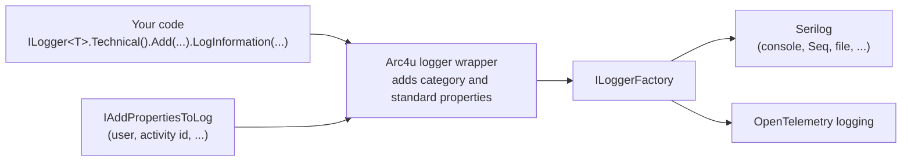
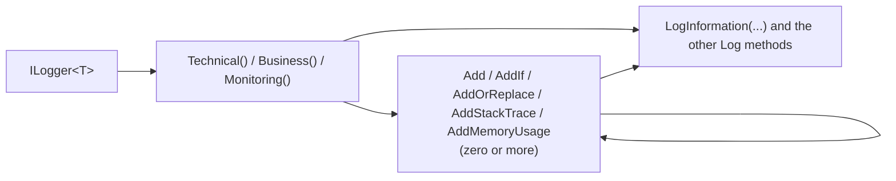

# Diagnostics and logging

Arc4u extends `Microsoft.Extensions.Logging` with a fluent API. It puts every log entry in one of three categories (Technical, Business or Monitoring), adds a standard set of properties (application, class, method, process, thread, user) and lets you attach your own properties without putting them in the message template. It is the logging layer that the other Arc4u packages use, and it follows the [design principles](../../concepts/design-principles.md): Arc4u adds a thin layer on top of what .NET already provides and does not replace it.

## What it solves

With plain `ILogger<T>` you get a message and the values of its template. In a business application you also need to:

- tell apart what IT people read (Technical), what business people read (Business) and the periodic measures for dashboards (Monitoring), so each audience gets its own sink or filter;
- find, on every entry, which application, class, method, process, thread and user produced it, without repeating that in each message;
- add a value to one entry (an order number, a duration) without polluting the message text.

Arc4u replaces the `ILogger<T>` registration with a wrapper that adds these properties and forwards the entry to the logger created by the `ILoggerFactory`. Everything after that is standard .NET: the providers you configure (Serilog, OpenTelemetry, console) receive the entry and decide what to do with it. Arc4u does not ship a sink you must use, and Arc4u.Diagnostics does not reference Serilog.



> [!NOTE]
> Arc4u 8 also had `TraceListener` based logging. It was removed in Arc4u 9 because Serilog and OpenTelemetry cover it. See [TraceListeners removed](../../migration/8x-to-9.md#tracelisteners-removed) in the migration guide.

## Packages involved

| Package | Use it for |
|---|---|
| `Arc4u.Diagnostics` | The fluent API (`Technical()`, `Business()`, `Monitoring()`, `Add`, `AddIf`, ...), `AddILogger`, the process monitoring (`AddSystemMonitoring`) and the `IActivitySourceFactory` used for OpenTelemetry traces. |
| `Arc4u.Diagnostics.Serilog` | A one-line text formatter, the category filter and anonymizer sinks, and the helper that reads the Arc4u properties from a Serilog event. See [Serilog](serilog.md). |
| `Arc4u.Diagnostics.Serilog.Sinks.RealmDb` | Sinks that keep the log entries in a Realm database or in memory, so a client application can show its own logs. See [Client-side log storage](frontend-logging.md). |

`Arc4u.Diagnostics.Serilog` and `Arc4u.Diagnostics.Serilog.Sinks.RealmDb` reference `Arc4u.Diagnostics`. The `Arc4u` package also references `Arc4u.Diagnostics`, and its `AddApplicationContext()` calls `AddILogger()` for you.

## Install

```bash
dotnet add package Arc4u.Diagnostics --prerelease
```

To write to Serilog sinks, add the Serilog integration and the hosting package that connects Serilog to `Microsoft.Extensions.Logging`:

```bash
dotnet add package Arc4u.Diagnostics.Serilog --prerelease
dotnet add package Serilog.AspNetCore
```

## Configuration

`AddILogger()` has no configuration section of its own. The only setting it reads is the application name written in the `Application` property of each entry.

| Key | Type | Default | Description |
|---|---|---|---|
| `Application.Configuration:Environment:LoggingName` | `string` | name of the entry assembly | Value of the `Application` property. Bound to `Arc4u.Configuration.ApplicationConfig` by `AddApplicationConfig`, which is described in the [configuration guide](../configuration/index.md). |

> [!NOTE]
> The `LoggingLevel` key that older Arc4u documentation showed in this section is not read by the code. Filter by level in your logging provider (for example the Serilog `MinimumLevel`).

### Code

```csharp
// Program.cs
using Arc4u.Dependency;
using Arc4u.Diagnostics;
using Arc4u.Diagnostics.Formatter;
using Serilog;
using Serilog.Events;

var builder = WebApplication.CreateBuilder(args);

builder.Services.AddILogger();

builder.Host.UseSerilog((context, configuration) => configuration
    .MinimumLevel.Information()
    .MinimumLevel.Override("Microsoft", LogEventLevel.Warning)
    .WriteTo.Console(new SimpleTextFormatter()));

var app = builder.Build();

app.MapGet("/orders/{id:int}", (int id, ILogger<Program> logger) =>
{
    logger.Technical().LogInformation("Reading order {OrderId}", id);
    logger.Business().Add("Customer", "contoso").LogInformation("Order shipped");
    return Results.Ok(id);
});

app.Run();
```

`AddILogger` (namespace `Arc4u.Dependency`) removes the existing `ILogger<>` registration and registers:

- `ILogger<T>` as a transient `LoggerWrapper<T>`;
- `IScopedLogger<T>` as a scoped `ScopedLoggerWrapper<T>`, for code that wants the properties shared during a scope such as an HTTP request;
- the non-generic `ILogger` as a transient `ILogger<DefaultLogger>`, for [static classes](#log-from-a-static-class);
- a `NullLoggerProperties` under the keys `"Scoped"` and `"Transient"` (see [Add the user and activity id to every entry](#add-the-user-and-activity-id-to-every-entry)), unless you registered your own.

Calling `GET /orders/7` writes these two lines (the `RequestId`, `RequestPath` and `ConnectionId` come from the ASP.NET Core logging scope; the long padding of the fixed columns is shortened here):

```text
29/09/2026 14:53:26,030  Information   Technical   27153  7   Program - <Main>$ - Reading order 7 - {"OrderId":7,"RequestId":"0HNOU52JGMDCV:00000001","RequestPath":"/orders/7","ConnectionId":"0HNOU52JGMDCV"}
29/09/2026 14:53:26,044  Information   Technical   27153  7   Program - <Main>$ - Order shipped - {"OrderId":7,"Customer":"contoso","RequestId":"0HNOU52JGMDCV:00000001","RequestPath":"/orders/7","ConnectionId":"0HNOU52JGMDCV"}
```

Two things in this output are known issues, described in [Troubleshooting](#troubleshooting):

- the second entry is a Business entry but the text formatter prints `Technical` (the category is not read correctly by the Arc4u Serilog formatters and stores, although the entry itself carries the right value);
- `OrderId`, which was only a template argument of the first entry, is written again on the second one.

### Properties written on every entry

The logger adds these properties to each entry (the names are constants of <xref:Arc4u.Diagnostics.LoggingConstants>, and they cannot be used as your own keys):

| Property | Value |
|---|---|
| `Category` | `Technical`, `Business` or `Monitoring` (<xref:Arc4u.Diagnostics.MessageCategory>), written as a string. |
| `Application` | The `LoggingName` described above. |
| `SourceContext` | Full name of the class that logs (the `T` of `ILogger<T>`, or the type you pass for a non-generic `ILogger`). |
| `Method` | Name of the calling member, filled in by the compiler (`[CallerMemberName]`). |
| `Pid`, `Tid` | Id of the process and of the managed thread. |
| `Identity`, `ActivityId` | Only when an <xref:Arc4u.Diagnostics.IAddPropertiesToLog> provider supplies them. |
| `Stacktrace` | Only after `AddStackTrace()`. |

## Common scenarios

### Choose the category and add properties

`Technical()`, `Business()` and `Monitoring()` are extension methods on `ILogger<T>`. Each one selects the category and returns an <xref:Arc4u.Diagnostics.ILoggerWrapper`1> on which you chain `Add...` methods, then finish with any standard `Log...` method (`LogTrace`, `LogDebug`, `LogInformation`, `LogWarning`, `LogError`, `LogCritical`, `Log`).



```csharp
using Arc4u.Diagnostics;

public class OrderService(ILogger<OrderService> logger)
{
    public void Ship(int orderId, TimeSpan duration, bool verbose)
    {
        logger.Business()
              .Add("OrderId", orderId)
              .AddIf(verbose, "DurationMs", () => duration.TotalMilliseconds)
              .LogInformation("Order shipped");

        logger.Technical().AddStackTrace().LogWarning("Shipping took {Duration}", duration);
    }
}
```

| Method | Description |
|---|---|
| `Add(key, value)` | Sets the property, replacing an existing value for the key. |
| `AddIf(condition, key, Func<object>)` | Same as `Add`, and the function is only called when the condition is `true`. |
| `AddOrReplace(key, value)` | Same as `Add`. |
| `AddOrReplaceIf(condition, key, Func<double>)` | Conditional variant for a numeric value. |
| `AddIfNotExist(key, value)` | Sets the property only when the key is not present and the value is not `null`. |
| `AddStackTrace()` | Adds the `Stacktrace` property: the stack trace of the logged exception, otherwise the current one. |
| `AddMemoryUsage()` | Adds a `Memory` property with `GC.GetTotalMemory(false)`. |

A `null` or white-space key throws `ArgumentNullException`, and a reserved key throws <xref:Arc4u.Diagnostics.ReservedLoggingKeyException>.

The values of the message template (`{Duration}` above) are also written as properties, as with any structured logger. What `Add` gives you is a property that is not in the message text.

> [!WARNING]
> Known issue: properties are not cleared after an entry is written. Read [Properties added with Add stay on later entries](#properties-added-with-add-stay-on-later-entries) before you add personal data.

### Log from a static class

A static class cannot take an `ILogger<T>`. Inject or resolve the non-generic `ILogger`, and pass the type that should appear as the `SourceContext`. The overloads on `ILogger` exist for the Technical and Monitoring categories only. `Technical<T>()` is the generic form of `Technical(typeof(T))`; C# does not accept a static class as `T`, which is why the sample uses `typeof`.

```csharp
using Arc4u.Diagnostics;

public static class Helpers
{
    public static void Log(ILogger logger, string path)
    {
        logger.Technical(typeof(Helpers)).Add("Path", path).LogInformation("Cleaning up");
        logger.Monitoring(typeof(Helpers)).Add("Files", 3).LogInformation("Cleanup done");
    }
}
```

### Log an exception

`LogException` is an extension of `ILogger` (namespace `Arc4u.Diagnostics`). It writes an Error entry with the message `Exception: {Message}` and event id 9000. Use the standard `LogError(exception, ...)` when you need your own message.

```csharp
using Arc4u.Diagnostics;

public class Importer(ILogger<Importer> logger)
{
    public void Run()
    {
        try
        {
            throw new InvalidOperationException("boom");
        }
        catch (Exception ex)
        {
            logger.Technical().LogException(ex);
        }
    }
}
```

When the exception is an `AggregateException`, the wrapper also writes one entry for each flattened inner exception.

### Log with high-performance messages

The [`LoggerMessage`](https://learn.microsoft.com/dotnet/core/extensions/logger-message-generator) source generator works on top of the fluent API: define the message as an extension method of `ILogger` and call it at the end of the chain. Arc4u uses this pattern for its own messages (for example `LogMonitoring`, event id 9001). Arc4u uses event ids in the 9000 range, so choose ids outside it.

```csharp
using Arc4u.Diagnostics;

public static partial class OrderMessages
{
    [LoggerMessage(EventId = 1001, Level = LogLevel.Information, Message = "Order {OrderId} shipped")]
    public static partial void LogOrderShipped(this ILogger logger, int orderId);
}

public class Shipper(ILogger<Shipper> logger)
{
    public void Ship(int orderId) => logger.Business().Add("Carrier", "dhl").LogOrderShipped(orderId);
}
```

### Add the user and activity id to every entry

The wrapper asks an <xref:Arc4u.Diagnostics.IAddPropertiesToLog> for extra properties each time it writes an entry. It resolves that service by key:

| Logger | Key |
|---|---|
| `ILogger<T>` (transient wrapper) | `"Transient"` |
| `IScopedLogger<T>` (scoped wrapper) | `"Scoped"` |

`AddILogger` registers a `NullLoggerProperties` (no property) under both keys, so **entries have no `Identity` and no `ActivityId` until you register a provider**. The `Arc4u` package contains `DefaultLoggingProperties`, which reads the user name and `ActivityID` from the `IApplicationContext`. It is exported with the key `"Scoped"`; `AddApplicationContext()` registers it without a key, which the wrappers do not use. Register it with the key yourself (or list `Arc4u.Diagnostics.DefaultLoggingProperties, Arc4u` in `Application.Dependency:RegisterTypes` when you use the [Arc4u source generators](../dependency-injection/index.md)), and inject `IScopedLogger<T>`:

```csharp
using Arc4u.Dependency;
using Arc4u.Diagnostics;

public static class LoggingRegistration
{
    public static void Register(WebApplicationBuilder builder)
    {
        builder.Services.AddILogger();
        builder.Services.AddKeyedScoped<IAddPropertiesToLog, DefaultLoggingProperties>("Scoped");
    }
}

public class Handler(IScopedLogger<Handler> logger)
{
    public void Handle() => logger.Technical().LogInformation("Handled");
}
```

To add your own properties, implement `IAddPropertiesToLog`. Values that are `null` are ignored, and the keys of `LoggingConstants` such as `Identity` and `ActivityId` are the ones the Arc4u formatters read.

```csharp
using Arc4u.Dependency;
using Arc4u.Diagnostics;

public class TenantProperties : IAddPropertiesToLog
{
    public IDictionary<string, object> GetProperties() => new Dictionary<string, object>
    {
        [LoggingConstants.Identity] = "alice",
        ["Tenant"] = "contoso",
    };
}

public static class TenantRegistration
{
    public static void Register(IServiceCollection services)
    {
        services.AddILogger();
        services.AddKeyedScoped<IAddPropertiesToLog, TenantProperties>("Scoped");
    }
}
```

With that provider, an entry written by an `IScopedLogger<T>` looks like this:

```text
29/09/2026 14:53:47,920  Information   Technical  alice  28853  1   Program - <Main>$ - hello - {"Tenant":"contoso"}
```

> [!NOTE]
> A transient `ILogger<T>` uses the `"Transient"` key, so it does not get the properties of a `"Scoped"` provider. Register a keyed transient provider as well if you want them on `ILogger<T>` entries.

### Log CPU and memory usage

`AddSystemMonitoring()` (namespace `Microsoft.Extensions.DependencyInjection`) registers the hosted service <xref:Arc4u.Diagnostics.Monitoring.SystemResources>. Ten seconds after the host starts, and then every ten seconds, it writes one Monitoring entry with the message `Cpu & Memory` and event id 9001. These values are fixed: `AddSystemMonitoring` has no parameter to change them.

```csharp
using Arc4u.Dependency;
using Arc4u.Diagnostics;

public static class MonitoringRegistration
{
    public static void Register(IServiceCollection services)
    {
        services.AddILogger()
                .AddSystemMonitoring();
    }
}
```

The entry carries these properties: `TotalCpuUsed`, `PrivilegedCpuUsed` and `UserCpuUsed` (percent of the CPU capacity of all processors since the previous measure), and `WorkingSet`, `NonPagedSystemMemory`, `PagedMemory`, `PagedSystemMemory`, `PrivateMemory` and `VirtualMemoryMemory` (bytes, as reported by `System.Diagnostics.Process`). A real entry, as written by the text formatter:

```text
29/09/2026 14:51:14,024  Information   Technical   21459  8   Arc4u.Diagnostics.Monitoring.SystemResources - CollectData - Cpu & Memory - {"TotalCpuUsed":0.11178381082593415,"PrivilegedCpuUsed":0.037256095413329,"UserCpuUsed":0.07455391315139101,"WorkingSet":77561856,"NonPagedSystemMemory":0,"PagedMemory":0,"PagedSystemMemory":0,"PrivateMemory":0,"VirtualMemoryMemory":462388707328}
```

Send these entries to their own sink, or exclude them from the console, with the category filter described in [Serilog](serilog.md#filter-by-category). `SystemResources` needs the Arc4u logger: call `AddILogger()` (or `AddApplicationContext()`) as well.

### Use it next to OpenTelemetry

Arc4u.Diagnostics has no dependency on OpenTelemetry. The two work side by side through standard .NET mechanisms, and this is what the code supports:

- **Logs.** The wrapper hands the properties to the `ILoggerFactory` as the log state. An OpenTelemetry logging provider (`builder.Logging.AddOpenTelemetry(...)`) therefore receives `Category`, `Application`, `SourceContext`, `Method`, `Pid`, `Tid` and your `Add` properties as log record attributes, and OpenTelemetry adds the `TraceId` and `SpanId` of the current activity itself.
- **Traces.** Arc4u components that trace their work (token providers, principal creation, middleware) start activities on an `ActivitySource` named `Arc4u`. <xref:Arc4u.Diagnostics.IActivitySourceFactory> returns that source (and any other you ask for by name and version) as a singleton, and `AddApplicationContext()` registers it. Subscribe to the source with the OpenTelemetry SDK: `WithTracing(t => t.AddSource("Arc4u"))`.
- **Ids.** The Arc4u `ActivityId` property is the `ActivityID` of the Arc4u `IApplicationContext`, not `System.Diagnostics.Activity.Current.Id`. Use the `TraceId` of the log record to correlate with traces.

A log record written with this setup, as printed by the OpenTelemetry console exporter (the `OrderId` and the Arc4u properties are the attributes):

```text
LogRecord.TraceId:                 e043c555c72709ccc77e2c854a69a99e
LogRecord.SpanId:                  f8ef3ec5f8cba95e
LogRecord.CategoryName:            Program
LogRecord.FormattedMessage:        inside activity
LogRecord.Attributes (Key:Value):
    OrderId: 42
    OriginalFormat (a.k.a Body): inside activity
    Method: <Main>$
    SourceContext: Program
    Category: Business
    Application: App
    Tid: 1
    Pid: 30603
```

The <xref:Arc4u.Diagnostics.OpenTelemetrySettings> class (`Address`, `Attributes`, `Sources`) exists in the package, but no Arc4u code reads it. Configure the OpenTelemetry SDK with its own options.

## Extensibility points

| Service | Default implementation | Replace it to |
|---|---|---|
| <xref:Arc4u.Diagnostics.IAddPropertiesToLog> (keys `"Scoped"` and `"Transient"`) | `NullLoggerProperties` | Add properties such as the user, a tenant or a correlation id to every entry. |
| <xref:Arc4u.Diagnostics.IActivitySourceFactory> | `DefaultActivitySourceFactory` | Control how `ActivitySource` instances are created. |
| `ILogger<T>` | `LoggerWrapper<T>` | Do not replace it: the fluent API throws an `InvalidOperationException` on any other implementation. |

In unit tests, use `NullLoggerWrapper<T>.Instance` where an `ILogger<T>` is required: it accepts the fluent API and writes nothing.

```csharp
using Arc4u.Diagnostics;

public static class TestHelpers
{
    public static void Use()
    {
        ILogger<OrderService> logger = NullLoggerWrapper<OrderService>.Instance;
        logger.Technical().Add("Key", "value").LogInformation("Nothing is written");
    }
}
```

## Troubleshooting

### InvalidOperationException: Bad Arc4u usage

`Technical()`, `Business()` and `Monitoring()` only work on a logger created by `AddILogger()` (or `AddApplicationContext()`, which calls it). You get this exception with a logger you created yourself (`LoggerFactory.CreateLogger`, `NullLogger<T>`) or with a mock. Resolve the logger from the container, or use `NullLoggerWrapper<T>.Instance` in tests. Also make sure `AddILogger()` runs after any other code that registers `ILogger<>`, because it removes the existing registration.

### ReservedLoggingKeyException

The key you passed to `Add` is one of `Application`, `Pid`, `Tid`, `Method`, `SourceContext`, `ActivityId`, `Identity`, `Stacktrace` or `Category`. Use another name.

### Nothing is written

`AddILogger` only prepares the entries. Add a logging provider, for example `builder.Host.UseSerilog(...)` with a sink, and check its minimum level. See [Serilog](serilog.md).

### Entries have no Identity or ActivityId

No `IAddPropertiesToLog` provider is registered under the key of the logger you use. See [Add the user and activity id to every entry](#add-the-user-and-activity-id-to-every-entry).

### Properties added with Add stay on later entries

Known issue. The properties you add (`Add`, `AddIf`, ...), the values of message template arguments and the `AddStackTrace()` setting are stored in the logger instance and are not cleared once the entry is written. Every later entry written by the same logger instance carries them, even when it uses another category. The lifetime of the instance follows its consumer: a transient `ILogger<T>` injected in a singleton service lives as long as the application, and an `IScopedLogger<T>` lives as long as its scope.

This output comes from one `ILogger<Program>` that logs three entries, only the first with `Add("Ssn", ...)` (the fixed columns are shortened):

```text
Information  Technical  Program - first - {"Ssn":"123-45-6789"}
Information  Technical  Program - second (no Add) - {"Ssn":"123-45-6789"}
Information  Technical  Program - third (plain ILogger call) - {"Ssn":"123-45-6789"}
```

Until this is fixed:

- do not `Add` personal or secret data (names, e-mail addresses, tokens) on a logger that lives longer than the operation you log;
- put per-call data in the message template of a short-lived logger, or clear the logger yourself before you log, as below.

```csharp
using Arc4u.Diagnostics;

public class Cleaner(ILogger<Cleaner> logger)
{
    public void Log()
    {
        var entry = logger.Technical();
        entry.AdditionalFields.Clear();
        entry.IncludeStackTrace = false;
        entry.LogInformation("Starts with no property from a previous entry");
    }
}
```

### The category is always Technical

Known issue. The logger writes `Category` as a string (`Business`), but the Arc4u helper that reads it for `SimpleTextFormatter`, `MemoryLogDB` and `RealmDB` expects a number and falls back to `Technical`. Sinks that read the property as it is (the Serilog Expressions filter, the JSON formatter, OpenTelemetry) see the right value. The same mismatch makes `WriteTo.CategoryFilter` forward nothing, see [Serilog](serilog.md#filter-by-category).

## See also

- [Serilog](serilog.md)
- [Client-side log storage](frontend-logging.md)
- [Configuration guide](../configuration/index.md) for `Application.Configuration`
- [Concepts](../../concepts/index.md)
- <xref:Arc4u.Diagnostics> in the API reference
