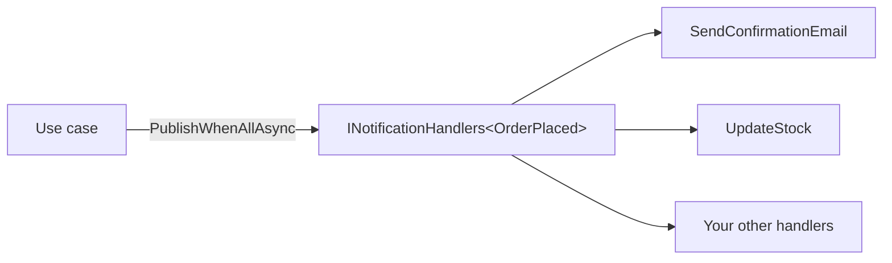

# Dispatcher

`Arc4u.Dispatcher` sends one notification to all the handlers registered for it in the dependency injection container. The handlers run in the same process and the same DI scope as the caller. It builds on the [abstraction plus injection](../../concepts/design-principles.md) approach of Arc4u: you write handlers against an interface and register them, and the publisher never knows the concrete types.

## What it solves

A use case often has to trigger several independent reactions: an order is placed, then you send an e-mail, update the stock and write an audit record. Calling each service from the use case couples it to all of them. With the dispatcher, the use case publishes an `OrderPlaced` notification and each reaction is a handler that you register separately.



The package is small on purpose. It gives you:

- `INotificationHandler<T>` to implement, with variants for two to five parameters.
- `INotificationHandlers<T>`, which resolves every registered handler for a notification type from the container.
- `PublishWhenAllAsync` and `PublishForEachAsync` to call them.

It does not give you a message bus, queueing, retries, a result from the handlers, a pipeline of behaviors, or delivery to another process. See [When to use it](#when-to-use-it-instead-of-plain-di).

## Packages involved

| Package | Use it for |
|---|---|
| `Arc4u.Dispatcher` | The handler interfaces, the registration method and the publish methods. It references only `Microsoft.Extensions.DependencyInjection.Abstractions`. |

## Install

```bash
dotnet add package Arc4u.Dispatcher --prerelease
```

`Arc4u.Dispatcher` targets `net10.0` and `net11.0`. See [Package support](../package-support.md) for the other packages.

## Configuration

This package has no configuration section. Registration is code only.

### Code

Register the generic publisher services once, then register each handler against the notification type it handles:

```csharp
// Program.cs
using Arc4u.Dispatcher.Notification;

var builder = WebApplication.CreateBuilder(args);

builder.Services.AddNotificationHandlersAsScoped();
builder.Services.AddScoped<INotificationHandler<OrderPlaced>, SendConfirmationEmail>();
builder.Services.AddScoped<INotificationHandler<OrderPlaced>, UpdateStock>();

var app = builder.Build();

app.MapPost("/orders/{id:int}", async (int id, INotificationHandlers<OrderPlaced> notifier, CancellationToken cancellationToken) =>
{
    await notifier.PublishWhenAllAsync(new OrderPlaced(id), cancellationToken);
    return Results.Accepted();
});

app.Run();

public record OrderPlaced(int OrderId);

public class SendConfirmationEmail : INotificationHandler<OrderPlaced>
{
    public Task HandleAsync(OrderPlaced notification, CancellationToken cancellationToken)
        => Task.CompletedTask; // send the e-mail
}

public class UpdateStock : INotificationHandler<OrderPlaced>
{
    public Task HandleAsync(OrderPlaced notification, CancellationToken cancellationToken)
        => Task.CompletedTask; // update the stock
}
```

<xref:Arc4u.Dispatcher.Notification.NotificationHandlersExtension.AddNotificationHandlersAsScoped*> registers `INotificationHandlers<>` (and its two to five parameter variants) as open generics, so you call it once for every notification type. It does not register your handlers: you do that with the usual `AddScoped`, `AddTransient` or `AddSingleton` calls.

| Parameter of `AddNotificationHandlersAsScoped` | Type | Default | Description |
|---|---|---|---|
| `lifetime` | `ServiceLifetime` | `Scoped` | Lifetime of the `INotificationHandlers<>` services. `Transient` registers them as transient. Any other value, including `Singleton`, registers them as scoped. |

## Common scenarios

### Publish a notification with several parameters

Use `INotificationHandler<T1, T2>` up to `INotificationHandler<T1, T2, T3, T4, T5>` when a notification is naturally a set of values and you do not want to define a class for it. The handler, the registration and the publish call all use the same type arguments:

```csharp
using Arc4u.Dispatcher.Notification;
using Microsoft.Extensions.DependencyInjection;

public static class TwoParameterSample
{
    public static async Task RunAsync(IServiceProvider provider, CancellationToken cancellationToken)
    {
        var notifier = provider.GetRequiredService<INotificationHandlers<string, int>>();
        await notifier.PublishWhenAllAsync("order", 42, cancellationToken);
    }
}

public class AuditHandler : INotificationHandler<string, int>
{
    public Task HandleAsync(string entity, int id, CancellationToken cancellationToken)
        => Task.CompletedTask;
}
```

Register the handler with `services.AddScoped<INotificationHandler<string, int>, AuditHandler>()`. Resolve `INotificationHandlers<string, int>` from a scope. Resolving it from the root provider throws when scope validation is on (the ASP.NET Core Development default), unless you call `AddNotificationHandlersAsScoped(ServiceLifetime.Transient)` and register singleton or transient handlers.

### Run the handlers in parallel or one after the other

| Method | Behavior |
|---|---|
| `PublishWhenAllAsync` | Starts the handlers one after the other, in registration order, without waiting for each one to finish, then awaits all of them together (`Task.WhenAll`). Handlers that yield at an `await` overlap. |
| `PublishForEachAsync` | Calls a handler, awaits it, then calls the next one. |

Use `PublishWhenAllAsync` when the handlers are independent and mostly I/O bound. Use `PublishForEachAsync` when a handler depends on the side effects of the previous one, or when the handlers share something that is not thread-safe, such as a `DbContext` in the same scope.

Both methods return once every handler has completed. If there is no handler registered for the notification type, they complete immediately and do nothing.

### Handle a failing handler

The two methods differ when a handler throws:

- `PublishForEachAsync` stops at the first exception. The handlers after the failing one are not called.
- `PublishWhenAllAsync` lets every handler that started run to completion, then throws the first exception to fail (the others are not surfaced by `await`). A handler whose `HandleAsync` is not an `async` method and throws before returning its `Task` is different: the exception propagates immediately, the handlers registered after it are never started, and the ones already started are not awaited. An `async` handler that throws before its first `await` returns a faulted task and behaves like any other async fault.

The dispatcher does not catch, log or retry. If a reaction must not break the use case, catch inside the handler.

## Extensibility points

| Service | Default implementation | Replace it to |
|---|---|---|
| `INotificationHandlers<T>` (and the variants with two to five parameters) | `NotificationHandlers<T>` | Filter, order or decorate the handlers before publishing. Register your own open generic after `AddNotificationHandlersAsScoped`, or register a closed type such as `INotificationHandlers<OrderPlaced>`. |
| `INotificationHandler<T>` | none: you provide them | Add a reaction to a notification. Register as many as you want for the same `T`. |

`NotificationHandlers<T>` reads the handlers from the `IServiceProvider` it is created with, in its constructor, with `GetServices<INotificationHandler<T>>()`. The handlers are therefore created when you resolve `INotificationHandlers<T>`, and they live as long as the handlers' own registration lifetime allows.

## When to use it instead of plain DI

Plain dependency injection already lets you inject `IEnumerable<IOrderReaction>` and loop over it. That is often enough. The dispatcher adds a shared vocabulary and two publish strategies, and nothing else.

| Situation | Use |
|---|---|
| One caller, one collaborator | Inject the service. No dispatcher. |
| Several reactions in the same process, you want a typed notification and a choice between parallel and sequential calls | `Arc4u.Dispatcher`. |
| The reaction must survive a crash, be retried, or run in another service | A message broker. Arc4u has no messaging package: use Dapr pub/sub directly. See [NServiceBus replaced by Dapr pub/sub](../../migration/8x-to-9.md#nservicebus-replaced-by-dapr-pubsub). |
| You need a return value, a validation pipeline or request/response | A mediator library, or a plain service call. |

## Troubleshooting

### `InvalidOperationException`: no service for type `INotificationHandlers<...>`

You did not call `AddNotificationHandlersAsScoped()`. Call it once at startup. In a minimal API endpoint that takes `INotificationHandlers<T>` as a parameter, the symptom is different: the parameter is inferred as a request body and the request fails with HTTP 400 (`Implicit body inferred for parameter "notifier" but no body was provided`).

### My handler is never called

- The handler is registered against a different `T` than the one you publish. `INotificationHandler<OrderPlaced>` and `INotificationHandler<OrderPlaced, int>` are unrelated types.
- The handler is registered against its class only (`AddScoped<SendConfirmationEmail>()`). Register it against the interface: `AddScoped<INotificationHandler<OrderPlaced>, SendConfirmationEmail>()`.
- You registered no handler at all. Publishing then does nothing and raises no error.

### `Cannot resolve scoped service ... from root provider`

`INotificationHandlers<T>` is scoped by default. Resolve it from a scope, for example from `HttpContext.RequestServices` or an `IServiceScope`, or pass `ServiceLifetime.Transient` to `AddNotificationHandlersAsScoped` and register singleton or transient handlers.

### `AddNotificationHandlersAsScoped(ServiceLifetime.Singleton)` does not register singletons

By design of the current code, any lifetime other than `Transient` registers the services as scoped. The method name says so.

## See also

- [Design principles](../../concepts/design-principles.md)
- [Package support](../package-support.md)
- [Migration from 8.x: NServiceBus replaced by Dapr pub/sub](../../migration/8x-to-9.md#nservicebus-replaced-by-dapr-pubsub)
- <xref:Arc4u.Dispatcher.Notification> in the API reference
