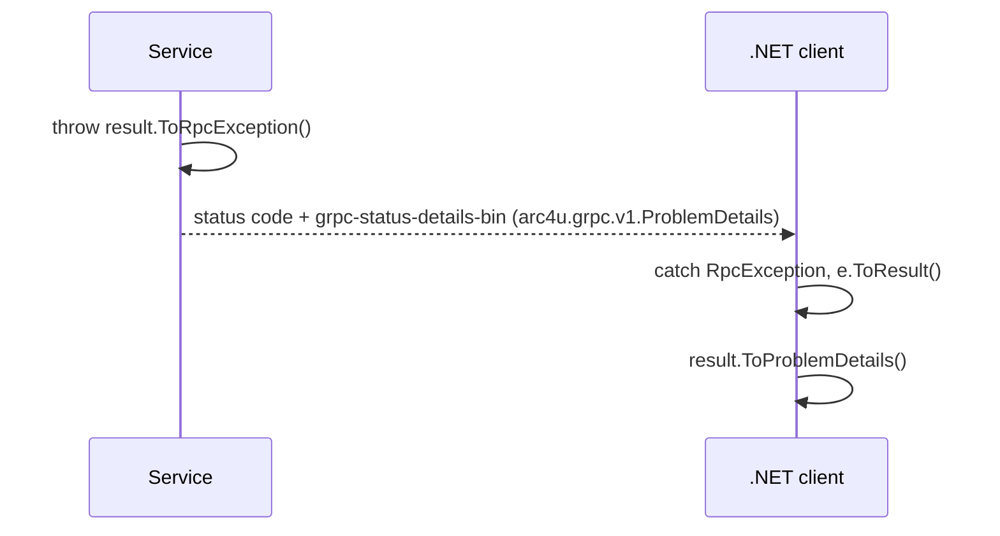

# ProblemDetails over gRPC

A REST endpoint reports a failed `Result` as a [ProblemDetails](../../concepts/glossary.md#problemdetails)
document. gRPC has only a status code and a message. Arc4u sends the same document over gRPC, so a
failure means the same thing on both transports, and a .NET client turns it back into a failed
`Result`. The result model itself is described in [Results and errors](../results/index.md) and the
[Result pattern](../../concepts/glossary.md#result-pattern) concept.

## What it solves

`Result.ToRpcException()` (service) and `RpcException.ToResult()` (client) are two halves of one
contract:

- The service derives everything from the `ProblemDetails` that `ToProblemDetails()` produces for the
  same result, so the REST and gRPC answers cannot drift apart.
- The document travels in the `grpc-status-details-bin` trailer, following the gRPC
  [richer error model](https://grpc.io/docs/guides/error/#richer-error-model), so a client in any
  language can read it.
- The client rebuilds the errors the document was made from, so `ToProblemDetails()` on the client
  gives back the document the service produced, validation messages included.



## Packages involved

| Package | Use it for |
|---|---|
| `Arc4u.AspNetCore.gRpc` | `ToRpcException()` on the service. |
| `Arc4u.gRPC` | `ToResult()`, `ToResult<T>()` and `ToProblemDetailError()` on the client, and the `problem_details.proto` contract. |
| `Arc4u.AspNetCore.Results` | `ToProblemDetails()`, when you want to render the client's result as a ProblemDetails document. |

## Install

```bash
dotnet add package Arc4u.AspNetCore.gRpc --prerelease   # service
dotnet add package Arc4u.gRPC --prerelease              # client
```

## Configuration

Nothing to configure: the conversion is a pair of extension methods.

## Common scenarios

### Fail a call from the service

Throw the exception built from the failed result. The `Detail` of the ProblemDetails becomes the
detail of the gRPC status.

```csharp
using Arc4u.AspNetCore.gRpc.Results;
using Arc4u.Results;
using FluentResults;
using Grpc.Core;
using Orders.Grpc;

public class FailingOrderService : OrderService.OrderServiceBase
{
    public override Task<OrderReply> GetOrder(GetOrderRequest request, ServerCallContext context)
    {
        var result = Result.Fail<OrderReply>(ProblemDetailError.Create("Order 2 does not exist.")
                                                               .WithStatusCode(404)
                                                               .WithTitle("Order not found"));

        throw result.ToRpcException();
    }
}
```

A client sees `StatusCode.NotFound` with the detail "Order 2 does not exist.", and the document
`{"type":"about:blank","title":"Order not found","status":404,"detail":"Order 2 does not exist.","Severity":"Error"}`.

The status code is the closest counterpart of the HTTP status of the ProblemDetails:

| HTTP status | gRPC status code |
|---|---|
| 400 (also a bare `Result.Fail("...")`) | `InvalidArgument` |
| 401 | `Unauthenticated` |
| 403 | `PermissionDenied` |
| 404 | `NotFound` |
| 409 | `Aborted` |
| 412 | `FailedPrecondition` |
| 422 (validation failure) | `InvalidArgument` |
| 429 | `ResourceExhausted` |
| 501 | `Unimplemented` |
| 503 | `Unavailable` |
| 504 | `DeadlineExceeded` |
| any other, 500 included | `Internal` |

The 422 is kept in the `status` member of the document sent in the details.

### Read the failure in a .NET client

Catch the `RpcException` and convert it. `ToResult<T>()` gives a failed `Result<T>`.

```csharp
using Arc4u.gRPC.Results;
using FluentResults;
using Grpc.Core;
using Orders.Grpc;

public class OrderClient(OrderService.OrderServiceClient client)
{
    public async Task<Result<OrderReply>> GetAsync(int id, CancellationToken cancellationToken)
    {
        try
        {
            return Result.Ok(await client.GetOrderAsync(new GetOrderRequest { Id = id }, cancellationToken: cancellationToken));
        }
        catch (RpcException e)
        {
            return e.ToResult<OrderReply>();
        }
    }
}
```

When the fault carries no ProblemDetails (a transport failure that never reached the service, or a
service that does not use Arc4u), the error is built from the gRPC status alone:

| gRPC status code | HTTP status |
|---|---|
| `InvalidArgument`, `OutOfRange` | 400 |
| `Unauthenticated` | 401 |
| `PermissionDenied` | 403 |
| `NotFound` | 404 |
| `Aborted`, `AlreadyExists` | 409 |
| `FailedPrecondition` | 412 |
| `ResourceExhausted` | 429 |
| `Unimplemented` | 501 |
| `Unavailable` | 503 |
| `DeadlineExceeded` | 504 |
| any other | 500 |

A call to an unreachable address, for instance, becomes a `503` error whose detail is "Error connecting
to subchannel.".

`ToProblemDetailError()` returns the single error describing the fault. It keeps the status, title,
type, instance and detail but not the validation messages: use `ToResult()` to keep them.

### Report a validation failure

A result made of validation errors is reported as a `422` with the messages grouped by severity.
Over gRPC the status is `InvalidArgument` and the messages are in the details, most severe first:

```csharp
using Arc4u.Results.Validation;
using FluentResults;

public static class ValidationSample
{
    public static Result Validate() => Result.Fail(new List<IError>
    {
        ValidationError.Create("Customer is required."),
        ValidationError.Create("Amount rounded.").WithSeverity(Severity.Warning),
    });
}
```

`ToRpcException()` on this result, then `ToResult()` and `ToProblemDetails()` on the client, give
`{"type":"https://github.com/Arc4u-org/Arc4u/wiki/StatusCodes#validation-error","title":"Error from validation.","status":422,"errors":{"Error":["Customer is required."],"Warning":["Amount rounded."]}}`.

### Keep large validation failures within the metadata limit

gRPC clients cap the metadata of a response (8 KiB by default in Java and in the C core behind
Python). The service therefore keeps the `grpc-status-details-bin` trailer within 6 KiB, base64
included. When a validation failure has too many messages, the least severe ones are left out and
their count is sent in `omitted_errors`. The .NET client appends a last warning to the result:
"N more validation message(s) were left out.". If even the document without any message does not fit,
only the status code and the detail are sent.

### Read the failure from another language

The details hold an `arc4u.grpc.v1.ProblemDetails` message, packed in the `google.rpc.Status` of the
trailer. Generate your code from `problem_details.proto`, which is in the repository at
`src/Arc4u.gRPC/Protos/arc4u/grpc/v1/problem_details.proto` and in the package at
`content/protos/arc4u/grpc/v1/problem_details.proto`, and read the status with the helper of your
language:

| Language | Helper |
|---|---|
| Java | `StatusProto.fromThrowable` |
| Go | `status.FromError(err).Details()` |
| Python | `rpc_status.from_call` |

The message has the members of RFC 7807 (`type`, `title`, `status`, `detail`, `instance`), the
validation messages `errors` (each with a `severity` and a `message`) and `omitted_errors`.

### Use ProblemDetails inside your own messages

A .NET application does not compile `problem_details.proto`: the message is already compiled in
`Arc4u.gRPC`. To use it in one of your own protos, for a ProblemDetails per item of a stream for
instance, import it. The package adds `content/protos` to the `Grpc.Tools` import path, and the
generated code refers to the type in the `Arc4u.gRPC` assembly:

```proto
import "arc4u/grpc/v1/problem_details.proto";

message ImportLineResult {
  oneof result {
    string order_id = 1;
    arc4u.grpc.v1.ProblemDetails problem = 2;
  }
}
```

The generated C# type is `Arc4u.gRPC.Protos.ProblemDetails`.

## Extensibility points

The conversion is not extensible: the mapping tables above are fixed. To send other information, add
your own message to the status details or to the response.

## Troubleshooting

### The client shows `Internal` instead of my error

An exception that is not an `RpcException` is replaced by `Internal` with the message "An error
occurs." by `AuthorizationInterceptor`. Throw `result.ToRpcException()` instead of letting the
exception escape. See [gRPC services and clients](grpc.md).

### The validation messages are missing on the client

Either the client called `ToProblemDetailError()`, which keeps a single error, or the failure was
larger than 6 KiB and some messages were left out (the result then ends with a warning saying how
many). Use `ToResult()`: when messages were left out, its last error is a warning saying how many.

### `ToProblemDetails()` is not available in the client

It is defined in `Arc4u.AspNetCore.Results`. A client that only references `Arc4u.gRPC` reads the
errors of the result directly.

## See also

- [gRPC and API versioning](index.md)
- [gRPC services and clients](grpc.md)
- [Results and errors](../results/index.md)
- <xref:Arc4u.gRPC.Results> in the API reference
- <xref:Arc4u.AspNetCore.gRpc.Results> in the API reference
