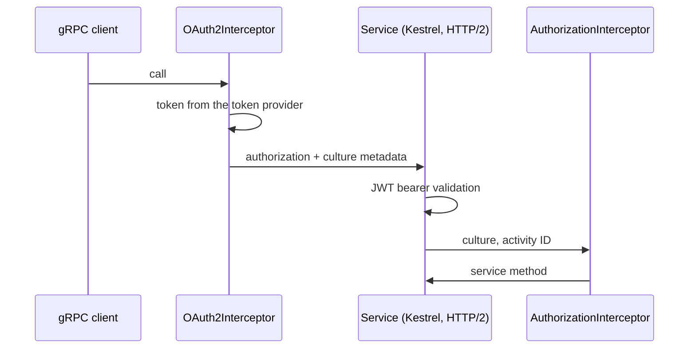

# gRPC services and clients

Arc4u does not replace the .NET gRPC stack. It adds interceptors and middleware around it so that a
gRPC call carries the caller's identity and culture, fails with a predictable status, and is
measured like any other Arc4u endpoint. This page covers the service, the client and the
interceptors. Failures are covered in [ProblemDetails over gRPC](grpc-problem-details.md) and the
HTTP/2 hosting in [Kestrel and HTTP/2](kestrel.md). The general ideas are in the
[concepts](../../concepts/index.md) section.

## What it solves

- **Authentication propagation.** A service calling another service, or a UI calling a service, must
  forward a token. `OAuth2Interceptor<T>` obtains it from an Arc4u
  [token provider](../../concepts/glossary.md#token-provider) and puts it in the `authorization`
  metadata of every call, together with the user's culture.
- **Server context.** `AuthorizationInterceptor` applies the culture header (when the application
  context already has a principal) and sets the activity ID of the Arc4u application context, and hides unexpected exceptions behind an `Internal` status.
- **Consistent failures.** `AddGrpcAuthenticationControl()` turns the redirect an interactive
  authentication challenge produces into a `401`, which a gRPC client understands.
- **Timing.** `AddGrpcMonitoringTimeElapsed()` logs how long each call took.



## Packages involved

| Package | Use it for |
|---|---|
| `Arc4u.AspNetCore.gRpc` | Service side: middleware, `ToRpcException()`, `ConfigureLocalCaCertificateForGrpc()`. |
| `Arc4u.gRPC` | The interceptors, `ServiceAspectAttribute`, the PEM certificate helpers and `ToResult()`. |

## Install

```bash
dotnet add package Arc4u.AspNetCore.gRpc --prerelease   # service (also for ConfigureLocalCaCertificateForGrpc)
dotnet add package Arc4u.gRPC --prerelease              # client
```

The samples on this page use the `orders.proto` below. `Grpc.AspNetCore` generates the service base
class, `Grpc.Net.ClientFactory` the client.

```proto
syntax = "proto3";
option csharp_namespace = "Orders.Grpc";
package orders.v1;

service OrderService {
  rpc GetOrder (GetOrderRequest) returns (OrderReply);
}
message GetOrderRequest { int32 id = 1; }
message OrderReply { int32 id = 1; string customer = 2; }
```

## Configuration

There is no Arc4u section for gRPC. The registrations are code only.

### Service

```csharp
// Program.cs
using Arc4u.AspNetCore.Middleware;
using Arc4u.gRPC.Interceptors;
using Arc4u.Security.Principal;

var builder = WebApplication.CreateBuilder(args);

builder.Services.AddApplicationContext();
builder.Services.AddGrpc(options => options.Interceptors.Add<AuthorizationInterceptor>());

var app = builder.Build();

app.AddGrpcAuthenticationControl();
app.AddGrpcMonitoringTimeElapsed();
// UseAuthentication() and UseAuthorization() come next.
app.MapGrpcService<OrderGrpcService>();

app.Run();
```

| Call | What it does |
|---|---|
| `AddApplicationContext()` | Registers the scoped <xref:Arc4u.Security.Principal.IApplicationContext> and the Arc4u logger. `AuthorizationInterceptor` needs both; the timing middleware only needs the Arc4u logger. |
| `Interceptors.Add<AuthorizationInterceptor>()` | Applies the `culture` request header to the current thread and to the principal profile, only when the application context already has a principal (for example after JWT bearer authentication), sets `ApplicationContext.ActivityID` to `Activity.Current?.Id` (or a new GUID), logs every exception, `RpcException` included, at error level (expected `NotFound` or validation failures too), and turns any exception that is not an `RpcException` into `StatusCode.Internal` with the message "An error occurs.". |
| `AddGrpcAuthenticationControl()` | A gRPC request (content type containing `grpc`) that ends with a `302` is answered with `401` and its headers are cleared. Add it before `UseAuthentication()`. |
| `AddGrpcMonitoringTimeElapsed()` | Writes the service type, method name, elapsed milliseconds and response status to the technical log of every gRPC endpoint. Pass an `Action<Type, TimeSpan>` to also feed a metric. |

The service itself is a normal `Grpc.AspNetCore` service. Protect it with the standard
`[Authorize]` attribute once JWT bearer authentication is configured as described in
[Authentication (server)](../authentication-server/index.md).

```csharp
using Arc4u.AspNetCore.gRpc.Results;
using Arc4u.Results;
using FluentResults;
using Grpc.Core;
using Orders.Grpc;

public class OrderGrpcService : OrderService.OrderServiceBase
{
    public override Task<OrderReply> GetOrder(GetOrderRequest request, ServerCallContext context)
    {
        Result<OrderReply> result = request.Id == 1
            ? Result.Ok(new OrderReply { Id = 1, Customer = "Contoso" })
            : Result.Fail<OrderReply>(ProblemDetailError.Create("Order not found.").WithStatusCode(404));

        return result.IsFailed ? throw result.ToRpcException() : Task.FromResult(result.Value);
    }
}
```

### Client

Register the generated client with the client factory and add the interceptor that forwards the
token. `OAuth2Interceptor<T>` has no default constructor: derive from it and pick the token
settings by name.

```csharp
using Arc4u.Configuration;
using Arc4u.gRPC.Interceptors;
using Microsoft.Extensions.Options;

public class BearerInterceptor(
    IServiceProvider serviceProvider,
    ILogger<BearerInterceptor> logger,
    IOptionsMonitor<SimpleKeyValueSettings> settings)
    : OAuth2Interceptor<BearerInterceptor>(serviceProvider, logger, settings.Get("OAuth2"));
```

```csharp
// Program.cs
using Arc4u.Security.Principal;
using Orders.Grpc;

var builder = WebApplication.CreateBuilder(args);

builder.Services.AddApplicationContext();
builder.Services.AddTransient<BearerInterceptor>();
builder.Services.AddGrpcClient<OrderService.OrderServiceClient>(options => options.Address = new Uri("https://orders.example.com"))
                .AddInterceptor<BearerInterceptor>();
```

`AddApplicationContext()` registers the Arc4u logger: the interceptor logs through it and throws
`InvalidOperationException` ("Bad Arc4u usage.") on the first call without it. To add a token the interceptor
also needs an `IApplicationContext` with a principal and a keyed `ITokenProvider`.

`"OAuth2"` is the default name under which `ConfigureOAuth2Settings` registers the settings
(`Constants.BearerAuthenticationType`); use the name you passed there. The token settings and the
token providers are covered in [Authentication (client)](../authentication-client/index.md).

## Common scenarios

### Forward the caller's token and culture

`OAuth2Interceptor<T>` runs on every call type (unary, client, server and duplex streaming). It adds
the `authorization` metadata when all of these hold:

- the call has no `authorization` metadata yet;
- an `IApplicationContext` with a principal exists;
- the settings contain an `AuthenticationType`;
- either that type is `inject`, or it equals the authentication type of the principal's identity;
- the `ITokenProvider` registered with the settings' `ProviderId` returns a token that has not
  expired.

With `inject` the token comes from the provider without a user identity (a service account) and the
scheme is the token's type; otherwise the header is `Bearer <token>`. The interceptor also adds a
`culture` metadata with the two-letter code of the principal's current culture, which
`AuthorizationInterceptor` applies on the other side.

When one of the conditions is not met, the interceptor adds nothing and lets the call go on: the
service then answers `Unauthenticated`. Most cases log at trace level; an identity whose
authentication type differs from the settings' returns silently, without a log entry. The interceptor
catches token provider errors, but it throws when the Arc4u logger is not registered, and a
`KeyNotFoundException` when an `authorization` metadata already exists and the settings have no
`AuthenticationType`.

### Route through a reverse proxy with a path prefix

A reverse proxy such as YARP can route on a path prefix. `AddSuffixPathInterceptor` is an abstract
client interceptor that puts a prefix in front of the service name of every call. Despite its name it
prefixes; the prefix is used as is, so end it with a slash and do not start it with one.

```csharp
using Arc4u.gRPC.Interceptors;

public class OrdersPrefixInterceptor() : AddSuffixPathInterceptor("orders/");
```

With the `orders.proto` above, `GetOrder` is then sent to `/orders/orders.v1.OrderService/GetOrder`.
Register the class like `BearerInterceptor` with `AddInterceptor<OrdersPrefixInterceptor>()`, and
add a YARP route that matches `/orders/{**catch-all}` and removes the prefix with a path transform.

### Trust a private root CA

A client calling a service signed by an internal CA must trust that CA. `ConfigureLocalCaCertificateForGrpc()`
configures the primary `SocketsHttpHandler` of the client so that a server certificate that fails
the default validation is accepted when it chains to one of the configured custom roots.

```csharp
using Arc4u.AspNetCore.gRpc;
using Orders.Grpc;

public static class CaSample
{
    public static void Register(IServiceCollection services)
    {
        services.AddGrpcClient<OrderService.OrderServiceClient>(options => options.Address = new Uri("https://orders.example.com"))
                .ConfigureLocalCaCertificateForGrpc();
    }
}
```

Without an argument it uses every root registered with `AddCustomRootCA`; pass the name of one
registration to use only that one. When no certificate can be loaded, it logs a warning and keeps
the default validation.

The method needs the Arc4u logger (`AddApplicationContext()` or `AddILogger()`; without it creating
the handler throws "Bad Arc4u usage.") and a registered `IX509CertificateLoader`. It lives in
`Arc4u.AspNetCore.gRpc`, so a client that uses it references that package too. The registration and the configuration of the roots are described in the
[Authentication (server)](../authentication-server/index.md) guide.

> [!CAUTION]
> Known issue (security): when the default validation reports any error, the certificate is only
> re-validated against the custom roots. The **host name is not checked**: a certificate issued by a
> configured root is accepted for any server, and revocation is not checked either. Register only
> roots that you control, and do not use this method where a server could present a certificate from
> such a root for another host.

### Declare the rights of a method

`ServiceAspectAttribute` (`Arc4u.gRPC`) records a scope and operation identifiers on a service method:

```csharp
using Arc4u.gRPC;
using Grpc.Core;
using Orders.Grpc;

public class SecuredOrderService : OrderService.OrderServiceBase
{
    [ServiceAspect("Orders", 1, 2)]
    public override Task<OrderReply> GetOrder(GetOrderRequest request, ServerCallContext context)
        => Task.FromResult(new OrderReply());
}
```

The attribute only carries data. No interceptor of the packages reads it, so it protects nothing by
itself: enforce access with `[Authorize]` and policies, or read the attribute in an interceptor of
your own.

## Extensibility points

| Service | Default implementation | Replace it to |
|---|---|---|
| <xref:Arc4u.gRPC.ChannelCertificate.IRootCertificateExtractor> | <xref:Arc4u.gRPC.ChannelCertificate.RootCertificateExtractor> | Fetch the certificate of a server another way. Used by <xref:Arc4u.gRPC.ChannelCertificate.RootPemCertificates>. |

`RootPemCertificates.GetPemFor(Uri)` returns the certificate of an `https` server as a PEM string
and caches it by host. It serves stacks that take a PEM, such as the deprecated `Grpc.Core`
`SslCredentials`. It is registered through the `Export` attribute of Arc4u's
[dependency injection](../dependency-injection/index.md), so it only resolves when those
registrations are scanned. With `Grpc.Net.Client`, prefer `ConfigureLocalCaCertificateForGrpc()`.

To change what a call carries, derive from `Grpc.Core.Interceptors.Interceptor` and add it with
`AddInterceptor<T>()` on the client or `Interceptors.Add<T>()` on the service, before or after the
Arc4u ones.

## Troubleshooting

### The service answers `Unauthenticated` although the client is signed in

The interceptor added no token; it usually logs why at trace level (not when the principal's authentication type differs from the
settings'). Enable the `Trace` level for
`ILogger<BearerInterceptor>` and look for a missing application context, principal, authentication
type or token provider. A common cause is settings registered under another name than the one passed
to `settings.Get(...)`.

### `ClientErrorInterceptor` does not convert my errors

`ClientErrorInterceptor` turns `StatusCode.PermissionDenied` into an `UnauthorizedAccessException`
and rethrows any other `RpcException`, but only when the exception is raised while the call is being
started. The failure of a unary call surfaces when you await the response, after the interceptor
returned, so it is not converted. It does not intercept client-streaming or blocking unary calls. Catch
the `RpcException` and use `ToResult()` instead, as shown in
[ProblemDetails over gRPC](grpc-problem-details.md).

### Culture and activity ID are not set on a client-streaming method

`AuthorizationInterceptor` overrides the unary, server-streaming and duplex handlers. Client-streaming
calls are not intercepted: they get no culture, no activity ID and no exception mapping.

### `RootPemCertificates.GetPemFor` throws `KeyNotFoundException`

The extractor returns a certificate only when the platform trusts the server certificate, and it
captures it when the connection is negotiated, so a second request to a host over a reused connection
can return `null`. Both cases end in a `KeyNotFoundException`; the cause is in the technical log.

## See also

- [gRPC and API versioning](index.md)
- [ProblemDetails over gRPC](grpc-problem-details.md)
- [Kestrel and HTTP/2](kestrel.md)
- [Authentication (server)](../authentication-server/index.md)
- [Authentication (client)](../authentication-client/index.md)
- <xref:Arc4u.gRPC.Interceptors> in the API reference
- <xref:Arc4u.AspNetCore.gRpc> in the API reference
