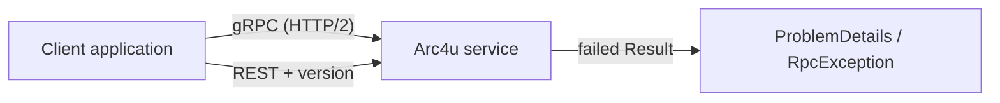

# gRPC and API versioning

Arc4u services talk to each other and to their clients over REST and gRPC. This guide covers the
three packages that make both transports behave the same way: gRPC interceptors and error
handling, a Kestrel setup that serves gRPC over HTTP/2, and a fixed API versioning convention for
REST endpoints. It builds on the [Result pattern](../../concepts/glossary.md#result-pattern) and on
the layers described in the [concepts](../../concepts/index.md) section.

## What it solves

A gRPC call and a REST call fail differently: REST answers with an HTTP status and a
[ProblemDetails](../../concepts/glossary.md#problemdetails) document, gRPC answers with a status code
and a text message. Arc4u closes the gap so that a use case returning a failed `Result` reports the
same failure over both transports, and a .NET client reads it back as a failed `Result`.

Arc4u also adds the pieces around a gRPC call that ASP.NET Core leaves to you: forwarding the
caller's bearer token and culture, rejecting an unauthenticated call with a 401 instead of a
redirect, timing each call, and trusting a private root CA on a gRPC client. Hosting itself is left
to .NET: the gRPC runtime is `Grpc.AspNetCore` on the server and `Grpc.Net.ClientFactory` on the
client, and Kestrel serves HTTP/2.

For REST, `Arc4u.AspNetCore.Versioning` wraps [Asp.Versioning](https://github.com/dotnet/aspnet-api-versioning)
with one convention for every Arc4u service: the same three ways to give a version, the same header
names, and a version that is mandatory.



## Packages involved

| Package | Use it for |
|---|---|
| `Arc4u.gRPC` | Client and shared side: `OAuth2Interceptor<T>`, `AddSuffixPathInterceptor`, `ClientErrorInterceptor`, the server `AuthorizationInterceptor`, `RpcException.ToResult()` and the `arc4u.grpc.v1` proto. |
| `Arc4u.AspNetCore.gRpc` | Server side: `Result.ToRpcException()`, the gRPC middleware and `ConfigureLocalCaCertificateForGrpc`. References `Arc4u.gRPC`. |
| `Arc4u.AspNetCore.Versioning` | `AddServiceApiVersioning()` for REST endpoints. Independent of the two gRPC packages. |

Install `Arc4u.AspNetCore.gRpc` in a service that hosts gRPC (it brings `Arc4u.gRPC`), and
`Arc4u.gRPC` alone in a client that only calls it.

## Install

```bash
dotnet add package Arc4u.AspNetCore.gRpc --prerelease
dotnet add package Arc4u.gRPC --prerelease
```

```bash
dotnet add package Arc4u.AspNetCore.Versioning --prerelease
```

> [!NOTE]
> `Arc4u.AspNetCore.Versioning` is not published on NuGet.org yet and targets `net10.0` only. Until
> a preview is published, reference the project from the repository.

The gRPC runtime comes from Microsoft: add `Grpc.AspNetCore` to a service and `Grpc.Net.ClientFactory`
to a client, and declare your `.proto` files with `Grpc.Tools` as described in
[gRPC on .NET](https://learn.microsoft.com/aspnet/core/grpc/).

## Configuration

None of the three packages reads a configuration section of its own. What you configure lives in
other places:

- the Kestrel endpoints and protocols, in the `Kestrel` section: see [Kestrel and HTTP/2](kestrel.md);
- the token settings used by `OAuth2Interceptor<T>` and the JWT bearer validation of the service:
  see [Authentication (server)](../authentication-server/index.md) and
  [Authentication (client)](../authentication-client/index.md);
- the private root CA trusted by `ConfigureLocalCaCertificateForGrpc`: see the
  [Authentication (server)](../authentication-server/index.md) guide.

## Common scenarios

### Host a gRPC service

Register the Arc4u application context and the interceptor, then add the middleware before
authentication. [gRPC services and clients](grpc.md) explains each line.

```csharp
// Program.cs
using Arc4u.AspNetCore.Middleware;
using Arc4u.gRPC.Interceptors;
using Arc4u.Security.Principal;

var builder = WebApplication.CreateBuilder(args);

builder.Services.AddApplicationContext();
builder.Services.AddGrpc(options => options.Interceptors.Add<AuthorizationInterceptor>());

var app = builder.Build();

app.AddGrpcAuthenticationControl();
app.AddGrpcMonitoringTimeElapsed();
// UseAuthentication() and UseAuthorization() come next.
app.MapGrpcService<OrderGrpcService>();

app.Run();
```

### Report a failed Result over gRPC

Throw `result.ToRpcException()` in the service and call `ToResult()` on the `RpcException` in the
client. Both ends see the same ProblemDetails, validation messages included. See
[ProblemDetails over gRPC](grpc-problem-details.md).

### Version a REST API

```csharp
// Program.cs
using Arc4u.AspNetCore.Versioning;
using Asp.Versioning;

var builder = WebApplication.CreateBuilder(args);
builder.Services.AddServiceApiVersioning();

var app = builder.Build();

var versionSet = app.NewApiVersionSet().HasApiVersion(ApiVersionDefault.V1).Build();
app.MapGet("/interface/v{version:apiVersion}/environment", () => Results.Ok())
   .WithApiVersionSet(versionSet);

app.Run();
```

See [API versioning](api-versioning.md) for the readers, the mandatory version and controllers.

### Serve gRPC and REST from a Kubernetes pod

Use one HTTP/2 endpoint for gRPC and a plain HTTP/1 endpoint for the probes. See
[Kestrel and HTTP/2](kestrel.md).

## Extensibility points

| Service | Default implementation | Replace it to |
|---|---|---|
| `OAuth2Interceptor<T>` | none (built with a settings name) | Change how a call is authenticated. |
| `AddSuffixPathInterceptor` | none (abstract) | Prefix the path of every call so a reverse proxy can route it. |
| `IRootCertificateExtractor` | `RootCertificateExtractor` | Fetch the server certificate another way. |

The details and code are in [gRPC services and clients](grpc.md#extensibility-points).

## Troubleshooting

### The client fails with `HTTP_1_1_REQUIRED` or the server logs "HTTP/2 is not enabled"

The endpoint has `Http1AndHttp2` but no TLS, so HTTP/2 is not negotiated. Use `Http2` for a
plain-text endpoint, or add a certificate. See [Kestrel and HTTP/2](kestrel.md#troubleshooting).

### A gRPC call returns `Internal` with the message "An error occurs."

`AuthorizationInterceptor` replaces every exception that is not an `RpcException` by that status so
that no internal detail leaves the service. The original exception is in the technical log.

### A REST call answers 400 with `ApiVersionUnspecified`

The version is mandatory. Send it in the URL segment, the `x-api-version` header or the
`api-version` query string. See [API versioning](api-versioning.md#troubleshooting).

## See also

- [gRPC services and clients](grpc.md)
- [ProblemDetails over gRPC](grpc-problem-details.md)
- [API versioning](api-versioning.md)
- [Kestrel and HTTP/2](kestrel.md)
- [Results and errors](../results/index.md)
- [Authentication (server)](../authentication-server/index.md)
- <xref:Arc4u.gRPC.Interceptors> in the API reference
- <xref:Arc4u.AspNetCore.Versioning> in the API reference
