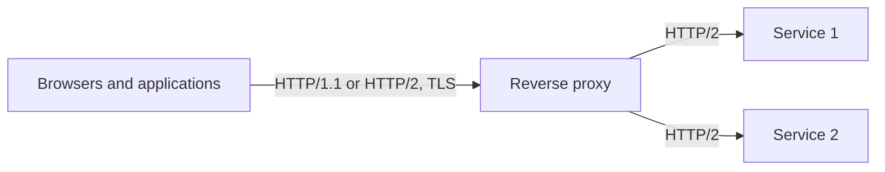

# Kestrel and HTTP/2

gRPC needs HTTP/2, and HTTP/2 needs either TLS or a client that speaks it without negotiation.
Arc4u has no code for this: it is Kestrel configuration, and the same service can be deployed as a
Windows service or in Kubernetes with only its `appsettings.json` changing. This page gives the
configuration for the deployments Arc4u services usually run in. The architecture behind it, a reverse
proxy in front of the services, is described in the [architecture concept](../../concepts/architecture.md).

## What it solves

A typical Arc4u deployment puts a reverse proxy (such as [YARP](https://microsoft.github.io/reverse-proxy/))
in front of the services. The proxy faces browsers and applications, terminates TLS and serves both
HTTP/1.1 and HTTP/2. The services behind it only talk to the proxy.



Each endpoint of each process needs the right protocols, and getting them wrong shows up as
failures at call time. The rules that matter:

- A `Protocols` value of `Http1AndHttp2` (the default) negotiates HTTP/2 through TLS. Without TLS,
  the connection silently falls back to HTTP/1.1, and a gRPC client cannot use it.
- Plain-text HTTP/2 (without TLS) needs `Http2` alone, and every client of that endpoint must
  connect with HTTP/2 from the start.
- An `Http2` endpoint refuses HTTP/1.x requests, so a health probe needs its own `Http1` endpoint.

## Packages involved

None: Kestrel ships with ASP.NET Core. The Windows service host needs
`Microsoft.Extensions.Hosting.WindowsServices`.

## Install

Nothing to install for Kestrel. For a Windows service:

```bash
dotnet add package Microsoft.Extensions.Hosting.WindowsServices
```

## Configuration

Kestrel reads its endpoints from the `Kestrel:Endpoints` section. Each child is an endpoint with an
arbitrary name. The keys used on this page are:

| Key | Type | Default | Description |
|---|---|---|---|
| `Kestrel:Endpoints:<name>:Url` | `string` | none (required) | Address to listen on, for example `https://*:5001`. |
| `Kestrel:Endpoints:<name>:Protocols` | `string` | `Http1AndHttp2` | `Http1`, `Http2`, `Http3`, `Http1AndHttp2` or `Http1AndHttp2AndHttp3`. |
| `Kestrel:Endpoints:<name>:Certificate:Path` | `string` | none | Certificate file (`.pfx`, or `.crt`/`.pem` with `KeyPath`). |
| `Kestrel:Endpoints:<name>:Certificate:KeyPath` | `string` | none | Private key file for a PEM certificate. |
| `Kestrel:Endpoints:<name>:Certificate:Password` | `string` | none | Password of the certificate file, if any. |
| `Kestrel:Endpoints:<name>:Certificate:Subject` | `string` | none | Subject of the certificate to find in a store. |
| `Kestrel:Endpoints:<name>:Certificate:Store` | `string` | none | Store to search, for example `My`. |
| `Kestrel:Endpoints:<name>:Certificate:Location` | `string` | `CurrentUser` | `LocalMachine` or `CurrentUser`. |
| `Kestrel:Endpoints:<name>:Certificate:AllowInvalid` | `bool` | `false` | Accept a certificate that fails validation. |

Endpoint names are case-insensitive. An `https` endpoint without a `Certificate` section uses
`Kestrel:Certificates:Default`, then the development certificate; without any it fails to start.
All the options are described in Microsoft's
[Kestrel endpoint configuration](https://learn.microsoft.com/aspnet/core/fundamentals/servers/kestrel/endpoints).

Nothing in the code reads the section explicitly: `WebApplication.CreateBuilder(args)` loads it.

### Code

```csharp
// Program.cs
var builder = WebApplication.CreateBuilder(args);

builder.Services.AddGrpc();

var app = builder.Build();
app.Run();
```

## Common scenarios

### Run as a Windows service

Run a service that hosts gRPC as a Windows service, not in IIS. Add `UseWindowsService()` to the host.
It only takes effect when the process is started by the service control manager, so the same build
also runs from a console:

```csharp
// Program.cs
var builder = WebApplication.CreateBuilder(args);

builder.Host.UseWindowsService();
builder.Services.AddGrpc();

var app = builder.Build();
app.Run();
```

Publish the project and register the executable:

```powershell
sc.exe create OrdersService binPath= "C:\services\Orders\Orders.exe"
```

Because a Windows service is reached from other machines, its endpoint uses TLS. Read the
certificate from the machine store:

```json
{
  "Kestrel": {
    "Endpoints": {
      "Https": {
        "Url": "https://*:9900",
        "Protocols": "Http1AndHttp2",
        "Certificate": {
          "Subject": "orders.example.com",
          "Store": "My",
          "Location": "LocalMachine",
          "AllowInvalid": false
        }
      }
    }
  }
}
```

> [!IMPORTANT]
> The account the service runs under must be able to read the private key of the certificate.

The reverse proxy uses the same kind of endpoint. A service behind it can use the same endpoint, or
`Http2` alone when only HTTP/2 clients reach it.

### Host in IIS

IIS hosts the application in the ASP.NET Core Module and does not use the `Kestrel` section for its
endpoints. It is enough for REST endpoints and asynchronous communication. For gRPC, IIS needs
HTTP/2 support on the server, which depends on the Windows version: check Microsoft's
[gRPC hosting requirements](https://learn.microsoft.com/aspnet/core/grpc/aspnetcore) and, if in doubt,
use a Windows service. Install the
[ASP.NET Core Hosting Bundle](https://learn.microsoft.com/aspnet/core/host-and-deploy/iis/hosting-bundle)
on the server.

### Reverse proxy in Kubernetes

In Kubernetes the `appsettings.json` is not built into the image: a `ConfigMap` provides it, and a
`Secret` provides the certificate files. Environment variables can override any key, with `__` in place
of `:` (for example `Kestrel__Endpoints__Default__Url`).

The proxy serves HTTP/1.1 and HTTP/2 with TLS to the outside, HTTP/2 without TLS to the services
inside the cluster, and an HTTP/1 endpoint for the probes:

```json
{
  "Kestrel": {
    "Endpoints": {
      "Default": {
        "Url": "https://*:5001",
        "Protocols": "Http1AndHttp2",
        "Certificate": {
          "Path": "certs/tls.crt",
          "KeyPath": "certs/tls.key"
        }
      },
      "Internal": {
        "Url": "http://*:5000",
        "Protocols": "Http2"
      },
      "Probe": {
        "Url": "http://*:8080",
        "Protocols": "Http1"
      }
    }
  }
}
```

`certs/tls.crt` and `certs/tls.key` are the files of a `kubernetes.io/tls` secret mounted under the
working directory of the container.

### Services behind the proxy in Kubernetes

The services are not exposed outside the cluster (`ClusterIP`), so they need no certificate. They
serve HTTP/2 in plain text to the proxy and keep an HTTP/1 endpoint for the probes:

```json
{
  "Kestrel": {
    "Endpoints": {
      "Default": {
        "Url": "http://*:5000",
        "Protocols": "Http2"
      },
      "Probe": {
        "Url": "http://*:8080",
        "Protocols": "Http1"
      }
    }
  }
}
```

A YARP cluster does not use HTTP/2 to a plain-text destination by default: it sends HTTP/1.1, and the
service answers `400` with "An HTTP/1.x request was sent to an HTTP/2 only endpoint.". Ask for HTTP/2
and forbid the downgrade in the cluster:

```json
{
  "ReverseProxy": {
    "Clusters": {
      "orders": {
        "HttpRequest": {
          "Version": "2",
          "VersionPolicy": "RequestVersionExact"
        },
        "Destinations": {
          "orders-1": { "Address": "http://orders:5000" }
        }
      }
    }
  }
}
```

A gRPC client calling such a service directly uses an `http://` address too.

### Serve the liveness and readiness probes

Kubernetes probes speak HTTP/1.1, hence the `Probe` endpoint. Map the health checks and restrict them
to that port:

```csharp
// Program.cs
var builder = WebApplication.CreateBuilder(args);

builder.Services.AddHealthChecks();

var app = builder.Build();

app.MapHealthChecks("/healthz").RequireHost("*:8080");

app.Run();
```

Point the liveness and readiness probes of the container at port `8080` and the path `/healthz`, and
do not add that port to the Kubernetes `Service`.

> [!NOTE]
> `RequireHost` only restricts the health check route. The other endpoints of the application also
> answer on port 8080, so keep the port out of any `Service` or ingress instead of relying on the route.

## Extensibility points

Kestrel is configured with the standard ASP.NET Core options. To set what the JSON cannot express, for
instance a certificate loaded by code, use `builder.WebHost.ConfigureKestrel(...)`. Endpoints defined
in code and in configuration can be mixed.

## Troubleshooting

### The gRPC client fails with `HTTP_1_1_REQUIRED`

The client sees the exception "The HTTP/2 server closed the connection. HTTP/2 error code
'HTTP_1_1_REQUIRED'", and the server logs "HTTP/2 is not enabled for ...: the endpoint is configured to
use HTTP/1.1 and HTTP/2, but TLS is not enabled". The endpoint has `Http1AndHttp2` without a
certificate. Give it a certificate, or, for a plain-text endpoint, set `Protocols` to `Http2`.

### A browser or `curl` gets "An HTTP/1.x request was sent to an HTTP/2 only endpoint"

That is the answer of an `Http2` endpoint to an HTTP/1.x request, with status `400`. Send the request to
an `Http1AndHttp2` endpoint, or use `curl --http2-prior-knowledge` for a plain-text `Http2` endpoint. A reverse proxy that reaches
such an endpoint with HTTP/1.1 gets the same answer: see [Services behind the proxy in Kubernetes](#services-behind-the-proxy-in-kubernetes).

### Throughput drops under load through YARP with HTTP/2

A team reported ([#156](https://github.com/Arc4u-org/Arc4u/issues/156)) that the HTTP connections between
YARP and a REST destination were exhausted under a high number of parallel requests, and worked around it
in the cluster configuration of the proxy by limiting the connections and forcing HTTP/1.1 to that
destination:

```json
{
  "ReverseProxy": {
    "Clusters": {
      "rest-service": {
        "HttpClient": {
          "MaxConnectionsPerServer": 32
        },
        "HttpRequest": {
          "Version": "1.1",
          "VersionPolicy": "RequestVersionOrLower"
        }
      }
    }
  }
}
```

This is YARP configuration, not Arc4u's, and it was not reproduced for this guide. Do not apply it to a
gRPC destination: gRPC requires HTTP/2.

## See also

- [gRPC and API versioning](index.md)
- [gRPC services and clients](grpc.md)
- [Architecture](../../concepts/architecture.md)
- [Kestrel web server in ASP.NET Core](https://learn.microsoft.com/aspnet/core/fundamentals/servers/kestrel)
