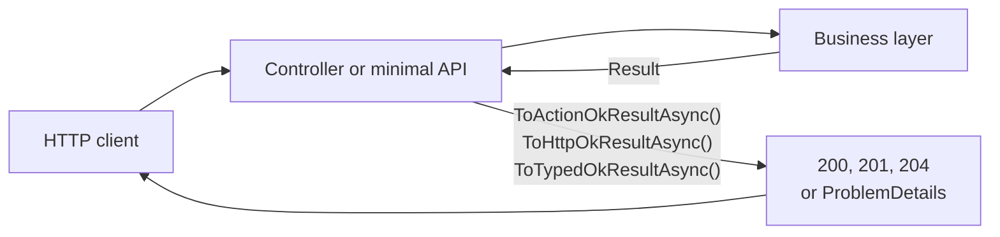

# Results and errors

Arc4u business code reports failure by returning a [`Result`](../../concepts/glossary.md#result-pattern) instead of throwing
an exception or filling a list of messages. The REST layer turns that result into an HTTP
response, and turns every failure into a
[`ProblemDetails`](../../concepts/glossary.md#problemdetails) body (RFC 9457, previously RFC 7807).
This guide covers the three packages that do this. It replaces the `Message` and `Messages`
types of Arc4u 8 (see [the migration guide](../../migration/8x-to-9.md#message-and-messages-replaced-by-problemdetails)).

## What it solves

A use case can succeed, fail in a way the caller can fix (invalid input, missing entity,
business rule) or break in a way nobody planned (I/O error, bug). With plain .NET you get an
`if`/`else` on every call, an exception for the unplanned case, and a hand-written
`switch` in each controller action that picks the status code and the body.

Arc4u builds on [FluentResults](https://github.com/altmann/FluentResults) and adds three things:

- **Fluent chains** (`OnSuccess`, `OnFailed`, `LogIfFailed`, ...) so that a use case reads
  as a sequence of intentions, without `if` statements. See [Fluent result chains](fluent-results.md).
- **Error types that map to HTTP**: `ProblemDetailError` for a business problem with its own
  status code, `ValidationError` for input validation. One extension method per response
  style converts a result into a controller `ActionResult`, a minimal API `IResult` or a typed
  `Results<...>`. See [Results to HTTP responses](http-mapping.md).
- **FluentValidation integration**: validators return a `Result` whose errors become an HTTP
  `422` response. See [Validation errors](validation.md).

Arc4u leaves the rest to .NET: it does not replace `ProblemDetails`, content negotiation or
the ASP.NET Core exception middleware.



## Packages involved

| Package | Use it for |
|---|---|
| `Arc4u.Results` | Fluent chain extensions on `Result`, `ProblemDetailError`, `ValidationError`, and `FluentLogger`, the logger for results. No ASP.NET Core dependency: use it in the business layer. |
| `Arc4u.AspNetCore.Results` | Conversion of a result to `ActionResult`, `IResult` or typed `Results<...>`, and of errors to `ProblemDetails`. Use it in the interface layer (controllers and minimal APIs). References `Arc4u.Results`. |
| `Arc4u.FluentValidation` | FluentValidation rules and `ValidateWithResult` extensions that produce a `Result` with `ValidationError`s. The assembly is named `Arc4u.Validation`. References `Arc4u.Results` and `Arc4u.Data`. |

All three target `net10.0` and `net11.0`.

## Install

Business layer:

```bash
dotnet add package Arc4u.Results --prerelease
```

ASP.NET Core project that exposes the API:

```bash
dotnet add package Arc4u.AspNetCore.Results --prerelease
```

If you validate with FluentValidation:

```bash
dotnet add package Arc4u.FluentValidation --prerelease
```

## Configuration

None of the three packages reads an `appsettings.json` section. Two things are configured in code.

| What | Where | Default |
|---|---|---|
| Logger used by `LogIfFailed` and `ToGenericMessage` | `Result.Setup(cfg => cfg.Logger = ...)` (FluentResults) | A logger that writes nothing |
| Function that turns errors into a `ProblemDetails` | `FromResultToProblemDetailExtension.SetFromErrorFactory` | The mapping described in [Results to HTTP responses](http-mapping.md#how-errors-map-to-a-response) |

### Code

Register `FluentLogger` and give it to FluentResults once, at startup. Without this, `LogIfFailed`
logs nothing, and the message "A message has been logged" that Arc4u puts in a `500` response is not true.

```csharp
// Program.cs
using Arc4u.Results.Logging;
using Arc4u.Security.Principal;
using FluentResults;

var builder = WebApplication.CreateBuilder(args);

builder.Services.AddApplicationContext();                        // provides the Arc4u ILogger<T> that FluentLogger needs
builder.Services.AddSingleton<IResultLogger, FluentLogger>();

var app = builder.Build();

Result.Setup(cfg => cfg.Logger = app.Services.GetRequiredService<IResultLogger>());

app.Run();
```

`AddApplicationContext` is described in the [diagnostics guide](../diagnostics/index.md).
`FluentLogger` writes with the Arc4u business logger, so its output follows your Serilog or
`ILogger` configuration.

## Common scenarios

### Return a result from a controller action

The business layer returns a `Result<T>`. The action converts it in one call:

```csharp
using Arc4u.AspNetCore.Results;
using Arc4u.Results;
using FluentResults;
using Microsoft.AspNetCore.Mvc;

public record OrderDto(int Id, string Name);

public interface IOrderService
{
    Task<Result<OrderDto>> GetAsync(int id);
}

[ApiController]
[Route("api/orders")]
public class OrdersController(IOrderService orders) : ControllerBase
{
    [HttpGet("{id:int}")]
    public Task<ActionResult<OrderDto>> Get(int id) => orders.GetAsync(id).ToActionOkResultAsync();
}
```

A success answers `200` with the value. A failure answers with a `ProblemDetails` body and the
status code of the error. [Results to HTTP responses](http-mapping.md) lists every case, with the real JSON.

### Return a business problem with its own status code

Create the error where the problem is detected. `Create` takes the `detail` of the problem:

```csharp
using Arc4u.Results;
using FluentResults;

public static class OrderRules
{
    public static Result<OrderDto> NotFound(int id)
        => Result.Fail<OrderDto>(ProblemDetailError.Create($"Order {id} does not exist.")
                                                   .WithTitle("Not found")
                                                   .WithStatusCode(404));
}
```

The client receives:

```http
HTTP/1.1 404 Not Found
Content-Type: application/problem+json; charset=utf-8

{"type":"about:blank","title":"Not found","status":404,"detail":"Order 2 does not exist.","Severity":"Error"}
```

### Expose the same result from a minimal API

```csharp
// Program.cs (excerpt)
app.MapGet("/orders/{id:int}", (int id, IOrderService orders) => orders.GetAsync(id).ToHttpOkResultAsync());
```

## Extensibility points

| Service | Default implementation | Replace it to |
|---|---|---|
| `FluentResults.IResultLogger` | `FluentLogger` (needs `Result.Setup`) | Send result logs somewhere else than the Arc4u business logger. |
| `FromResultToProblemDetailExtension.FromError` (set with `SetFromErrorFactory`) | Built-in mapping | Change the status codes, the `type` URIs or the shape of the `ProblemDetails` for the whole application. Call `SetFromErrorFactory` once at startup. |

```csharp
using System.Diagnostics;
using Arc4u.AspNetCore.Results;
using FluentResults;
using Microsoft.AspNetCore.Mvc;

FromResultToProblemDetailExtension.SetFromErrorFactory(errors =>
{
    if (errors.OfType<IExceptionalError>().Any())
    {
        return Result.Fail(errors).ToGenericMessage(Activity.Current?.Id, true);   // never expose Exception.Message
    }

    return new ProblemDetails
    {
        Title = "Request failed",
        Detail = errors.First().Message,
        Status = StatusCodes.Status400BadRequest
    };
});
```

The factory is static and applies to the whole process. It replaces the default mapping completely, including
the protection that hides exception details: do not put `Exception.Message` in the response. See
[Change the mapping](http-mapping.md#change-the-mapping).

## Troubleshooting

### `LogIfFailed` writes nothing

FluentResults uses a logger that discards everything until you call `Result.Setup`. Follow the
[Code](#code) section above.

### Compile error `CS0104: 'Severity' is an ambiguous reference`

`Arc4u.Results.Validation.Severity` and `FluentValidation.Severity` both exist. When a file
imports both namespaces, qualify the one you mean, for example
`Arc4u.Results.Validation.Severity.Warning`.

### `ToActionResultAsync` does not exist

Some older notes use `ToActionResultAsync`. The methods are `ToActionOkResultAsync` and
`ToActionCreatedResultAsync` (controllers), `ToHttpOkResultAsync` and `ToHttpCreatedResultAsync`
(`IResult`), `ToTypedOkResultAsync` and `ToTypedCreatedResultAsync` (typed results).

### Known issues

> [!WARNING]
> - `LogIfFailed(LogLevel)` accepts a level, but `FluentLogger` logs each error at a level it chooses itself
>   (see [Logging failures](fluent-results.md#logging-failures)). The level you pass has no effect.
> - `LogIfFailed(context, content, level)` makes the singleton `FluentLogger` add a `Context` property that is never
>   cleared, so it appears on every later result log in the process. Avoid that overload until it is fixed.
> - Three of the four `ToGenericMessage` overloads ignore their `unexpectedType` argument
>   (see [Results to HTTP responses](http-mapping.md#the-generic-500-message)).

## See also

- [Fluent result chains](fluent-results.md)
- [Results to HTTP responses](http-mapping.md)
- [Validation errors](validation.md)
- [Migration from Arc4u 8: Message and Messages replaced by ProblemDetails](../../migration/8x-to-9.md#message-and-messages-replaced-by-problemdetails)
- <xref:Arc4u.Results> and <xref:Arc4u.AspNetCore.Results> in the API reference
